http://www.youtube.com/embed/HODnmb0WzN8

Design a character in MakeHuman and export him in the MHX format. Import the character into Blender using the MHX importer. Make sure that the MakeWalk plugin is enabled. It is found in the MakeHuman category. Select the character and press the Load And Retarget button in the main MakeWalk panel. Select a bvh file in the file selector.

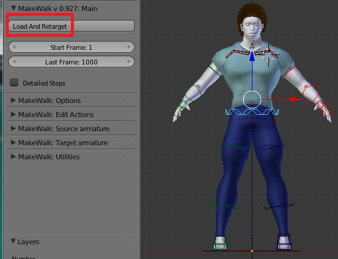

The animation is loaded onto the character. In this case the character is running in a figure eight pattern.

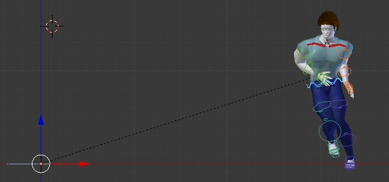

However, the animation has many imperfections. This is perfectly normal. Loading and retargeting the animation is only the first step. To obtain an acceptable result, the animation must be tweaked. Doing this manually is a major undertaking, which possibly requires more effort than animating by hand. Fortunately, MakeWalk has several tools for automating this task. The editing tools are found in the MakeWalk: Edit Actions panel. The picture below shows frame 121 before and after editing.

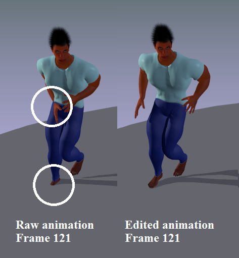

The first problem is that the arms and hands penetrate the body multiple times. This probably happens because the original actor had a different body shape that the present, quite muscular, character. At some frame where the problem is apparent, select the upper arms and rotate them out so they are safely away from the body. With both upper arms selected, press Shift Animation in the Global Edit section. After some time, the arms have been rotated for the entire animation.

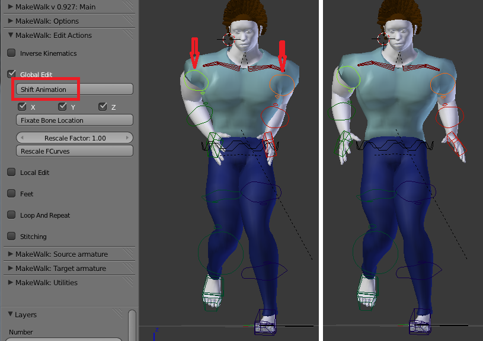

We will fix floor penetrations by transfer the FK animation to the IK bones. The MHX rig has a reverse foot setup, which allows the foot to rotate around the toe, ball, and heel. The reverse foot and toe bones are completely fixed by the corresponding FK bones, but the IK effector can be placed arbitrarily, as long as it ends at the toe tip. The transfer tool uses this freedom to make the IK effector perfectly horizontal, provided that the toe is below the ball and heel.

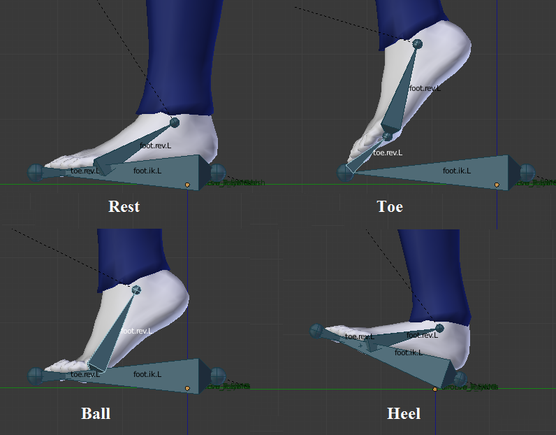

To use this feature we must ensure that the toe is below the ball of the foot. In the foot section, press the Offset Toes button. This changes the direction of the toe bones so the toe tip is below the ball in global space throughout the animation.

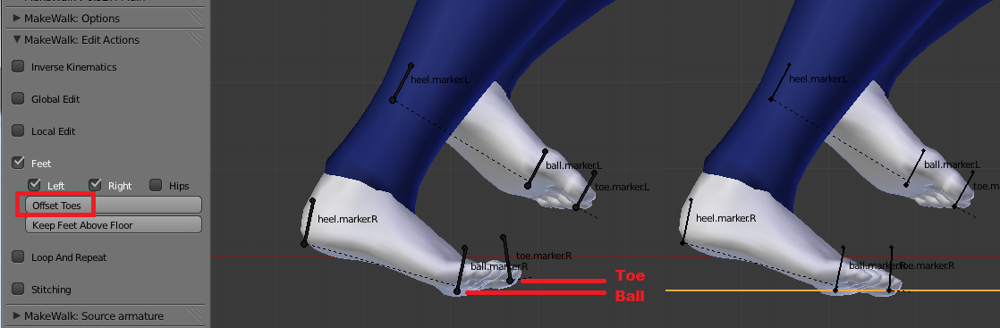

The previous step causes some awkward bending of the toes when the heel is the lowest point. The toe should never be bend down in local space. Since the local X axis points to the left, this means that the toe's local X rotation must not be positive. In the graph editor, select all keyframe points with positive X rotation, scale the Y coordinates to zero (S Y 0) and move the points down to the Y axis (G Y).

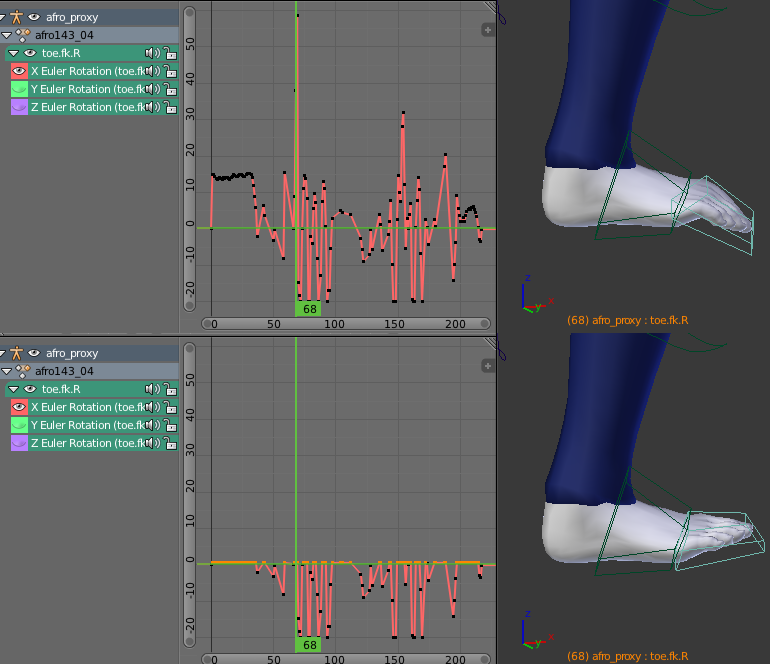

We will employ a tool that lifts the feet to the floor if they are below, but the tool does nothing if the foot is already above the floor. To prevent that the foot ever floats above the floor, select the hip bone, move it slightly down, and press Shift Animation again. The foot should be on or below the floor at every frame that it is supposed to rest on it.

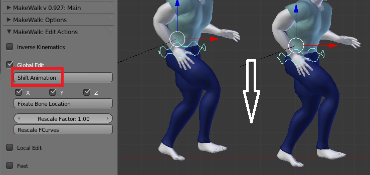

Before we transfer the animation to the IK bones, we will make it loop seamlessly. Looping takes more time when there are several bones with location F-curves, and it may cause feet to move away from the floor. We find two keyframes where the character is in similar positions; frames 97 and 173 are a good pair. Set timeline markers at these frames, and change the animation range to 97-172; since the poses at 97 and 173 will become identical, we must make sure that it is only included once.

In the Loop And Retarget section, set the Blend Range to 10, enable the Loop in place checkbox, and press Loop F-curves. Loop in place must be enabled, because we want the location to be the same in the beginning and end of the animation.

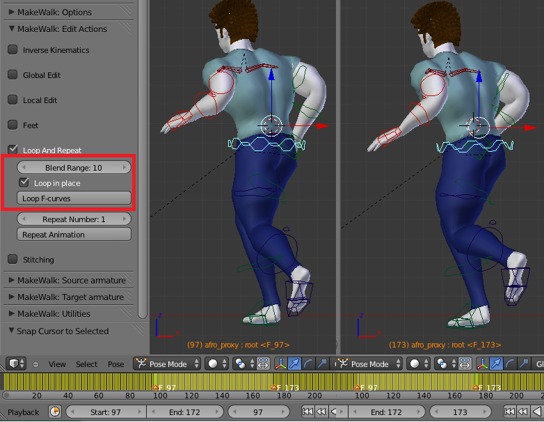

The animation in the beginning and end of the selected time range (between the two selected time markers) is blended, and the poses at frames 97 and 173 become identical.

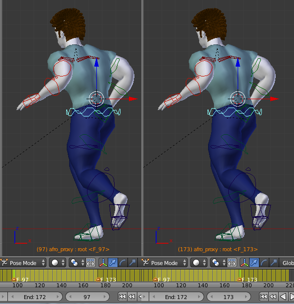

Next we transfer the FK animation to the IK bones. With some bone selected, press the Transfer FK =&gt; IK button in the Inverse Kinematics section. Make sure that the Legs checkbox is enabled and that Arms is disabled.

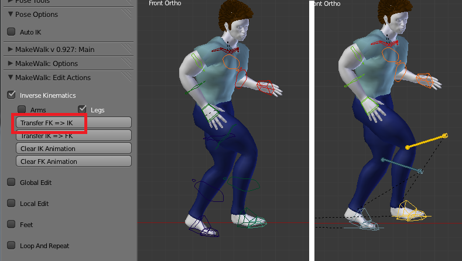

In the Feet section, press the Keep Feet Above Floor button. At every keyframe where a leg IK effector is below the floor, it is lifted up to rest on it.

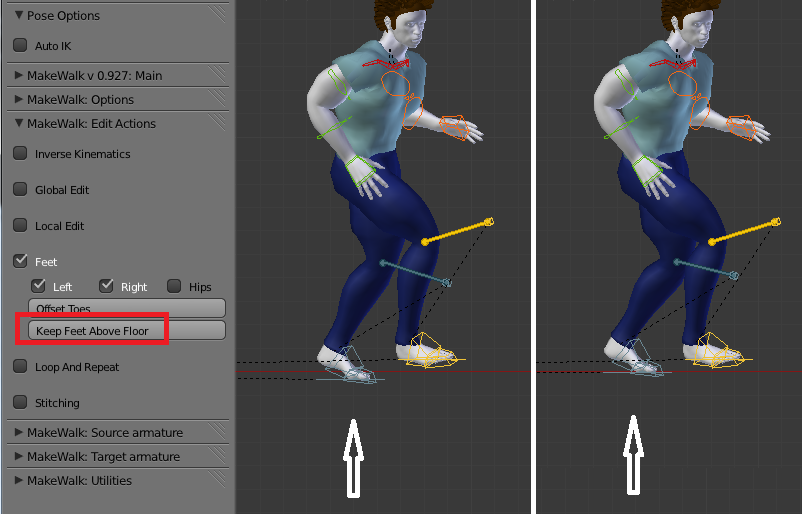

Since we moved the hips down before, the character will be kneeling slightly. To compensate for that, we can move the hips up slightly and press Shift Animation again. However, make sure to not move them up too much, lest the distance between the hip and the foot becomes longer than the leg length.

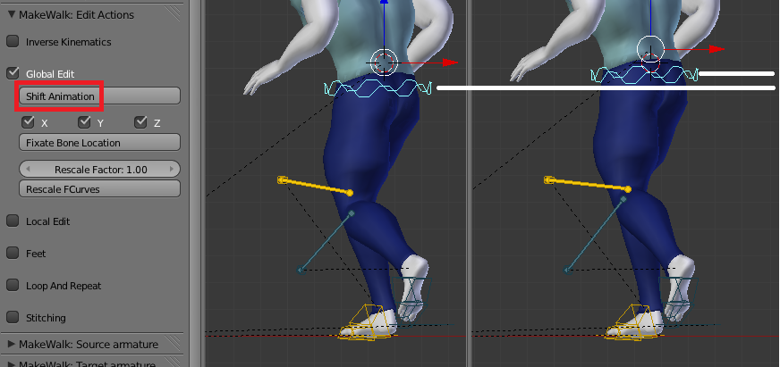

The camera is also animated to keep the character always in sight. Make sure that the camera animation is also periodic.

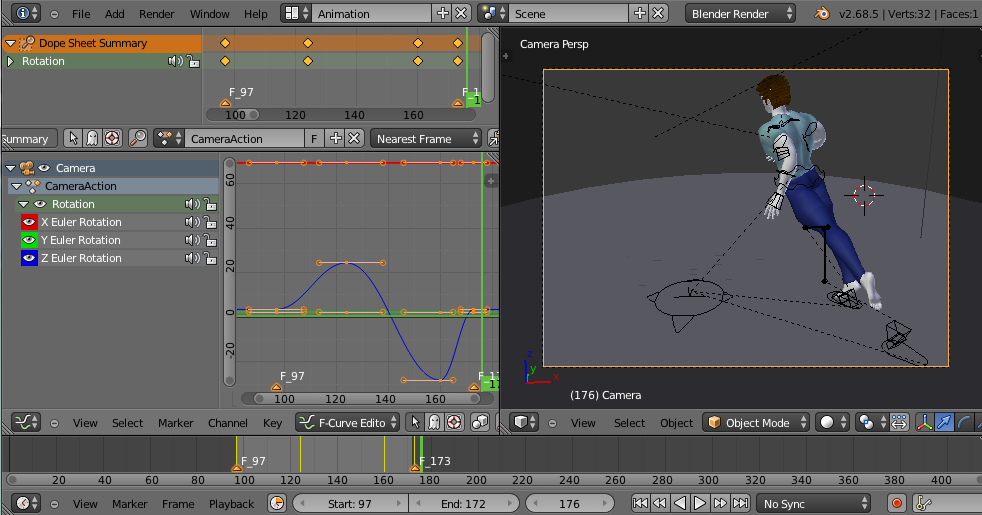

Finally the scene was rendered to png files and assembled in the video sequencer. The final clip consists of two copies of the raw animation (directly after Load And Retarget), three copies of the edited animation, and some stills.

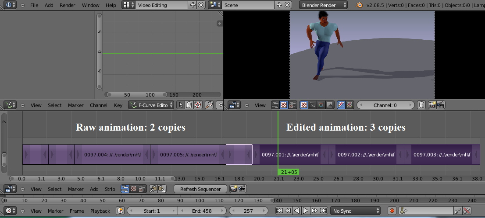

