These are instructions for how to set up shape keys on a rigged makehuman model in blender. 

## Step by step to make it work.

On the character body armature modifier, activate the function "Display modifier in Edit Mode"

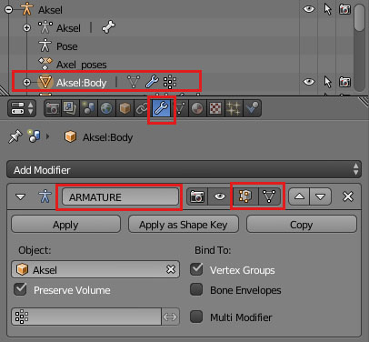

Create a basis shape key and then a deformation shape key, give it a suitable name. Pin the shape key to always show.

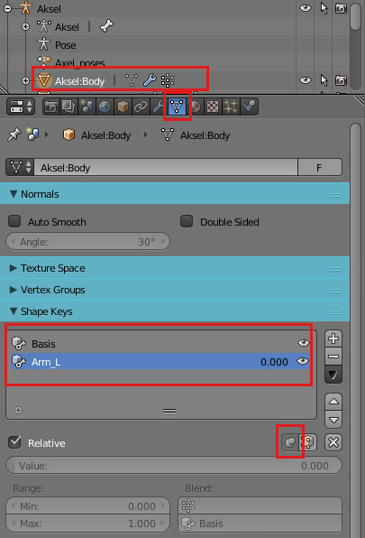

Select the bone you want shall control the shape key and pose it to the position where you want full shape key deformation.
Remember the bone name and wich axis you rotate it, in this example bone "lowerarm01.L" local X rotation - press key R then XX.

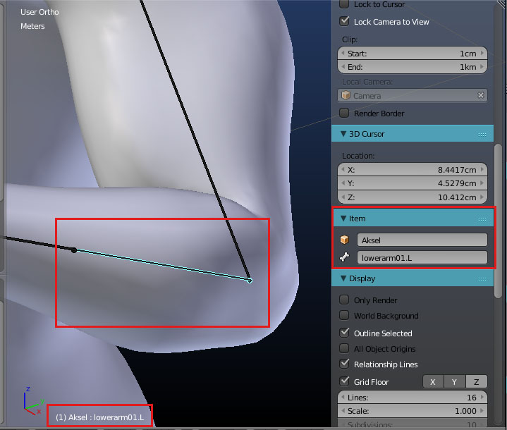

Select the body and edit the mesh until desired shape for that pose. Proportional edit is very useful.

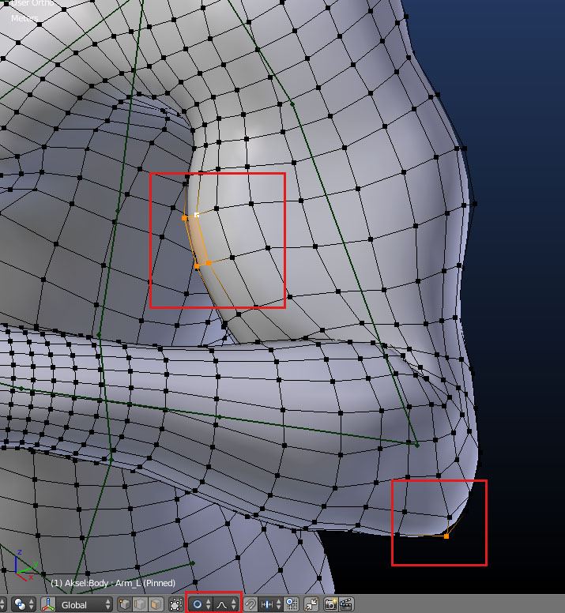

Reset the bone to default position - press key ALT and R

Prepare the shape key to be driven by the bone.

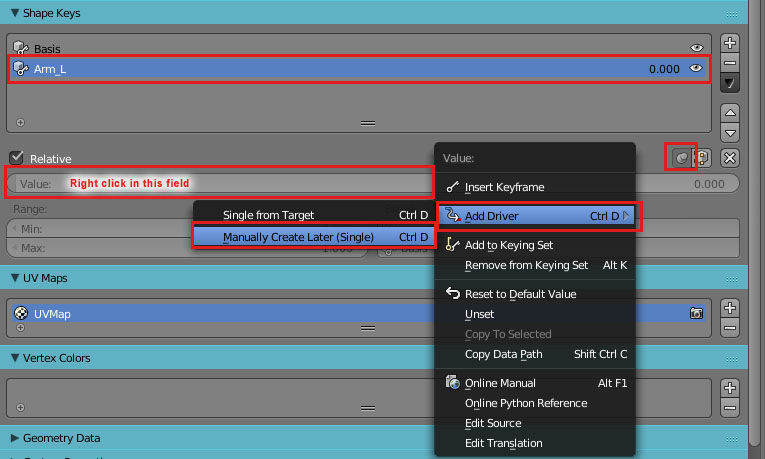

The Value field color is now purple. Unpin the shape key and you will see the mesh transforms back to the default shape.

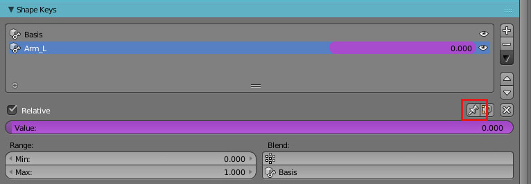

Open "Graph Editor" - "Edit Drivers"

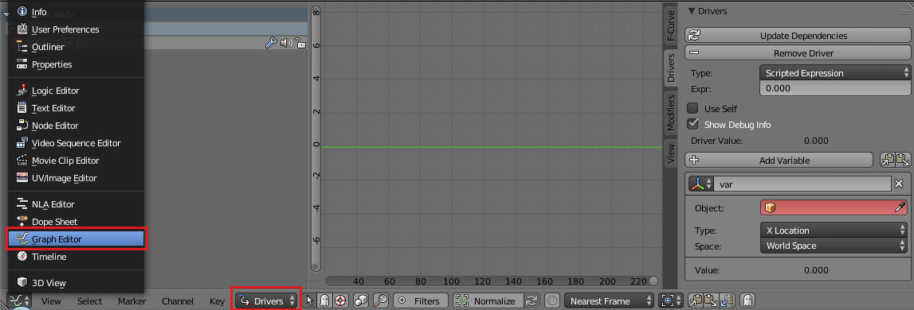

Select the shape key to the left and the tab "Drivers", in the field "Object" select the skeleton and "Bone" in this example "lowerarm01.L" As this example want the bone local X rotation to control this shape key select "X Rotation" and "Local Space".

Finish by setting "Type:" to "Averaged Value".

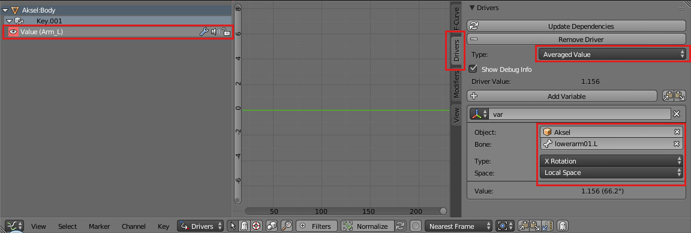

If the shape key shall deform on the negative rotation axis, add the driver modifier "Generator" and value -1.000 as shown here.

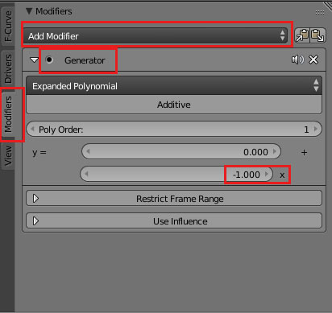

Rotate the bone on local X axis (key R then XX) and the shape will deform the mesh.

Adjust the shape key until satisfied. The shape will always deform in a strait line.

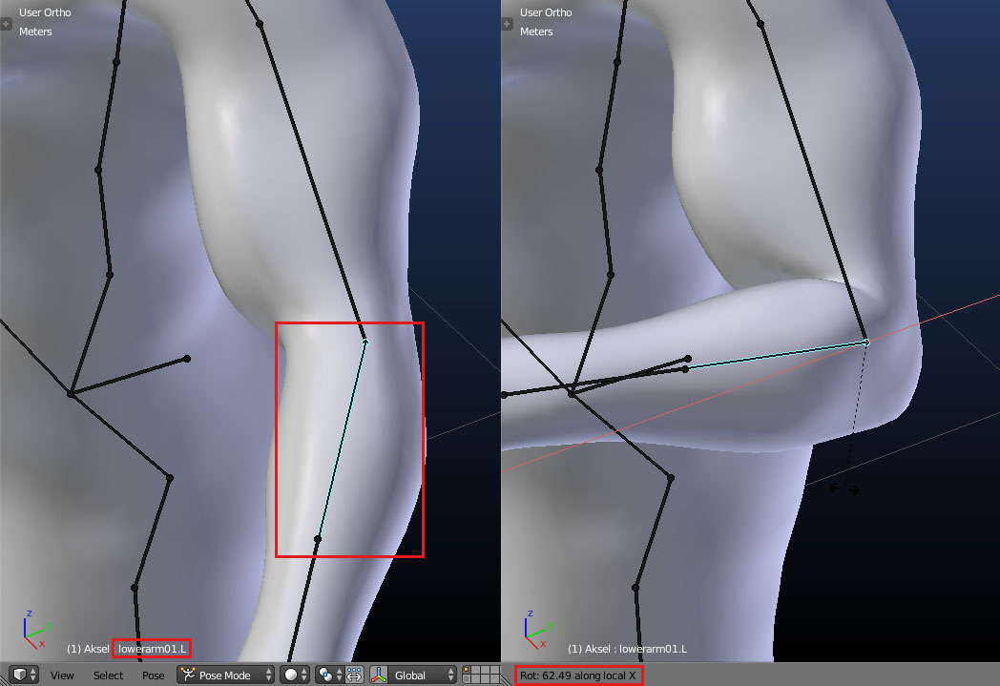

## Mirror shape keys

Select the shape key you want to mirror and activate pin.

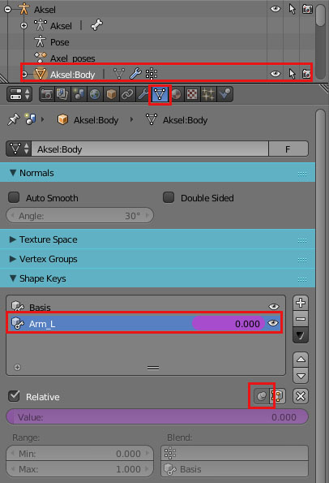

Make a copy of the shape key.

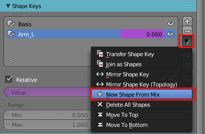

Give the new shape key a suitable name.

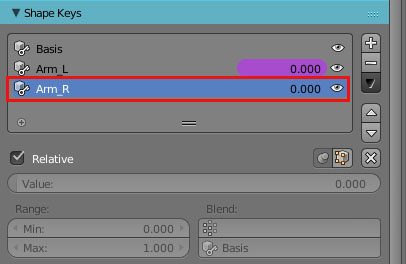

Mirror the new shape key. Choose either "Mirror Shape Key (Topology)" or "Mirror Shape Key"

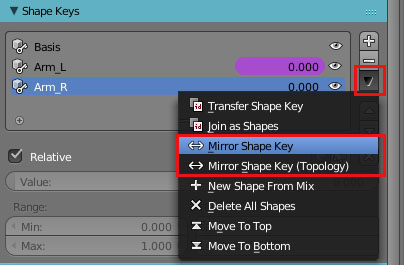

If succed you have a new working shape key on the opposit side, and just need to assign it to be driven by, in this example, the bone "lowerarm01.R".

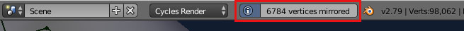

If both alternative generate an error message, the mirror process has failed, that occur when the mesh is non symetric and differs to much. Dont accept any error at all.

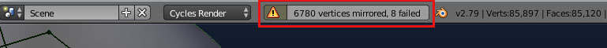

Instead read part 3 below ("Transfer shape keys to another character"). Import a symetrical MakeHuman character. Transfer the shape key to it, do the mirror, and transfer the shape key back to the original character, and give the shape key a suitable name. It is uncertain if the shape will look exactly the same but it wont generate any error message.

## Transfer shape keys to another character

Most important to know, the characters must have exactly the same topology. In some cases character specific adjustments has to be done afterwards. At this moment I only knows it possible to transfer shape key's one at a time.

Select the source character and the shape key to transfer.

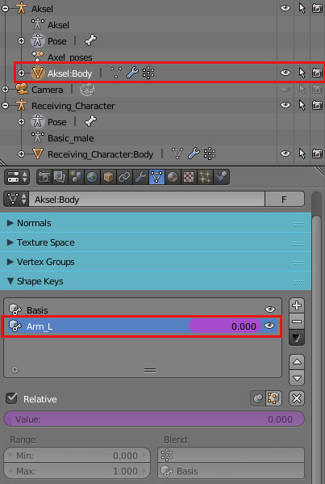

Shift select the receiving character's body and transfer the shape key.

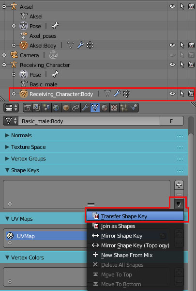

If not exist also a "Basis" shape key will automatically be created.

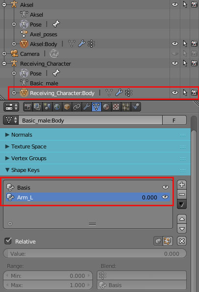

