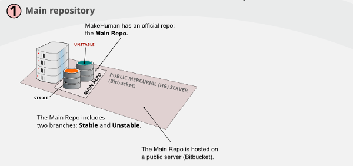
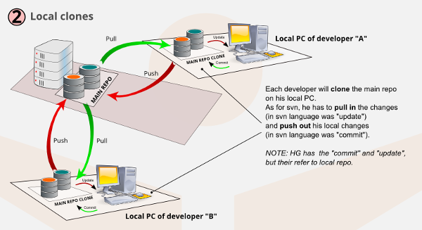
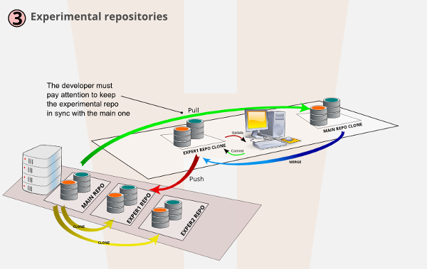
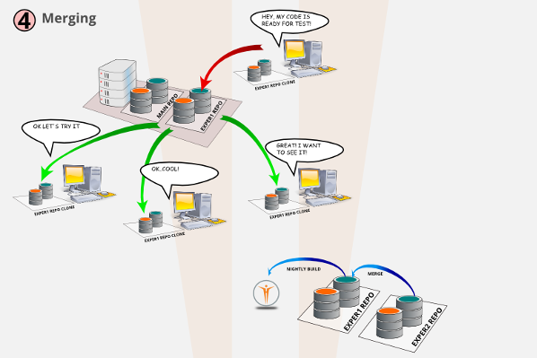
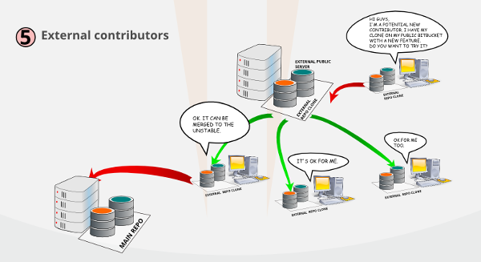

The development of MakeHuman is based on two fundamental tools:
* Mercurial (HG), a stable and robust platform for distributed revision control, with the main repo hosted on!LINK!https://bitbucket.org/MakeHuman/makehuman -- Bitbucket!/LINK!
* A collaborative software!LINK!http://bugtracker.makehuman.org -- development platform!/LINK!, based on!LINK!http://www.redmine.org/ -- Redmine!/LINK!.

=### Get the code from BitBucket.

Obtain the code from BitBucket repository is very simple, but you need to have Mercurial installed on your system.
It's natively present on Linux systems, while for Microsoft Windows, a good software is TortoiseHG (!LINK!http://tortoisehg.bitbucket.org/ -- http://tortoisehg.bitbucket.org/!/LINK!).
To clone the repository to your PC, just use this command:
hg clone!LINK!https://bitbucket.org/MakeHuman/makehuman -- https://bitbucket.org/MakeHuman/makehuman!/LINK!
With tortoiseHG, you can do it visually, with:
right-click --> TortoiseHG --> clone

=### Using Redmine in MakeHuman development

Redmine is a very powerful tool.
[To expand with technical information about the roadmap organizations, the subprojects, and how to use it to accept experimental features]

 

 

=### Branches
The Unstable branch is where the development happens. This is our working branch, and so we can refer to it as default branch too.
The Stable branch is used for official release only.
  
It's just for mainteinance of the current official version. It's rarely used, except in the case of very noticeable bugs that will cause a service release. Any bugfix in the Stable must be merged in Unstable.
When the Unstable is ready for the release, it's merged in the Stable and a tag (a sort of bookmark) is created on this exact revision.
 

 
Working on experimental clone for new features in early development is a great comfort for the developer.
  
He doesn't have to keep his  code on the local drive since he  can commit it immediately.
  
It doesn't  matter if the code does not work yet or breaks the app, it is the private playground of the developer.
 

 
To start up a new feature yet unproven or that is unsure how to implement it exactly, or for a big refactor that might make a lot of problems until solved, we will create experimental repos, cloning the main one. One repo for (large) feature.
 

 
Once the developer has something to show, he can communicate with other team members so  they can:
* clone the experimental repo to a new folder on their local disk
* test it
* give feedback
* perhaps even commit fixes
Once a feature is proven to work  well enough and accepted by the rest of the team, it can be merged in official unstable branch, where it can be integrated in nighly build version and further finalized (it can now be tested by a broader audience and we will receive bugs reports from them)
 

 
It is also possible that an external programmer, without commit rights on the official repo, make changes on his own personal clone (that he can make public on his own account if he desires).
  
This is a good way to test new team members, where we can accept changes after verifying them. When we trust a new developer, we can give him direct access to official repo.