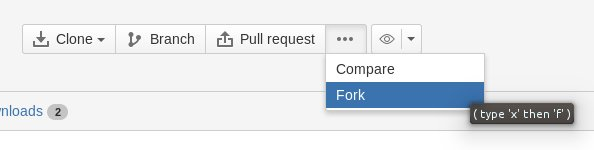

### Getting started
The best way to start your experiments with MakeHuman code is to clone our official repository and start to modify it.
  
In order to procced easily. it is recommended you use the tools available at!LINK!https://bitbucket.org -- https://bitbucket.org!/LINK!.
The general procedure is:
* Go to!LINK!https://bitbucket.org -- https://bitbucket.org!/LINK!and sign up (if you don't already have an account)
* Go to !LINK!https://bitbucket.org/MakeHuman/makehuman -- https://bitbucket.org/MakeHuman/makehuman!/LINK!
* Click "fork" (it's hidden under "..." in the button menu)

* Enter a name and description of your choice (the fork will end up on your account, so it doesn't matter what you call it). Use "fork at tip" and don't check "this is a private repository"
* You should be redirected to the new repository on bitbucket
* clone your new repository to your local harddrive (if you need a primer on how to clone or use bitbucket,!LINK!https://confluence.atlassian.com/display/BITBUCKET/Bitbucket+201+Bitbucket+with+Git+and+Mercurial -- see their tutorial!/LINK!)
* Make your code changes locally. Do not make a feature branch, work directly on the default branch.
* Commit and push the changes to your repository on bitbucket
* Go to your repository on bitbucket and click "pull request" (in the button menu at the top right of the page)
* Write a good description for what your changes concern and click "create pull request"
Once you have done this, the makehuman team will get a notification that there is an incoming code changes. This will be reviewed and either merged or rejected. 
If you want to continue working with updates in the future, make sure your fork is up to date with changes in the makehuman repository. Go to your repository, click the "..." button in the button menu and choose "compare", click the compare button on the page you get to. Merge any incoming changes.
If your tree is hopelessly out of sync with the makehuman tree, just delete it and make a new fork. Better that than accidentally getting junk in your pull requests.
Before starting with any of the above, you might want to read up on how to run makehuman from a source checkout rather than from a binary download. The short story is that you need to install a few dependencies. More information can be found here:!LINK!http://www.makehuman.org/doc/node/libraries_and_build_procedures.html -- http://www.makehuman.org/doc/node/libraries_and_build_procedures.html!/LINK!