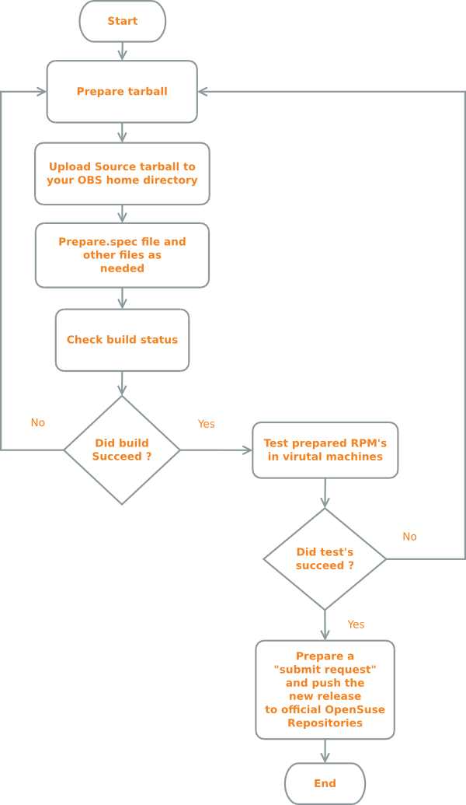

With each MakeHuman release, packages are created for MS Windows, Mac OS X, and Debian derivatives for linux. At present there is not an operating system independent package (although the raw repository will work on all platforms). Each platform has special considerations that are addressed by the designated mainainter for that platform.
### Dependencies
In order to run makehuman and/or build packages the following need to be installed on the system:
* Python (Python 2.7 (python 3.x will not work).!LINK!http://www.python.org/download/ -- http://www.python.org/download/!/LINK!)
* Python-numpy (!LINK!http://sourceforge.net/projects/numpy/files/NumPy/ -- http://sourceforge.net/projects/numpy/files/NumPy/!/LINK!)
* Python-opengl (!LINK!http://pyopengl.sourceforge.net/ -- http://pyopengl.sourceforge.net/!/LINK!)
* Python-qt4 (!LINK!http://www.riverbankcomputing.com/software/pyqt -- http://www.riverbankcomputing.com/software/pyqt!/LINK!)
* Python-qt4-gl (Package required by some linux distributions only)
For linux there are scripts (buildscripts/deb/install_deb_dependencies.bash and buildscripts/rpm/install_rpm_dependencies.bash) which will install all the necessary dependencies but please note that these scripts may not agree with all debian and rpm based distros so it may be worth reading the bash script contents prior to running them.
### Assets
For obvious reasons, the binary assets (characters, textures, clothes, etc..) are not stored on Mercurial repository, but in two different places:
* * Immutable single archive files of the assets of finished versions of MH are stored (disregarding patch version token) on bitbucket (!LINK!https://bitbucket.org/MakeHuman/makehuman/downloads -- https://bitbucket.org/MakeHuman/makehuman/downloads!/LINK!)
* Assets still under development are store on Tuxfamily ftp:!LINK!http://download.tuxfamily.org/makehuman/assets/ -- http://download.tuxfamily.org/makehuman/assets/!/LINK!
When a new version is released, the current ftp asset tree gets zipped and uploaded to bitbucket. In the tuxfamily asset store, the folder for that version's contents are replaced with an archive_url.txt file that points the download script to the right url.
A new folder gets created on the tuxfamily host containing the assets to be included in the next release. For a released version, assets will usually not change, unless to fix bugs (in which case the previous archive is best kept, and a new one is created alongside it with a slightly different name), and the archive_url.txt file is updated.
To download automatically the assets and place them in the correct folder on a local repository, it's sufficient to run the python script with the command:
### Other scripts
In the makehuman root, there are a few scripts which need to be run:
* cleannpz.sh (cleannpz.bat)
* cleanpyc.sh (cleanpyc.bat)
* compile_targets.py
* compile_models.py
* compile_proxies.py
Note that all these are called automatically in the correct order by the "build_prepare.py" script in "buildscripts" when running one of the pre-existing package building routines below. However, when running makehuman from a source checkout, you will need to run these scripts in the above order.
### General proceedings for making a package
On all platforms the following steps should be taken when making the package:
* Update from HG repository (!LINK!https://bitbucket.org/MakeHuman/makehuman -- https://bitbucket.org/MakeHuman/makehuman!/LINK!)
* Run the scripts in the makehuman root directory. These will for example compile target files to npz files
* Copy all that's relevant to a work directory, excluding at least *.target, the utils directory and the tools directory (strictly speaking there are more that is not necessary, but it will have a minor influence)
* Do platform-dependent stuff to the work directory
* Zip the directory into a suitable installable format for the platform.

=### Linux

### Debian
In order for makehuman to work on Debian the following dependencies are needed.
* python
* python-qt4
* python-numpy
* python-opengl
* python-qt4-gl
These can be installed by running the command below:
On Debian/derivatives (Ubuntu kubuntu etc.) the whole package building is automated through the buildDeb.py script found in the "deb" folder.
  
For Deb script see:!LINK!https://bitbucket.org/MakeHuman/makehuman/src/tip/buildscripts/deb/?at# default -- https://bitbucket.org/MakeHuman/makehuman/src/tip/buildscripts/deb/?atd...!/LINK!
  
To build a deb file, create an empty directory (for example /tmp/deb) and run:

When the script has finished, the deb file will be available in /tmp/deb/output.There are some settings in the head of the buildDeb.py script for tweaking the output.
 
### Fedora 19 64-biit RPM Packaging
These instruction have been written for and tested on Fedora 19 64-bit. You will never be able to run the MakeHuman HG version on distros such as RHEL/CentOS 6.4 or earlier, since they do not support python 2.7, not even if you enable RPMForge. The instructions may or may not work on other RPM-based distros.
* * Install a Mercurial client (Hg) and clone the!LINK!https://bitbucket.org/MakeHuman/makehuman -- Makehuman BitBucket Repository!/LINK!.
* Install required dependencies.
  As root, run the bash script for installing the required dependencies.
  buildscripts/rpm/install_rpm_dependencies.bash
  This script also installs optional but recommended dependencies. If you only want the really required  dependencies, run

* Run MakeHuman. Change working directory to the root of the makehuman tree:
  
Then run:
You will most likely want to do this as your normal desktop user, not as root.

=### Windows

* * Install an Mercurial client!LINK!http://tortoisehg.bitbucket.org/download/ -- (Tortoise HG client!/LINK!is a good choice on Windows) and clone the!LINK!https://bitbucket.org/MakeHuman/makehuman -- MakeHuman repository!/LINK!(see!LINK!http://www.makehuman.org/doc/node/development_infrastructure.html -- http://www.makehuman.org/doc/node/development_infrastructure.html!/LINK!)
* Install required dependencies
  If you are using a 64bit Windows version (only applies to 64-bit computers), you can choose to use either 32-bit python or 
  64-bit python. Howver it is important that your library dependencies (NumPy, PyOpenGL, and pyQT4) are 32-bit if you use 32-bit 
  Python and 64-bit if you use 64-bit Python.
  
* Run MakeHuman.
  Start a command console (cmd.exe), change directory to the makehuman folder. Then run:

=### Mac OSX

To build MakeHuman for Mac OS X, you should:
* * Download the MakeHuman OSX Builder from: !LINK!https://bitbucket.org/MakeHuman/makehuman-osx-builder -- https://bitbucket.org/MakeHuman/makehuman-osx-builder!/LINK!
* Follow the included instructions (Instructions.rtf)

## Packager's notes

Notes for packagers of Makehuman stables and nightlies.

### Packaging RPM's for Suse/Fedora using Open Build Service (OBS)
The Open Build Service is a service formerly known as the Opensuse build service. OBS allows packagers to build packages for several targets. Here a target is a particular OS version E.g. Suse 13.1, Suse 12.3, Fedora 20 , Ubuntu 14.04 and so on. OBS being a build system by itself can be hosted anywhere even on local infrastructure. For MakeHuman packages we use the OBS instance hosted by Novell at build.opensuse.org
This document will briefly outline the typical packaging workflow for Suse and Fedora. Both distributions use the RPM format and subsequently adhere to RPM's packaging rules.

### 1) Prepare source tarball:
OBS does not allow pulling from the internet once the rpm is being processed into a package so. When creating the source tarball you should assemble it either on your own computer or a server online (even a VPS will do).
There are several Important files and scripts which are of interest to us. One is build_prepare.py this assembles the main folder and all the common data which is needed by all OSes be it Mac or LInux distros or windows. This script is essential to run. Then there is build_rpm.py. We borrow some of the initial code in this and use it on our bash script but we do not build the whole RPM because OBS does that. Another third inportant file is build.conf (this stores the configuration used by build_prepare.py to make the source tarball). Using the above scripts/files I prepared a Bash script which is shown below.
The above script assumes the following:
* You have cloned MakeHuman's Mercurial (Hg) repo into your home directory and it is located at ~/makehuman (cloning into ~/ automatically makes the makehuman folder)
* You have python , numpy and pyQt4 installed (package names may vary from distribution to distribution)
* You are running on a LInux distribution.
* You want to prepare a source tarball from Hg tags.
* $VERS is the latest user specified stable tagged version
* makehuman-$VERS is your destination folder where all files are copied
* the final tarball uses bzip compression. How the tarball is compressed is significant as RPM accepts only certain compression algorithms. The resultant file is makehuman-$VERS.tar.bz2 (E.g. makehuman-1.0.2.tar.bz2)
* You use an FTP server whose file path is located at /var/ftp you can skip this step if the script is run locally by commenting the lines out.
​Explanation of the above script:
In the first section we use Hg and extract available tags and ask the user for input on which stable tag he/she wants to build against.
In the second section we automatically create the build.conf file which is used to specify if we want a release or development folder. Here we set isRelease=True
In the third section we use build.conf along with build_prepare.py this creates a basic non-OS specific folder in home (~/).
In the fourth section we copy extra files such as the .desktop file and the makehuman icon file, the shell wrapper for MakeHuman and remove the .bat file which is not needed in linux. Currently there is a bug where command line arguments are not passed by the shell wrapper to the python executable. We fix this by manually editing the file automatically in our bash script before copying it into the target folder to be tarballed. This is moved into the folder created earlier by build_prepare.py . With this we now have have a folder with all the basic requirements needed for packaging.
FInally the folder is then tarballed and it is ready for upload to OBS. If you are not using an FTP server then comment out the “mv” command which moves the tarball to /var/ftp in the shell script above. IN some distributions the FTP directory is /srv/ftp
### 2) Upload the tarball to OBS
The next step is to upload the tarball to OBS. Firstly you need to create a username and password. Then login to build.opensuse.org and create a project. On account creation you get your own home directory.
Two interfaces exist to OBS. One is the command-line interface which is available by installing the package "osc" it is available in most distributions. The other one is the Web User interface. Both are equally useful the command line interface is better for doing certain tasks however.
OBS also has a feature called “ services”. Several services are available such as services to pull from various sources e.g. FTP servers online, services to tarball the version controlled sources directly (tar_scm). You can make use of these _services (they are defined using XML notation in "_service" files). Read!LINK!”http://en.opensuse.org/openSUSE:Build_Service_Concept_SourceService” -- Source Services!/LINK!; or you can manually upload your tarball through the Web UI or use the "osc" command line utility. To learn how to use the "osc" utility use "man osc" or view the manpage online.
I would not recommend using _service files to pull the tarball as they can stop working. It is better to manually push the tarball to OBS. Either by pressing the upload button on the Web UI or placing the tarball in your project home directory created by using the “osc checkout” command. Then typing “osc ar” (add /remove) and finally “ osc commit -m ”put commit description here” “ to push and commit the changes you just made.
You can also automate the above process by adding lines to the shell script but It is better to administer osc separately and manually to allow for more control.
### 3) Prepare the spec file:
A .spec file is a special file which is used to build RPM's. It “contains information required by RPM to build the package, as well as instructions telling RPM to build it. The spec file also dictates exactly what files are a part of the package, and where they should be installed. The RPM specification is very well defined and it is fundamental than any packager develop a strong base in the fundamentals.” (taken from “Maximum RPM”)
A very important book detailing the various capabilities of RPM is!LINK!”http://www.rpm.org/max-rpm/” -- Maximum RPM!/LINK!. This is a must read for any packager and will help in understanding the spec file shown below. If you have not read it please bookmark the page and give the book a read. I cannot stress how important it is.
In OBS we have 2 main OS's which use RPM's as build targets Fedora and Suse. RPM provides macros to make packaging more standardised and easy. Most Macros are common however some are distribution specific. Below is the spec file used by the Makehuman project. For version 1.0.2.
The above .spec file follows the general structure and format of spec files as per the RPM specification. The spec file has been formatted for for OBS by running “osc service localrun format_spec_file” then reading the contents to ensure that nothing went wrong and committing the changes back to OBS. In the above spec file we have split MakeHuman into 2 subpackages and made them depend upon each other to ensure consistency. As you can see there are 2 sources one is the tarball we created with our bash script earlier and there is another file called "makehuman.1" this is a manpage. In the spec file instructions are issued to gzip it and put into the manual directory on install. The manpage (Source101 in the .spec file) is shown below.
How man pages are created is out of scope of this document. Man pages use gtroff. There are however ample resources online which can help with this.
The .spec file has been commented to provide you with a better understanding of what is done at various stages.
Once the .spec file has been updated on OBS it automatically triggers a rebuild duribg that time you can monitor the status of the build process and correct errors in your spec file or sources as they arise.
### 4)Pushing changes to the official repositories
Once you are satisfied that your package is stable you can make a submit request to submit the package from the Web User Interface or run the command below.
In the above command we submit the “makehuman” package to the OpenSuse “graphics” project. After this the package is reviewed by the maintainer of the graphics project and approved or rejected with comments given. You will receive an email after the project has been reviewed.
Notes:
* The .spec file and the manual page will change over time. The above is there for illustration purposes only.
* You can find copies of the most recent stable .spec file and makehuman.1 manpage!LINK!:https://build.opensuse.org/package/show/graphics/makehuman: -- here!/LINK!. This is the stable version after a "submit request" to the official Suse repositories.