## ### NOTE
There is a wealth of important information in this document, but some of the detail is badly out of date. Most of the fundamental information is quite usable, nevertheless. Things that need repairing:
* Broken links
* Reference to armatures in older version of MakeHuman
* The MakeWalk tool is now found as a tab on the T-side-panel in Blender
------------------------------------
MakeWalk is a Blender add-on for retargeting mocap data (.bvh files) to a given armature.

=### Retargeting: how it works

The goal of retargeting is to transfer a motion from a source armature (e.g. from a BVH file) to a given target armature (e.g. the MHX rig). However, it is not straightforward to assign the source action to the target rig, even if the bones have identical names. The motion of each bone is specified in local coordinates, relative to the parent and the bone's own rest pose. If the rest poses of the source and target armatures differ, the source F-curves can not be used directly by the target armature.
 

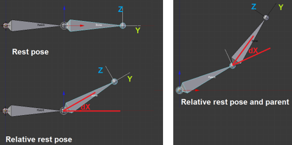

 
The picture above shows a transformation in the local coordinate system. Since the parent's local Y points along its axis and its local Z points up, the child bone is rotated around the local X axis. This is not very useful if the target armature has a diffent rest pose. To retarget the pose, we therefore reexpress the transformation in the global coordinate system, as shown below. The local X rotation corresponds to a global Y rotation, and by a different angle. Once the global transformation matrix is known, we can reexpress it in the target bone's local coordinate system.
  
The retargeting process thus consists of making two coordinate transformations:
Source local # > Global > Target local.
This will ensure that the source bone and the target bone will have the same global orientation.
 

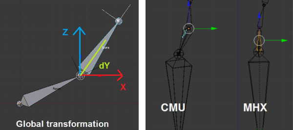

 
Unfortunately, things are a little more complicated. We do not always want the source and target bones to have identical orientation. In particular, the root or pelvis bone may point in entirely different directions in different  armatures. E.g. in the CMU armature rest pose the pelvis points forward-down, and in the MHX rig it points straight up.
 

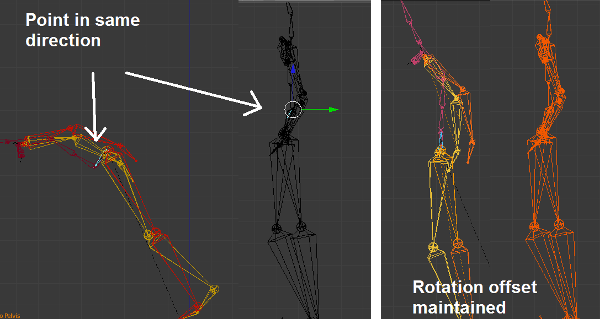

 
If we insisted that the root bone in the MHX rig would point in the same direction as in the CMU rig, the retargeting would not be very successful, as shown in the figure above. If we instead keep the rotation offset from the rest poses, the target pose becomes much better, as shown below.
To calibrate the source and target armature against each other, MalkWalk introduces extra keyframes at frame 0, where both armatures are posed in T-pose.
 

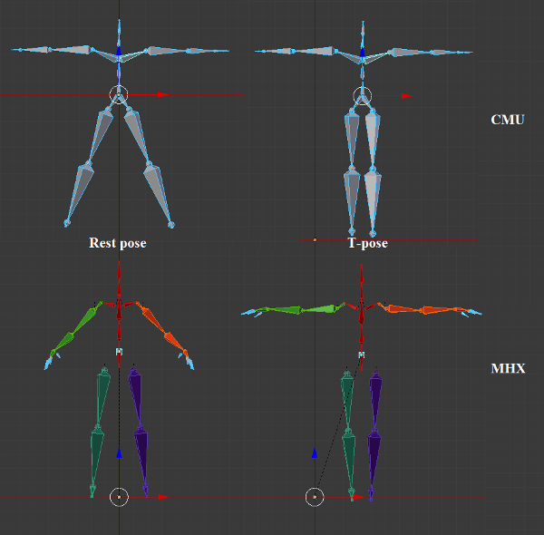

 
In the rest of the animation, bones in the target armature copy the global rotations of the source armature, apart from differences present in the T-poses. In this way we can transfer animations from CMU to the MHX rig, despite the fact that the rest poses are very different.
 

=### Basic Workflow

### Retargeting
The MakeWalk panels appear in the tool shelf whenever an armature is the active object. Select the armature and press the Load And Retarget button. In the file selector, select the .bvh file. We choose the file 90_04.bvh from the CMU database. It is a cartwheel animation.
 

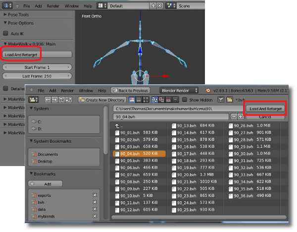

 
After a short wait, the armature is doing gymnastics.
 

 
At frame 0 of the animation the armature has been placed in T-pose. This is not part of the originial .bvh file, but inserted by MakeWalk to calibrate the source armature (defined by the bvh file) and the target armature (the selected armature in the viewport) against each other.
### Supported armatures
MakeWalk works with most straightforward biped rigs with FK arms and legs, such as the Rigify meta-rig. There is also built-in support for some more complex rigs: the MHX advanced rig from MakeHuman, the MHX rig from MakeHuman and Rigify.
 

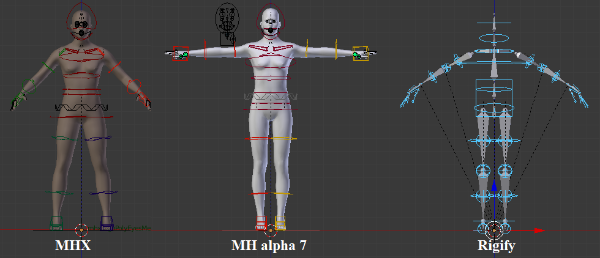

 
It is often possible to use MakeWalk with other complex rig, but in that case the automatic bone identification may fail. If so, a bone map must be defined manually, see -- [[Defining a Target Rig Manually]].

### Troubleshooting
Retargeting is a rather involved subject, and it can sometimes result in poor motion. The process may even fail completely, usually because MakeWalk failed to automatically identify the bones of a complex rig. If this should happen, see!LINK!http://www.makehumancommunity.org/wiki/Documentation:MakeWalk#Errors_and_Corrective_Actions -- Errors and Corrective Actions!/LINK!.

=### Where to find BVH files

There are several different formats that mocap files can be stored in. MakeHuman's mocap tool can only deal with files in Biovision BVH format. BVH files can be bought from many commercial sources, but a large range of mocap files are also available for free download. Here are some sites I found useful.
* CMU Graphics Lab Motion Capture Database: Hosted at Carnegie-Mellon University, this is a huge library of mocap files which can be downloaded for free. The web address is!LINK!http://mocap.cs.cmu.edu/ -- http://mocap.cs.cmu.edu!/LINK!.  CMU hosts mocap files in three formats: tvd, c3d and amc. However, the mocap tool can only read BVH files, so none of these files can be used directly. Fortunately, B. Hahne at!LINK!http://www.cgspeed.com/ -- www.cgspeed.com!/LINK!has converted the CMU files to BVH. The converted files are located at!LINK!http://sites.google.com/a/cgspeed.com/cgspeed/motion-capture -- http://sites.google.com/a/cgspeed.com/cgspeed/motion-capture!/LINK!.
  
* Advanced Computing Center for the Arts and Design (ACCAD): Hosted at the Ohio State University, this is another great source of free mocap files. BVH files can be downloaded from!LINK!http://accad.osu.edu/research/mocap/mocap_data.htm -- http://accad.osu.edu/research/mocap/mocap_data.htm!/LINK! 
* Eyes Japan (mocapdata.com):This is a Japanese company that sells mocap data commercially, but they also offer a huge number of motions for free. According to their homepage, mocapdata.com provides 744 premium motion data and 4197 free motion data. The only catch is that downloading requires registration. Not surprisingly, the homepage of mocapdata.com has the address!LINK!http://www.mocapdata.com/ -- http://www.mocapdata.com/!/LINK!.
  
* The Trailer's Park: Free mocap data can also be found at the Trailer's Park,!LINK!http://www.thetrailerspark.com/ -- http://www.thetrailerspark.com!/LINK!. This site does not offer original data, but offer repacks of mocap data from other free sites for download. Free download is limited to some five packs per day, so some patience is required here.
  
* Hochschule der Medien, Universität Bonn (HDM):!LINK!http://www.mpi-inf.mpg.de/resources/HDM05/ -- http://www.mpi-inf.mpg.de/resources/HDM05!/LINK! 
* The Perfume global site project #001:!LINK!http://perfume-dev.github.com/ -- http://perfume-dev.github.com/!/LINK!

### MHBlenderTools: MakeWalk user interface

=### The user interface

The user > interface of MakeWalk is located in under the Armature tab, and becomes visible when an armature is selected. It consists of six panels; the first one is open by default and the others are closed.
 

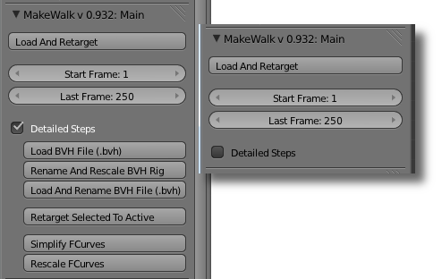

 
* Load And Retarget: Select a BVH file and retarget it to the active armature.
* Start Frame: The first frame in the BVH file to considered.
* Last Frame: The last frame to be considered, unless the animation stops earlier. The difference last_frame - first_frame is the maximal number of frames after retargeting. The number of frames in the BVH file may be larger, if some frames are skipped due to subsampling
* Detailed steps: When this options is selected, further buttons are show below
* Load BVH File (.bvh). Load a BVH file, and create an animated armature from it.
* Rename And Rescale BVH Rig. With the BVH armature active, and a target armature selected, rename and rescale the bones of the active armature to fit the target.
* Load And Rename BVH File (.bvh). A combination of the previous two buttons. With a target armature active, load a BVH file, and create an animated armature with renamed and rescaled bones.
* Retarget Selected To Active. Retarget the animation from a renamed and rescaled BVH armature to the active armature.
* Simplify FCurves. Simplify the F-curves of the active armature.
* Rescale FCurves. Rescale F-curevs of the active armature.What if retargeting fails?
MakeWalk is designed to retarget animations to a given armature with a minimum of user intervention. However, retargeting is a complex process, and entirely automatic retargeting may fail or result in suboptimal motion. Information about how to identify and correct problems is found in!LINK!/doc/node/blendertools_makewalk_troubleshooting.html -- Errors and Corrective Actions!/LINK!.
A common problem is that automatic identification of bones in the target armature fails. A bone map can then be assigned manually, cf.!LINK!/doc/node/blendertools_makewalk_troubleshooting.html -- Defining the Target Rig Manually.!/LINK!

=### Options panel

 

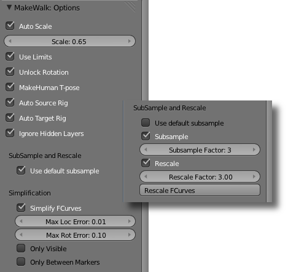

 
* Use Default Subsample. Blender normally plays the animation in 24 fps or 25 fps, but the animation in the BVH file may be recorded at a different speed. In particular, the BVH files from CMU were filmed at 120 fps. Enable this option to have the animation play at natural speed, irrespective of the frame rate in the BVH file. Other subsample options are described below.
* Auto scale. Set the scale automatically based on the size of the left thigh. This choice has two motivations:
* Almost all character do have a left leg.
* The leg size is crucial for making walk cycles look good.

* Scale. The default MakeHuman scale is decimeters - 1 unit = 1 decimeter. Translations in a BVH file are expressed in different units; often the base unit is inches, meters or centimeters, but more obscure units can also occur, e.g. in BVH files from CMU. If the scale is set incorrectly, rotations will still be correctly retargeted, but the character will appear to take giant leaps or miniscule steps.
* Use Limits: If this option is enabled, MakeWalk honors any Limit Rotation constraints, and will not allow excessive rotations. If the animation in the bvh files exceeds some rotation limits, this makes the retargeted animation less faithful. On the other hand, the rig may not be built for excessive rotations, so unchecking this option can lead to other problems.
* Unlock Rotation: If this option is disabled, MakeWalk honors any rotation locks. If the animation in the bvh files bend around locked axes, this makes the retargeted animation less faithful. If Unlock Rotation is enabled, any X or Z rotation locks are disabled. Y rotation locks (bone twisting) are never disabled. The reason for this is that in the MHX and Rigify rigs, forearm rotation is handled by deform bones controlled by hand twisting.
* Auto source rig. The source rig (i.e. the armature defined by the BVH file) is specified in the!LINK!/doc/node/blendertools_makewalk_source_and_target_armature.html -- Source Armature panel!/LINK!. Enable this option if the mocap tool should attempt to automatically identify the source rig, based on the structure of the bone hierarchy.
* Auto target rig. The target rig (i.e. the armature in the blend file) is specified in the!LINK!/doc/node/blendertools_makewalk_source_and_target_armature.html -- Target Armature panel!/LINK!. Enable this option if the mocap tool should attempt to automatically identify the target rig, based on the structure of the bone hierarchy.
* Ignore Hidden Layers. Ignore bones on hidden layers when identifying the target rig.
### Subsample and Rescale
If the Use Default Subsample option is set, the mocap tool will rescale the animation to fit the current frame rate. However, there are at least two reasons why you may want to load an animation at a different frame rate:
* * To obtain a slow-motion or rapid-motion effect.
* To quickly load an animation to see if the gross features will work out.
If the Use Default Subsample option is disabled, the SubSample section becomes visible.
* Subsample. Enable subsampling.
* Subsample Factor. If the value of this property is n, only every n:th frame of the BVH animation is loaded.
* Rescale. Enable rescaling.
* Rescale Factor. If the value of this property is n, the time distance between keyframes is changed to n.
* Rescale FCurves. Apply the settings above to existing F-curves rather than to the loaded animation.
Rescaling differs from simply scaling F-curves in the F-curve editor.
### Simplification
* Simplify FCurves. Remove unnecessary keyframes.
* Max Loc Error. The maximal allowed error for location keyframes, in Blender units. A larger error results in fewer keyframes but less accuracy.
* Max Rot Error. The maximal allowed error for rotation keyframes, in degrees. A larger error results in fewer keyframes but less accuracy.
* Only Visible. Simplification only affect F-curves visible in the Graph editor.
* Only Between Markers. Simplification only affects F-curves between the two outermost selected markers. The timeline must have at least  two selected markers.

=### Edit panel

Loading and retargeting is normally only the first step in the creation of an animation from mocap data. There are many reasons why a loaded animation does not behave exactly the way you want it to: artifacts in the mocap data, differences in armature structure not compensated for correctly by the retargeting process, differences in body stature between the mocap actor and the target character, or simply that the filmed sequence does not do exactly what you intend.. It is of course possible to edit the action directly in the graph editor, but this is unpractical due to the amount of mocap data. The mocap tool offers several possibilities to edit an action at a higher level. These tools are colleted in the Edit Action panel which is located just below the Options panel.
 

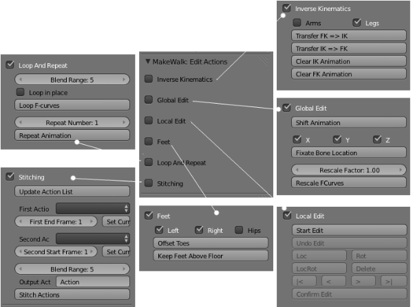

 
### Inverse Kinematics
* Transfer FK => IK: The load and retarget steps transfers an animation from a bvh file to the target character. However, only the FK bones are animated. Press this button to transfer the FK animation to the IK bones. Only works for the advanced MHX armature. If two markers are selected, only the animation between the markers is transferred.
* Transfer IK => FK: Transfer the animation back from the IK bones to the FK bones. Useful if the IK animation has been edited,
* Clear IK Animation: Remove all keyframes from all IK bones (arms and legs).
* Clear FK Animation: Remove all keyframes from all FK bones (arms and legs).
### Global Edit
* Shift Animation. Shift the keys for the selected bones at all keyframes.If two markers are selected, only the keyframes between the markers are deleted.
* X,Y,Z: F-curves affected by the next button.
* Fixate Bone Locations:Replace all location keys by their average. Only selected bones and keyframes between selected markers are affected.
* Rescale Factor: Factor used by next button.
* Rescale FCurves: Rescale all F-curves by the factor above. This is similar to scaling F-curves in the curve editor, but jumps are treated correctly. E.g., rotations of +180 degrees and -180 degrees are the same, but if we scale an F-curve with a factor two, the intermedate keyframe will have the average rotation 0 degrees, The Rescale FCurves button handles this case correctly.
### Local Edit
This section could be called "Poor man's animation layers". A loaded mocap animation usually has imperfections that must be edited, but without changing the overall feel of the motion. The Start Edit button creates a new animation layer where differences from the original motion are stored as keys, called delta keys since delta often denotes a difference.
* Start Edit: Start editing F-curves.
* Undo Edit: Quit F-curve editing, without modifying the original F-curves.
* Loc: Set a location delta keyframe.
* Rot: Set a rotation delta keyframe.
* LocRot: Set a location and rotation delta keyframe.
* Delete: Remove all delta keyframes at the current time.
* |<: Move to first delta keyframe
* <: Move to previous delta keyframe.
* >: Move to next delta keyframe.
* >|: Move to last delta keyframe.
* Confirm Edit: Modify the original F-curves and quit F-curve editing.
The delta keys are represented by markers in the timeline.
 

 
A delta key can be added with the Loc, Rot and LocRot buttons, and removed with Delete. There is no way to view the delta keys directly. In the viewport and the curve editor, the final pose is shown, which is the sum of the original pose and the delta key.
A common use for delta keys is to correct for intersection with other objects or the character herself. The typical workflow is as follows:
* * Start Edit.
* Set a delta key at a good frame just before the intersection.
* Set a delta key at a good frame just after the intersection.
* Edit the pose a the frame(s) where intersection occurs.
* If the intersection has been removed, Confirm Edit. If not, set new delta keys until it has, or Undo Edit to remove the delta layer.
### Feet
* Left: Affect the left foot.
* Right: Affect the right foot.
* Hips: Affect the characters hip (COM) bone.
* Offset Toes: Ensure that the toe is below the ball of the foot at all keyframes. Primarily useful for rigs with a reverse foot setup as explained below.
* Keep Feet Above Floor: If a mesh object (typically a plane) is selected, shift the keyframes to keep the affected feet above the plane. The plane does not necessarily lie in the XY plane; if the plane is tilted, the feet are kept on the plane's upper side. If no plane is selected, the feet are kept above the XY plane (z = 0). The IK feet are affected if the rig has and uses IK legs, otherwise the FK feet are kept above the floor. If two markers are selected, only the keyframes inbetween are shifted.
In a rig with a reverse foot setup, such as the MHX rig, the foot can rotate around the toe, ball, and heel. The reverse foot and toe bones are completely fixed by the corresponding FK bones, but the IK effector can be placed arbitrarily, as long as it ends at the toe tip. The transfer tool uses this freedom to make the IK effector perfectly horizontal, provided that the toe is below the ball and heel.
 

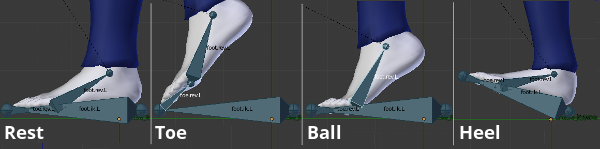

 
  
To use this feature we must ensure that the toe is below the ball of the foot, which is done by the Offset Toes button.
### Loop And Repeat
!LINK! -- Loop Animation!/LINK!
Create a loop of the action between two selected time markers, by blending the keyframes in the beginning and end of the loop. This is useful e.g. to create walk and run cycles for games. For good results, the poses at the beginning and end of the selected region should be similar.
* Blend Range: The number of keyframes used for blending.
* Loop in place: Remove the X and Y components of the root bone's location.
* Loop F-curves: Loop the animation.
!LINK! -- Repeat Animation!/LINK!
  
Repeat the action between two selected time markers. The actions should preferably be looped before it is repeated, to make the beginning and end match seamlessly.
* Repeat Number: The number of repetitions.
* Repeat F-curves: Repeat the animation.
### Stitching
Create a new action by stitching two actions together seamlessly.
* Update Action List: Update the first and second action drop-down lists.
* First Action: The name of the first action.
* First End Frame: Last frame of the first action
* Set Current Action: Set the first action as the current action.
* Second Action: The name of the second action.
* Second Start Frame: First frame of the second action.
* Set Current Action: Set the second action as the current action.
* Action Target: Choose between creating a new action and prepending the second action.
* Blend Range: The number of keyframes used for blending. Same parameter as in Loop Animations section.
* Output Action Name:
* Stitch Actions: Stitch the actions together.

### MHBlenderTools: MakeWalk armatures

=### Source Armature panel

MakeWalk transfers an animation from a source armature, defined in a bvh file, to a given target armature. It uses an intermediate standard rig described in!LINK!http://makehuman.org/doc/node/defining_the_target_rig_manually.html -- Defining the Target Rig Manually!/LINK!. The bone map from the source armature to the target armature hence consists of two parts:
* A map from the source rig to the standard rig. It is defined in the MakeWalk: Source Armature panel.
* A map from the target rig to the standard rig. It is defined in the!LINK!http://makehuman.org/doc/node/makewalk_target_armature_panel.html -- MakeWalk: Target Armature panel!/LINK!.
 

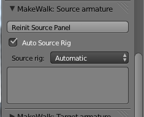

 
When a new scene is opened, the  panel consists of the single button Initialize Source Panel. Once this button has been pressed, the following content is available:
 

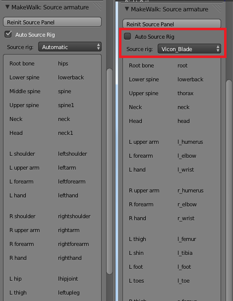

 
* Reinit Source Panel: Reinitialization.
* Auto Source Rig: If this option is enabled, MakeWalk will try to identify the source rig automatically. It may happen that MakeWalk fails to identify the source rig automatically, but this is very unusual. If it should nevertheless happen, it is possible to define the bone map manually in analogy with !LINK!http://makehuman.org/doc/node/defining_the_target_rig_manually.html -- how it is done for target rigs!/LINK!.
* Source rig. A list of bvh rigs recognized by the mocap tool. This either defines the expected source rig (if Auto Source Rig is disabled) or to Automatic.
* Bones in the active source rig.

=### Target Armature panel

The second part of the mapping from source to target armatures is defined by the panel labelled MH Mocap: Target armature. It is the top-most of the mocap tool panels, and is closed by default.
When a new scene is opened, the  panel consists of the single button Initialize Target Panel. Once this button has been pressed, the following content is available:
 

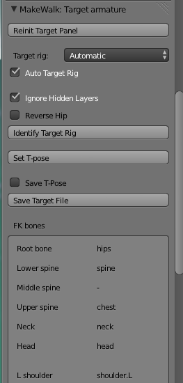

 
* Reinit Target Panel. Reinitialization.
* Target rig. A list of bvh rigs recognized by the mocap tool. This either defines the expected Target rig (if Auto Target rig guessing is disabled), or is set to a matching rig (if automatic target rig identificiation is enabled).
* Auto Target Rig. If this option is enabled, MakeWalk will try to identify the target rig automatically. However, automatic rig identification is not trivial for complex rigs, and it may fail. If so, the bone map may be specified manually, cf!LINK!http://makehuman.org/doc/node/defining_the_target_rig_manually.html -- Defining the Target Rig Manually!/LINK!. If the bone map is defined. The target rigs available by default correspond mostly to the rig presets that can be exported from MakeHuman
* MHX. An advanced rig from MakeHuman alpha 8.
* MH Alpha 7. The MHX rig from MakeHuman alpha 7.
* Rigify.

* Ignore Hidden Layers: Ignore bones on hidden layers during automatic rig identification.
* Reverse Hip. Select this option if the armature has an reverse hip. It is rather common that an armature has a reverse hip. In a normal hip setup, the armature root is the hip or pelvis bone, and the thighs and the rest of the spine are children of this bone. In a reverse hip setup, the first bone in the spine has been reversed. There is a separate root bone, and the two lowest bones in the spine are both children of thise root, whereas the thighs are children of the reversed hip.
* Identify Target Rig: Identify the target rig, i.e. find out how bone names in the active armature correspond to the internal names. This step is performed automatically during retargeting, but the identification can also be done separately for debugging purposes. The bone map appears in the area called FK bones below.
* Set T-pose. Pose the active armature in T-pose.
* Save T-pose. Option used by the next button.
* Save Target File. Save the current bone map as a .trg file. If the Save T-pose option is set, also save a json file defining the T-pose.
* FK bones. The bone map.
The picture below shows automatic rig identification of the Rigify meta-rig (Add > Armature > Advanced Human).
 

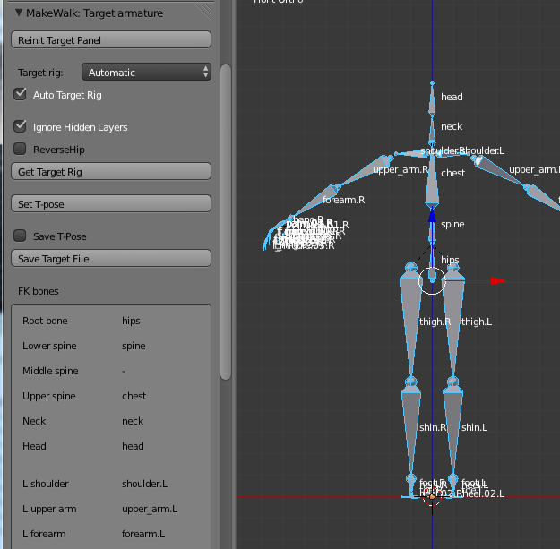

 
 

### MHBlenderTools: MakeWalk troubleshooting.

=### What if retargeting fails?

### Errors and Corrective Actions
This document will describe common errors and corrective actions.
It may happen that MakeWalk fails to retarget an animation to a given armature. In that case an error message is displayed.
 

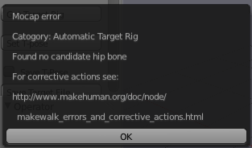

 
The error message consists of the following:
Mocap error
  
Category
  
Detailed error message
  
A link to this page
MakeWalk errors are grouped into the following categories:
* Load Bvh File
* Rename And Rescale
* Identify Target Rig
* Automatic Target Rig
* Manual Target Rig
* Identify Source Rig
* Retarget
* General Error
Load Bvh File
  
Rename And Rescale
  
Identify Target Rig
### Automatic Target Rig
The most common problem is probably that MakeWalk fails to identify the target rig automatically. There are several possible reasons for this:
* The character is not oriented correctly. In the rest pose, the character should be standing with up being the positive Z axis and facing -Y.
* The armature is complex with extra bones not corresponding to a standard biped rig.
* The armature only has IK arms or legs. MakeWalk retargets animations to the FK limbs, so if no such bones exist, the program will not work.
 

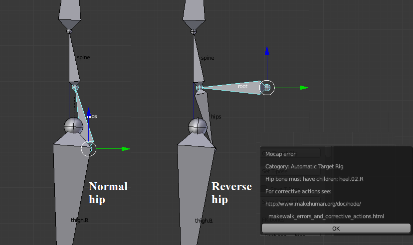

 
It is rather common that an armature has a reverse hip. In a normal hip setup, the armature root is the hip or pelvis bone, and the thighs and the rest of the spine are children of this bone. In a reverse hip setup, the first bone in the spine has been reversed. There is a separate root bone, and the two lowest bones in the spine are both children of thise root, whereas the thighs are children of the reversed hip.
 

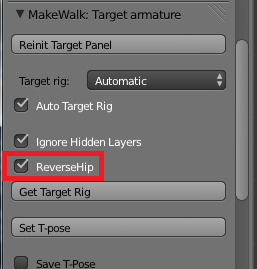

 
The advantage of such a setup is that the upper and lower body can be posed independently. However, MakeWalk failes to identify the bones, unless the Reverse Hip option has been enabled.
If automatic bone identification still fails, bone mapping has to be made manually. How this is done is described in the next section.
### Defining the Target Rig Manually
Internally, MakeWalk retargets animations to an armature with the following bone hierarchy.
Here is a visual illustration of the bone hierarchy:
 

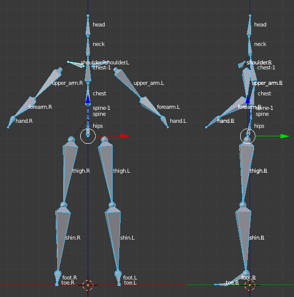

 
In order to retarget to an armature with different bone names, we must define a map between the given bones and the internal names. By default, MakeWalk attempts to do this automatically. However, automatic bone mapping may easily be confused for non-trivial rigs. If this happens, one can define the bone map manually.
A bone map for a target armature is defined by a .trg file located in the target_rigs folder under the makewalk directory. The folder already contains three files, for retargeting the MHX advanced rig, the MakeHuman, and Rigify. These rigs are too complicated to identify the bone map automatically, so MakeWalk recognizes these rigs and use the predefined bone map.
Create a .trg file using an existing file as a template. E.g., a .trg file could look like this:
Note that it is not necessary to define maps to all bones. Bone names must not contain spaces, since whitespace is used as a delimiter in the .trg file. If the bones in your armature do contain spaces, replace them by underscore ( _ ). MakeWalk treats space and underscore as equivalent, so this is not a problem, except for very strange naming convention.
 

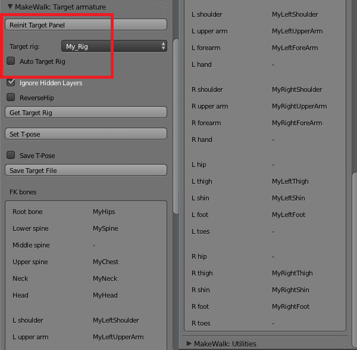

 
Save the .trg file with the name my_rig.trg in the target_rigs folder and press the Reinit Target Panel button.  My_Rig should now appear in the Target rig list. Select it. In the FK bones sections, the My_Rig bone names are now listed. Make sure that the Auto Target Rig option is deselected, to override automatic bone mapping. Finally go to the main panel and press Load And Retarget. The animation should now be loaded.

### MHBlenderTools: MakeWalk utilities

=### Utilities panel

This panel contains material that does not naturally fit into the other panels.
 

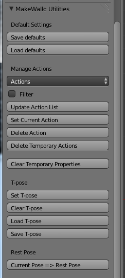

 
### Default Settings
* Save Defaults: Save current settings as the default settings.
* Load Defaults: Load the default settings from file.
### Manage Actions
* Actions: A list of all actions in the scene, at the time when the Update Action List button was last pressed.
* Filter: If selected, only actions belonging to the active character are included in the action list. When the mocap tool creates an action, the first four letters in the action name are taken from the rig name.
* Update Action List:
* Set Current Action: Set the action selected in the Actions list as the active action.
* Delete Action: Permanently delete the action selected in the Actions list. The action must have zero users. It is quite cumbersome to permanently delete actions in Blender. The reason is that creating an action with hand animation takes much work, which should not be lost accidentally. The situation is different with mocap, where it is easy to fill up a blend file with many irrelevant actions. This button makes it easier to clean out such junk motions.
* Delete Temporary Actions: Some tools create temporary actions, whose names start with a hash sign (#). Deletes all such actions.
### Temporary properties
* Delete Temporary Properties. MakeWalk creates some properties for relevant posebones during retargeting. Pressing this button removes these properties. However, be aware that some of the tools in the Edit panel may fail if the temporrary properties are deleted.
The temporary properties for the active posebone can be inspected in the N-panel.
 

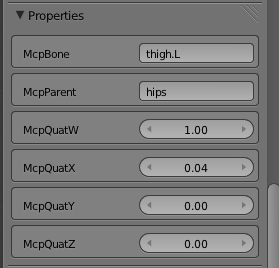

 
* McpBone: The name of this bone in the internal hierarchy.
* McpParent: The parent of this bone in the internal hierarchy.
* McpQuatW, McpQuatX, McpQuatY, McpQuatZ: The rotation of this bone in T-pose, represented as a quaternion.
### T-pose
* Set T-pose: Set the current pose to T-pose.
* Clear T-pose: Set the current pose to the default pose.
* Load T-pose: Load a T-pose from a .json file to the active armature.
* Save T-pose: Save the current pose as a .json file.
### Rest Pose
* Current Pose => Rest Pose: Set the current pose to rest pose.