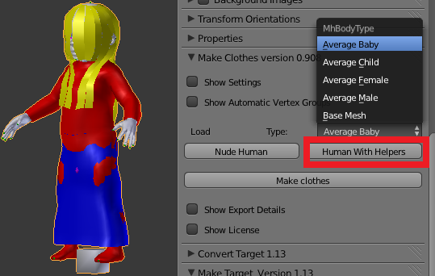
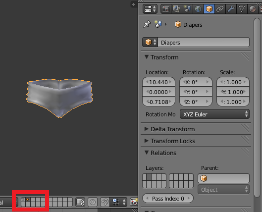
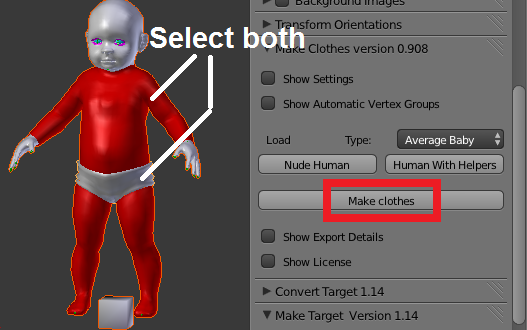
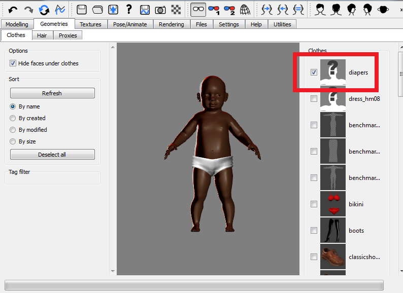

## Enable add-ons

MakeClothes is a Blender add-on. In order to use it, the add-on must first be enabled. Select User Preferences from the File menu, and open the add-ons tab. In the MakeHuman category, enable the MakeClothes add-on by checking the little box to the right, next to the running man. To make MakeClothes load every time you start Blender, press the Save User Settings button.

MakeClothes depends on MakeTarget, so you must enable this add-on as well, even if you do not intend to use MakeTarget itself.

## Loading a human

The simplest way to load a human into MakeClothes is to use the buttons in the middle of the Make Clothes panel, which is located in the N-pane to the left of the viewport. If the pane is not there, it can be made visible by hitting N-key. Select the type of human (currently the average male, female, child and baby are available, as well as the MakeHuman base mesh. Then press either Nude Human or Human with Helpers, depending on whether you intend to associate your clothes with the body itself or with the helper geometry. A human character is loaded into the viewport.

The helper geometry can be obtrusive, and there are several ways to get rid of it. We could simply delete annoying helpers, but since MakeClothes relies on vertex numbers being correct, that will only work if for helpers with higher vertex numbers than the part of the human that we will use. A better way is to scale down unused helpers and then hide them somewhere, e.g. inside the body. They must be far away from the surface of the body.

To hide hair and penis, select them from the materials tab, and scale down by a factor 10. They are now safely hidden inside the body.

## Preparing a piece of clothing

Once the human is in place, we proceed to model his clothes. The best practise is to place the human on one layer (e.g. layer 1) and the piece of clothing on another (e.g. layer 2). This makes it easy to quickly show or hide the human. If we make an entire outfit, the individual clothes can be put on different layers.

The clothing object should be given a descriptive name. This is important, because this will be the name of the exported file, and the name that is shown in MakeHuman. The clothes mesh must also consist of quad faces only, due to internal limitations in MakeHuman.,

It is good practise to also give the human name a descriptive name, e.g. Human. This name is not important because it is not used for anything, but it is helpful to immediately see whether the human is selected.

A common problem is that the body mesh may penetrate clothes, causing strange blotches of skin to shine through. This can mostly be avoided by making sure that the clothes mesh is everywhere on or outside the red tights helper, and that it is at least as dense as the body mesh. The baggier the clothes, the smaller the risk that skin will be visible through it.

## UV unwrapping

The mesh must be UV unwrapped. MakeClothes supports multiple UV layers, but every piece of clothing must have at least one UV layer.

## Assign vertex groups

Vertex groups must be assigned to both the human and the clothing to guide the vertex association process. It is often sufficient to let MakeClothes do that automatically.

The association of clothes mesh vertices to human mesh triangles is restricted to vertex groups with the same name. Therefore each clothes vertex must belong to exactly one vertex group, and the human and clothing must have the same vertex group names. The pictures above show the Left vertex groups, when Helpers and Tights were selected.

The Mid group (and any vertex group that starts with "Mid" or ends with "_M") plays a special role. Instead of associating a clothes vertex with a triangle (a triplet of human vertices), it associates it with a line (a pair of human vertices). If all vertices of the Mid group lie in the x = 0 plane, this plane will be preserved as long the targets do so.

Finally, the Delete vertex groups plays a special role. It is only created for the human mesh, and it is empty by default. The intention is that human vertices that will be hidden by the clothing should be added to this group, so MakeHuman can delete them and thus reduce the risk for penetration.

## Assign material and textures

Materials and textures are specified by creating them in Blender, using the old-fashion material editor; nodes materials are not supported. Since MakeHuman only supports one single material, the settings of the first material in the clothing's material stack are exported.

If the mesh has no material, it will be displayed as white in MakeHuman. This may be useful for debugging purposes, and it is what we will do here. However, if the mesh has a material, it must at least contain a diffuse texture, because otherwise the clothing will be invisible in MakeHuman. Therefore MakeClothes reports an error if the mesh has a material without diffuse texture.

## Making clothes

Once the clothes have been modelled and UV-unwrapped and all settings have been filled in, it is time to create the mhclo file. Select both the clothing and the human. The order is not important, because one mesh must be declared to be human (and to have the correct number of vertices), and the other must be a clothing.

Vertex coordinates must correspond exactly to what is shown in the viewport. This means that translation, rotation and scale transforms must be applied, all shapekeys must be applied, any parent relation or armature modifier must be applied, etc.This is done automatically by MakeClothes itself, to the extent that this is possible.

The vertex association is now made. This is a quite time-consuming process. You can follow the progress in the console window. For every tenth vertex, MakeClothes prints a line with the following content:

  Clothes vertex - Human vertex - Offset - Vertex group name - Clothes vertex group number - Human vertex group number.

If you used the default settings for the output directory, the diapers should now show up in MakeHuman, under the Geometries &gt; Clothes tab.

MakeClothes creates a folder named diapers, containing the two files diapers.obj and diapers.mhclo which describe the clothes mesh and vertex association to the human mesh, respectively. If a material had been created for the diapers, the file diapers.mhmat, describing the material properties, is also created. Moreover, all relevant textures are copied to this folder as well.

The diapers show up as a head with a question mark in the clothes selector. To avoid this, a thumbnail file must be created manually and placed in the diapers folder. The thumbnail should be a 128x128 pixel png image of the piece of clothing.