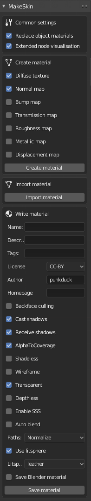
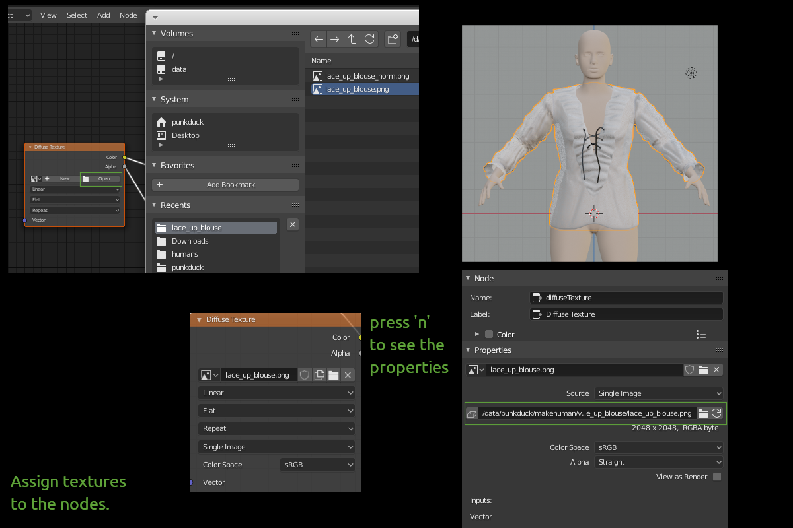

(documentation is under construction)

# MakeSkin

MakeSkin is part of the new blender tools and was created to have a better way to create materials for MakeHuman. Especially after geometry is created in MakeClothes, MakeSkin is designed to create a material which can be used in MakeHuman.

When MakeSkin is installed, it is detected and used by MakeClothes and Makehuman Plugin For Blender to get support for the full material model.

In the longer run, it is intended that the full MHMAT model should be supported, with both import and export to/from blender node setups. However, at this point, there are areas which do not map.

There are two ways to create a material:

* **create a new material**

* **modify an existent material**

## Create a new material

After a mesh for a piece of cloth was created and it was unwrapped to get an UV map, it is ready to export with MakeClothes to MakeHuman. However without a material, only a simple white default material is attached. It is possible to change this in MakeHuman using the **Material Editor** (Utilities). 

But in many cases it makes more sense to see the result in Blender before export, so it is also possible to create a material in Blender for MakeHuman.

First step is to decide which texture maps are needed. Typically a diffuse texture (containing the colors of the material) is a minimum. For clothes a normal map can be used to simulate the structure of the fabric.

There are 7 maps/textures available:

* **diffuse texture**
* **normal map**
* **bump map**
* **transmission map**
* **roughness map**
* **metallic map**
* **displacement map**

Select the ones needed. The blender material currently assigned to the mesh must be replaced. To allow this, select "Replace object materials". If you want a representation of the MakeHuman internal variables as Blender nodes, select "Extended node visualization". This is still an experimental feature and only shows a few additional nodes in node map.

----

For a makehuman material, the following parameters can also be changed, but they have no effect in blender. For most of the parameters the default settings are the best way, but there are some cases were they should be changed:

* **Backface culling** - set this to "off", when you are able to see the backfaces, typical for hair or skirt
* **Cast shadows**
* **Receive shadows**
* **AlphaToCoverage**
* **Shadeless**
* **Wireframe**
* **Transparent** - set this to "on" for a material, where more than one transparent layer will be visible, typical for hair
* **Enable SSS**
* **Litsphere** - typically leather is used. for hair and shiny assets some of the aniso-litspheres produce a better result

For the example the transparency effect is needed and it is also possible to see the backfaces.

----

After editing these parameters press **Create material**.

A node map is created with some empty texture nodes. The material name would be the same like the object name (if it does not already exist).

Assuming that the textures are already existent (e.g. created inside Blender or with a program like GIMP), now the texture names must be inserted into the nodes. After opening the file browser, select the filenames to insert.

If you are not 100% sure, what filename is used in the properties of the node, press "n" to see the properties. There should be an absolute path (starting from filesystem root like in the illustration) or a relative one of the file you selected. 

When filenames are added, the piece of cloth will be shown with texture like in the illustration.

Last step is to save the material. Before a few additional parameters can be added:

* **description**
* **tags**
* **license**
* **author**

<additional information about some parameters is still missing>

----

When you press **Save material**, file requester is opened and you have to search for the correct path and save material. All textures are copied to the destination as well.

If a material was created with MakeSkin, MakeClothes saves the material as well. 

----

<import material must be explained>