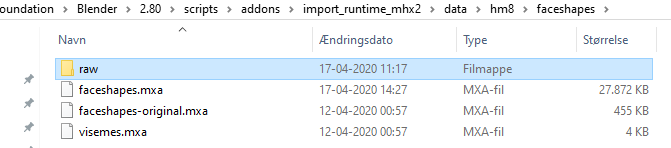
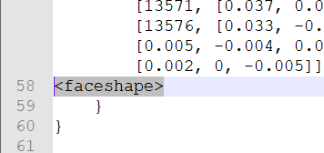
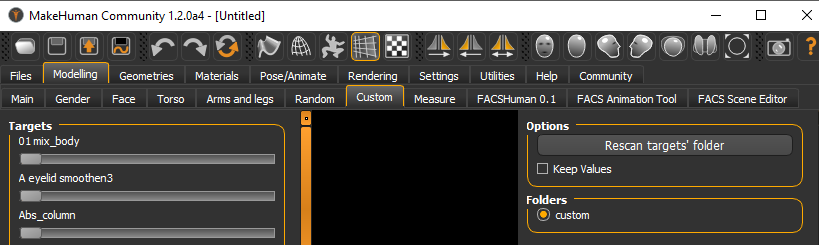
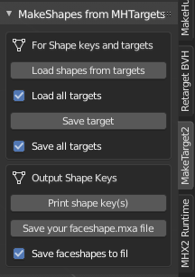

Please take a look at this page: [[Documentation:MH4UE|MH4UE]] - to get an overview of things you can use to get your Makehuman characters into Unreal Engine! 

* I am currently updating this page and the addon - to make it useful. --[[User:Assetdk|Assetdk]] ([[User talk:Assetdk|talk]]) 08:09, 30 January 2021 (UTC)

# MakeShapes for Blender
This is a new tool for importing MakeHuman Targets as Shape Keys in Blender. 

Please read the instructions below carefully and be sure to make a backup of any addons you change etc. 

## Find the addon on GitHub=
This is the link for the addon master: [https://github.com/AssetDK/makeshapes]

You need to add the addon to Blender and you need to know about two other addons, as described below. 
Currently this addon have been tested on Blender 2.80 only, but it should work on any Blender version that works for the two addons. 

### Current status# 
Thus far, in version 0.1.0 of the tool all of the Targets can be imported to Blender and the targets can be added to MHX2.

# Getting started with MakeTarget2
**It makes good sense to learn how to use MakeTarget2 first.** 

In general this addon was made by ''Joel Palmius'', and it builds upon the fact that you can directly transfer the characters you have loaded in MakeHuman. So start up MakeHuman and set it up to communicate with the Blender addon (This is done in the community/Socket tab, and the setting in the Blender addon must be the same. As they are by default).
### BaseMesh - this paragraph is for later# 
Now make your Basemesh human. The first time you used MH you probably made some very fancy model, as you can. However you now want a 'base' character, with as little customization as possible. You will want to be able to transfer parameters/attribures between characters when they are in Unreal, and for that reason they must share the same basic definitions. 

### MakeTarget import#  
The process is very simple, you load your basecharacter to MakeHuman, without any targets, but as you would like to see it in Blender/UE4/Unity. And then you go to Blender/MakeHuman and run 'Import human'! You should probably use the MakeTarget preset for this. This could look something like this, remember to use the preset Load button. 

In the current version of MakeTarget2 you will have two options - when you select the 'Body' or 'BaseMesh' you imported. This all happens in Blender/Object mode. Select to view the shape keys:

When you press the 'Load target' button you must locate an existing .target file. These can be found in a directory: C:\Users\<user>\Documents\makehuman\v1py3\data\custom (this may change depending on how you set up MH!). These are accessed in Makehuman via the Modelling/community "menu" - make sure to check out that you can find even more community targets!  

Try this now, selecting elf-ears.target and load this. Two new entries are made under shape keys: Basis, PrimaryTarget. And your character should now have elf ears! You can change the size of the ears, in 'Object mode'. The general scope of MakeTarget2 is that you can make a new target, or you can load one and change it - when you are satisfied with that you can save you new target file, import and use it in MakeHuman....: 

* Go to 'edit mode', 
* edit the elf-ears
* Press 'Save target' 
* Name your target elf-ears2.target and save it 

If you did this in the correct folder, your new target should appear in Makehuman and you can use it there! 

When you made one target you can not make one more, so you need to delete the Shape keys, in blender, to load/make a new one. Be sure to make a backup if your work was brilliant!
You may also notice that not all targets will get loaded correctly to Blender using MakeTarget2, I do not know why... 

You can now import your character from Makehuman make a new community Target and you can get it to work in Makehuman. Using two of the must have Blender addons.

::However you also may have noticed that MakeTarget2 do not work on your entire base character it will "only" import the mesh and the shape keys can not be used as such if you moved it to Unreal.

# Using **MHX2 import**
Now try to EXPORT your MakeHuman character in **MHX2** format - from the MakeHuman application. You probably already know that you can load and save characters, and you can not "transfer" them to Blender. But some of the data appears to be lost, left out or missing when you look at the character in Blender. 

However when you make use of the 'MHX2 runtime' import you will notice that it imports shape keys - however these shape keys are not visible  when you look for them in MakeHuman! There are similar to targets, but they are not the same! MHX2 runtime simply can add some predefined 'Face shape and face shape drivers' to your character, when you thick the box before you import. (You can also chose to import the Base mesh, the Proxy or both..!)

You should try to play around with the MHX2 import options. I ended up with some very specific settings, as I want to import the character in UE4 - you may find that you need different settings depending on what your needs are.

In case you think you now know enough about MakeTarget2 and MHX2 import, you can now take a look at what can be done with MakeShapes.

::Now lets get started!!

# Using MakeShapes
You should be familiar with Makehuman, MakeTargert2, MHX2 import - that is you should be able to perform the following tasks: 

* 'Import human' for the base human character from Makehuman to Blender. (do this now)
* You should have installed MakeTarget2 to blender and you can now install MakeShapes - notice that it will install with MakeTarget2. 

MakeShapes works exploits the fact that MHX2 import imports shape keys, so MakeShape will simply merge these shape keys with the targets. In order to not mess this up please follow the instructions. 

There is two manual steps to do before you can use MakeShapes: 
* find the faceshapes.mxa file, make a backup and make your faceshapes_BASE.mxa file
* Find the community target files, that are used by Makehuman

### Initial setup for faceshapes.mxa# 

You don't need to use MakeTarget2, but you will now need to locate some **.target** files, and the faceshapes.mxa that you will use soon!
With your file explorer try to locate this directory, on your computer (The version ext may be difrent for your installation): 

 C:\users\<your user>\AppData\Roaming\Blender Foundation\Blender\2.80\scripts\addons  <--- **where all addons are when installed**

 C:\users\<your user>\AppData\Roaming\Blender Foundation\Blender\2.80\scripts\addons\import_runtime_mhx2\data\hm8\faceshapes <-- **the files you need, soon**

 C:\users\<your user>\AppData\Roaming\Blender Foundation\Blender\2.80\scripts\addons\import_runtime_mhx2\data\hm8\faceshapes\raw <-- **the files you add to, soon**

This is how my directory shows up:
 
  

You will notice that my faceshapes.mxa file is not looking like yours. I recommend that you make two copies of that file and call them faceshapes_BASE.mxa and faceshapes-original.mxa. (- do not change or delete the original!) 

Now make a new folder, anywhere where ever you want, and **move** the new file faceshapes_BASE.mxa there, then edit this file and add one line <faceshape> at the bottom of the file, but above the two } } lines, like this: 

  

Please note that you will not need to do this again, unless there is a new version of the MHX2 addon.

### Initial setup for target files#  
Before you do this you should add all the targets you want to use to Makehuman. you find these under modelling/custom! And you can download even more from 'Community'/'Download assets'

 

The **.target** files are located in the Makehuman directory, your setup may be different, but on my computer this looks like this: 

  C:\Users\<user>\Documents\makehuman\v1py3\data\custom

You take a copy of all the files (or you may prefer to do this with a few .target files at first)  -  add the selected files to the MHX2 raw folder: 

 C:\users\<your user>\AppData\Roaming\Blender Foundation\Blender\2.80\scripts\addons\import_runtime_mhx2\data\hm8\raw

You can simply add more .target files to the directory, as you need! To be on the safe side make a backup copy of the .target files! 
After this you should be good to go!

## Using MakeShapes=
'''Disclaimer - sadly I have found that the lager part of the .targets does not work properly. They seem to work, somewhat, inside Makehuman, but they do not work in Blender and they definitely do not work in Unreal. The problem seems to be that the shape keys only affect the body mesh, so shaping the face will not have any effect on the eyes (or indeed bones). 
'''
 

### How to, make shapes# 

MakeShapes installed, you should see the above. 

* You imported the standard character from the running Makehuman. Using the MakeTarget settings!
* You locate the shape keys, under "object data", this icon: 

. 
* You can now press the 'Load shapes from targets' button (if you want to you can load a single target, this happens when you uncheck the corresponding checkbox). 

The target files you want to load are those you found before:

 C:\Users\<user>\Documents\makehuman\v1py3\data\custom

If you do not uncheck the checkbox all .target files will be processed - now the targets should appear in Blender, as shape keys, and they should be active and working!

::**WARNING!!** You should not use the 'Save Targets' buttons, it will save all of the .target files, but I think they are useless.

Next step is to press 'Save your faceshapes.mxa file' button, select the same folder where you placed the faceshapes_BASE.mxa file. 

This will produce a new and bigger faceshapes.mxa file. 

Your final task will be to copy this file to the MHX2 directory:
 C:\users\<your user>\AppData\Roaming\Blender Foundation\Blender\2.80\scripts\addons\import_runtime_mhx2\data\hm

Now when you import any Makehuman MHX2 file and check on the 'Face shapes' and 'Face shape drivers', all of the targets will be added to the character! 

You do not need to do anything else..
### Getting errors# 
Some of the larger targets will probably give you errors. Remove the .target files from the import folder. 

### Limitations to shape keys and morph targets# 
While working with Blender and Shape keys you will find that while they are just fine for Usage in Blender and rendering, but they are often useless for animations. That is shape keys will only work on the mesh and bones will not follow the shape of the mesh. The same apply to morph targets. 

Quite many of the Makehuman targets will work just fine for you in Blender. Most of them may also work fine even with animations, but a few of them can not be used in UE4.

# Use in Unreal 4
Please view this page: [[Documentation:Saving_models_for_Unreal_Engine_and_how_to_import_them_there|Saving models for Unreal Engine and how to import them there]]. - your base character should be working fine and you probably already have the basic shape keys working in Unreal as-is? 

Your next step is to MHX2 import the proxy version of your base character and export it as FBX. You may want to re-import the FBX or perhaps you should first try to import the FBX as a new file? 
When you follow the prescription you should now have a solid character that have more morph targets than you can handle! 

Lucky for you I am working on the next version of MakeShapes, that version will enable you to export the morph target information in a format that can be used in **a character customization widget.** 

### Different versions of faceshape.mxa file!!#  
The MHX2 import can only use one faceshape.mxa file, but you can now start working with several versions. Primarily you would want the have a male and a female version, and perhaps even some variations. 
### Skeletons# 
When importing your characters you will find that you only need one skeleton, or perhaps a male and a female skeleton. Whit these you will only need to retarget these two - and your various characters will all be using the exact same animations. 

# MakeShapes progress
### MakeShapes, done.... # 
While MakeTargt2 can help you modify existing target it will not help you much when you what to "transfer" shape keys. My very first attempt on learning Python and making a new Blender addon involved using VSCode and and extension called 'Blender code' - whit that you can run Blender and the load and debug an existing addon... this was what I did with MakeTaget2. 

Messing around with the code I found out how to change the names of the shape keys, name to the "file name". After that it was easy to read all .target files from a directory and add them all as shape keys! This took me only half the way though... as I wanted the shape keys to merge with the character, any character, that I made in MakeHuman. I did try several tools for transfer shape keys, but some did not work at all and some would transfer only party or with some issues. So I finally looked into how the original set of shape keys came to Blender. And I found that the 'MHX2 import' added "face shapes".. that were not part of the original export! 

Using the MakeTarget2 print/save functions enabled me to "dump" the raw 'Shape key' data to print/files and I am now able to cut/paste the "printed" version. Say, the elf-ears, can now be add to the file that 'MHX2 import' works with, and the shape keys will be added to the imported Blender characters... for both Base/proxy mesh. Right now MakeShapes will export the selected shape key only. 

### MakeShapes todo# 
* The addon must be packaged and put on Github (done, but thre is a "new" version)
* I need to output all of the shape keys, in one "faceshape" file.
* I want to be able to process expressions. 
 * C:\Users\<user>\AppData\Local\makehuman-community\makehuman\data\expressions
* I what to be able to process all expression builder targets