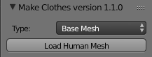
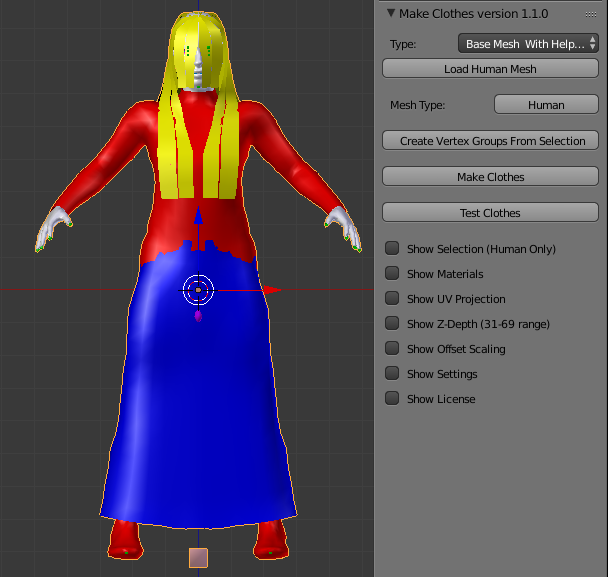
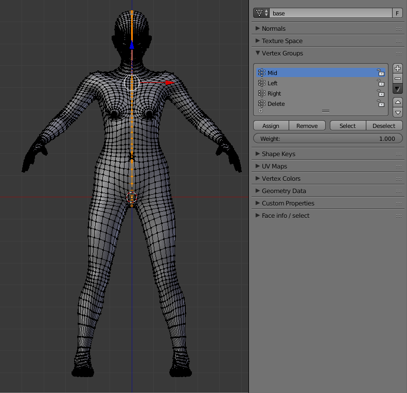
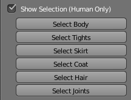
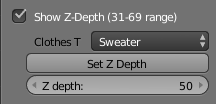
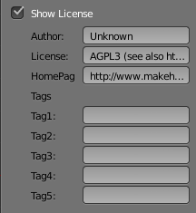

## Introduction

MakeClothes, as its name implies, is a Blender addon that is used to construct clothing assets for use in the MakeHuman program. Clothes can be modeled using any technique that is natural. For example, clothing can be modeled from scratch, or by altering either the human mesh or the “clothing helpers” (see below) provided by the MakeClothes tool. When designing and modeling a clothing item, there are two restrictions that should be kept in mind. First, the algorithm for mapping a clothing mesh to the human mesh requires that the clothing mesh consists entirely of quad faces. Second, it is important to know that MakeClothes supports only one material per item of clothing.

Upon completing the MakeClothes workflow, a new folder will be created by the tool within your HOME/makehuman/v1/data/clothes. That folder will assume the unique name that the user provides for the clothing item. This folder will be populated with the assets necessary to make the item available in MakeHuman. The one additional, useful but not essential, item that the user must supply is a thumbnail icon for the clothing. The thumbnail icon can be created with any image editing program as a 128 x128 pixel image in .png format. The file should then be saved in the same folder as the other assets and the extension changed to .thumb.

## Standard Tools

### Using MakeClothes addon

 MakeClothes is controlled by the MakeClothes panel in the N-shelf to the right of the viewport. It consists of the main buttons that are always visible, and several hidden sections that can be displayed by enabling a checkbox.
 

 

The main section contains the following:
* Type: Specifies the character to be used as a reference. It can be one of the following:
** Base Mesh: The MakeHuman mesh without any targets applied.
** Average Male: A caucasian young male.
** Average Female: A caucasian young female.
** Average Child: A caucasian young child.
** Average Baby: A caucasian young baby.
** Base Mesh with Helpers: The MakeHuman mesh without any targets applied.
** Average Male with Helpers: A caucasian young male.
** Average Female with Helpers: A caucasian young female.
** Average Childwith Helpers: A caucasian young child.
** Average Baby with Helpers: A caucasian young baby.
*Load Human mesh: the button to load the selected type into the scene.

Note:"helpers" in MakeHuman are a type of special, invisible geometry over the base mesh which can be loaded to help model clothes, for example, a helper sweater, helper tights, etc. They have their own materials. It is important to note that no alterations should be made to the base mesh type after it is loaded otherwise the script will fail. The image (right) shows the result of pressing "Load Human Mesh", with type set to Base Mesh.
 

 A human mesh is loaded into the viewport, and more tools are enabled:

* Mesh Type: MakeClothes divides meshes into two types: human and clothing. This button displays the mesh type (Human/Clothing) of the active mesh and is greyed out if the active object is not a mesh. (MakeHuman normally detects the items accurately, but in the event of an error, you can click the button to change the mesh type so that it is treated as a clothing item instead of human if it is a clothing item and incorrectly detected).
* Create Vertex Groups From Selection: MakeClothes uses vertex groups to control the fitting.
* Make Clothes. This is the main entry point for the MakeClothes script. With one human and one piece of clothing selected, create an association between clothes vertices and human triangles, i.e. triplets of human vertices. Both meshes must have vertex groups with identical names, and each clothing vertex must belong to exactly one vertex group. The result of the association is saved in the file ObjectName/ObjectName.mhclo, in the default directory. This button is greyed out if the active object is not a mesh.
* Test Clothes. This buttons loads a piece of clothing (an .mhclo file) and fits it to the active mesh, which must be a human. Typically a second human is loaded on a different layer, and the quality of the clothes fitted to that character can immediately be checked in Blender. To test the clothes under the strictest conditions, the human model used for testing should be quite different from the human used for clothes-making. If the original character is an adult, Baby With Helpers is a good choice.

If, instead, the Human With Helpers button is pressed, the full MakeHuman mesh including the helper geometry is loaded. Different materials are assigned to each type of helper geometry. The materials are ordered in the order of the vertex number. This makes it easy to peel off one helper type at a time.
 

### Glue clothes to the body

The clothes are meshes that can be modelled directly in Blender, or in another package and then imported into Blender as an obj file. Note that the mesh type is Clothing, which is the default unless the mesh has been declared to be a human. A simple method to obtain a starting point modelling is to duplicate part of the human mesh and separate it from the human. However, in this case the duplicated mesh will still be a human. To change the mesh type, press the toggle button Human. The status is now changed into Clothing.

After loading the human, the next step is to "glue" the clothes to the human, in order that they will automatically fit the body changes. To control this association, MakeClothes uses vertex groups. Each clothing vertex must belong to exactly one vertex group, and a vertex group with the same name must exist in the human mesh as well. Only human vertices in the correct vertex group will be considered when making clothes.

Vertex groups speed up the clothes-making process by pruning the search tree, and can be used to control the appearance of clothes as well. However, assigning vertex groups can be quite tedious, and in many cases it is sufficient to let MakeClothes create vertex groups automatically. This is done automatically when a human mesh is loaded. If a clothing mesh does not have any vertex groups, it is also done automatically, when the MakeClothes button is pressed.

### Automatic vertex groups

 If vertex groups need to be reassigned, for example because a piece of clothing has been edited, the automatic vertex groups can be used. When the human is selected, there is a button, visible in the image (above right), called "Create Vertex Groups From Selection". Selecting a cloth, the button changes to "Create Vertex Groups". Both the buttons do the same thing, but there is a little difference: in the human it is possible to generate the vertex groups only for a sub set of the vertices (selected in edit mode), while for clothing the vertex groups must include all vertices. This is because we need to associate only a part of the human vertices with all vertices of the clothing. For example, we need to associate all the vertices of a skirt with the human torso only.
 

 Pressing the button, the following vertex groups are created:

* Mid: Vertices on or very close to the center line (|x| < 0:001).
* Left: Vertices to the left of the center line (x > 0:001). For a human the Mid vertices are also included in the Left group.
* Right. Vertices to the right of the center line (x z 0:001). For a human the Mid vertices are also included in the Right group.
* Delete: An empty group only created for humans. Human vertices hidden by the piece of clothing can be added to this groups. These vertices are then optionally deleted when the clothing is applied in MakeHuman, thus avoiding that blotches of skin poking through the clothes. Note that when a vertex is deleted, so are all faces containing this vertex. Don't assign a vertex to the Delete group unless all faces containing it are hidden by the pieces of clothing.
In the images (right), we can see the vertices assigned to the Mid and Left groups for a nude human.
 

### Generate the clothes file

When both clothing and human has the vertex groups with same name, just press the MakeClothes button to generate the files.
They will be located in your HOME/makehuman/v1/data/clothes, in order to be inbcluded automatically in MakeHuman.

## Advanced tools

Under the main buttons of Makeclothes, there are seven hidden panels that can be activated clicking the checkbox. Let's see their meaning.

### Show selection, Show Materials, Show UV projection

*Show selection. This feature is just a shortcut to quickly select some part of the human. So, instead of classic Blender selection (go to edit mode, move the mouse on a vertex and press Lkey to select the linked vertices), you can just press these buttons.
 

* Show Materials. This shows a button to export the materials only. This is useful when there are no changes to the geometry, but only to the material, in order to avoid recalculating everything.

* Show UV projection. This section is useful mainly for making proxy meshes.
** Recover seams. Creates a Seam object, which has edges where the selected mesh's UV layout has seams. The Seam object is intended to be a reference for marking seams for the clothing.
** Auto seams.
** Project UVs. Automatically create a UV layout for the clothing, compatible with the human's UV coordinates. This is intended for the mask UV layer, which must be compatible with the body mesh for all clothes. The actual texture can use a different UV layer which can be laid out in any desirable manner.
** Reexport Mhclo file.The mhclo file must be resaved when the mask UVs have been defined. This can be done by pressing Make clothes again, but Reexport Mhclo file is faster.
 

### Show ZDepth, Show Offset scaling
 

* Show ZDepth. This option is used to assign a depth to the cloth, in order to hide skin and clothes which are covered by clothes on top of it. The Z depth specifies the stacking order, which decides which clothes should hide others. Normally the Z depth ranges between 0 (skin) and 100 (external accessories such as backpacks).
** Depth name. Roughly indicates the preferred Z depth for various clothes types. The choices are: Body, Underwear and Lingerie, Socks and Stockings, Shirt and Trousers, Sweater, Indoor Jacket, Shoes and Boots, Coat, Backpack.
** Set Z depth.Set the Z depth depending on the selected depth name.
** Z depth.The value of the Z depth. This is changed by the Set Z depth button, but can be set manually for fine-tuning.
 

* Show Offset scaling. The location of a clothing vertex depends on two data: a point on a body triangle, described in barycentric coordinates, and the offset from that point. The offset is scaled in the X, Y and Z directions depending on the size of a certain body part.
** Body Part. Set this to the body part which is most affected. The choices are: Custom, Body, Genital, Head, Torso, Arm, Hand, Leg, Foot.
** Examine Boundary. Select the boundary vertices with Set boundary is invoked.
** Set Boundary. Set the boundary to vertices determined by the selected body part.
** Custom Boundary. To manually set the bounday box.
** X1, X2, Y1, Y2, Z1, Z2. The vertex numbers of the six vertices which define the scaling boundary. The X scale is determined from the distance between vertices X1 and X2, the Y scale by Y1 and Y2, and the Z scale by Z1 and Z2.
 

### Show Settings, Show License

* Show Setting. The settings include the author name and the export path. It's possible to save and restore the settings. 
 

* Show License.This set of options are to add the author name, the type of license and the tags for clothes. Licensing information to be put at the top of the exported mhclo file. It consists of three strings that can contain arbitary text.
** Author. Defaults to: Unknown.
** License. Defaults to: AGPL3
** HomePage. Defaults to: <NOWIKI>http://www.makehuman.org/ -- http://www.makehuman.org/</NOWIKI>
 