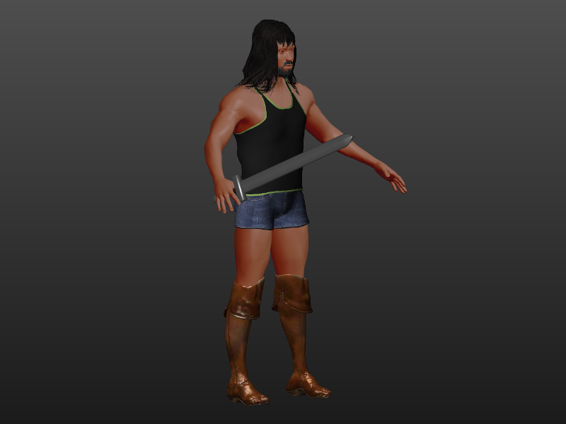
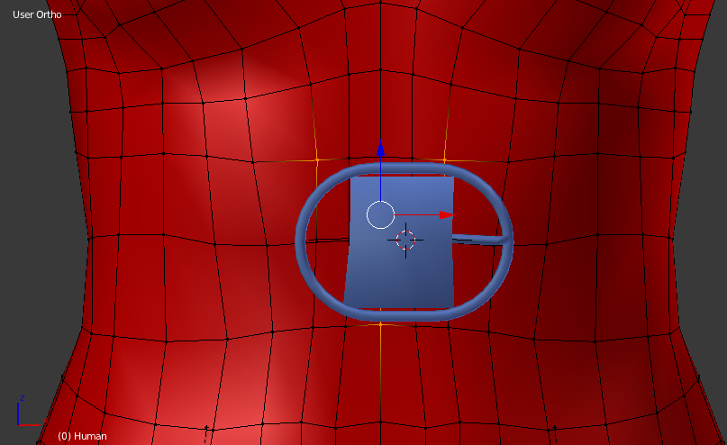

A common problem with creating "hard" items is that they tend to look very strange in MakeHuman. As the character changes (for example between male and female), items deform to fit the new shape. This is what you want with soft items (for example clothes), but is undesirable in the case of hard items (for example tools, buttons, glasses and similar). 

## The "*" group

Fortunately, it is possible to tell MakeClothes that a set of vertices should scale linearly instead of deform. This is done by creating a vertex group with an asterisk. When doing so, the vertext group will scale only in size, but the relative distance between all the vertices in the group will remain the same. 

## Case in point: a sword

A sword would look strange if it got all bent just because a female toon held it (even disregarding the misogynist implications).

It's entirely possible to make a sword that looks good with most toons, even babies. 

First start with making a sword. Here's quick draft of how it could look. The thing to note is that it has depth, it's just not a single 2d plane. 

Mark seams, UV-unwrap and set a material as noted elsewhere in the MakeClothes docs. 

Assign all vertices of the sword object to a new vertex group called "*sword"

Mark exactly three vertices on the palm of the human toon. These are what will control the size of the sword

Assign these to a new vertex group (on the human) called "*sword" 

Set license, author, homepage and so on and so forth and click "MakeClothes". You now have a non-deforming sword in MakeHuman

The item used to create this tutorial is available at http://www.makehumancommunity.org/clothes/crude_sword.html

## Other hints for hard items

For clothes, it will usually makes the most sense to select the "*" group on the "clothes helper" layer of the human rather than on the body itself. Particularly in the breast are for female toons, the scaling 
might become problematic otherwise. 

