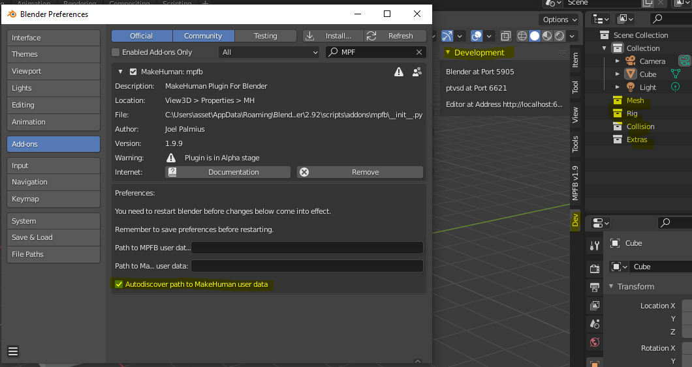
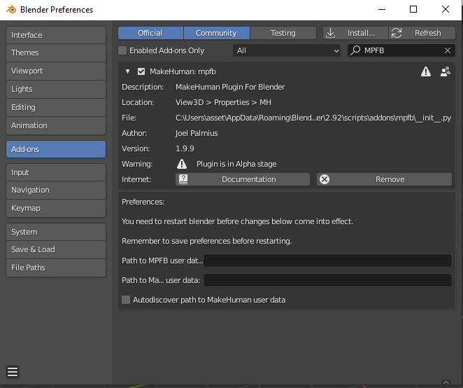
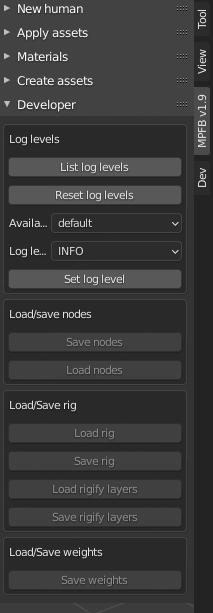

Go back to [[Documentation:MPFB|MakeHuman Plugin For Blender - main page]]

# MPFB2 getting started with VS code
On this page you will find notes, tips and hints - in general I intend to make notes on how MPFB2 was implemented as I learn and hopefully this can help others to understand the addon, debut it, make extensions/suggestions and perhaps you can even learn how to make your own addon? 

## Getting started= 

As of now VS code - actually Visual Studio Code - will be refereed to as VSC. For your information VSC is a free version of the professional tool called Visual Studio, Both are provided by Microsoft. Visual Studio is used by companies that have a portfolio of software and it is often used as a front end for different repository systems, this is needed when you have complex systems and a need for keeping track of software versions. If you use VSC you will learn a bit... but never mind, lets get to the first issue you may run into. 

### Running the addon, startup to-do# 
I found that the addon currently depends on that you have MetaHuman (1.2.0?) running already. The addon will try to connect with this and "reuse" some of the setup...

### The very first issue!!# 

Getting Blender running from VSC, you need to open the folder in VSC and ctrl-shift-p and select the runtime - in my case D:\Blender\stable\blender-2.92.0-windows64\blender.exe - but if you do this like I did you will just see Blender start up and then pass-away. if you are new to VSC you may not notice that there is a message about this on the console - the operative part is: PermissionError:. This rather meaningless, however but what happen is that did already install the addon with this Blender version 2.92.0... and in short you need to unload and uninstall the addon you want to run/debug in VSC.

This is what Blender should look like when running from VSC - I highlighted tree things:

* It looks like 2.9.2 (or perhaps MBPF2) adds collections to the Scene: Mesh/Rig/Collision/Extras.
* When running from VSC you will get a extra DEV tool-tab, this is good to know i you are running Blender both ways.
* When running from VSC the add on gets installed - and it will **remain installed as is,** when you run (the same) Blender stand alone without VSC.
::

:
### The 2nd issue - upgrade the addon!# 
Well perhaps not, but you may well run into this - as did I. 

You can not (always) simply install the latest version of the addon on top of a older version. I ran into this and was happy that I made a backup. To install the first version I downloaded mpfb2-latest.zip, unpacked the files directly in a folder called Blender/addon/mpfb2-latest and ran VSCode from that folder. These are the steps you need to follow, to go to the new version:  

* Open blender 2.9, disable the MPFB2 addon and close Blender
* Move the old zip file to Blender/addon/mpfb2-latest 
* Rename the old folder Blender/addon/mpfb2-latest to say * Move the old zip file to Blender/addon/mpfb2-latest-1
* Download a new version of the mpfb2-latest.zip MPFB file. 

Now you should be able to run the new version from VSCode as it were. You will get a message: 
::Could not read preference mpfb_user_data 

If you set the preferences they are now "lost", I don't know where it is saved...

### Blender preferences# 
This is what the MPFB preferences look like in the current version. 
::

Please note that the auto discover appears to depend on the running MetaHuman program.

### Developer options# 
These are the developer option: 
::

### Using GitHub?!# 

Placeholder for how to get the addon.

### Inspect an error# 

Placeholder for looking at the console and reporting errors.

### Debug the code# 

Placeholder for "digging in" and inspecting the code.

### Adding your own code# 

Placeholder for - how to "sample" the existing code, adding your own menus/buttons and functions.

### MFB2 in Blender# 

Placeholder for "how are the MPFB2 components organized in Blender".

### Useful Blender things# 

Placeholder for learning to use Blender via MPFB2!

### Useful VSC things and extensions# 

Placeholder for VSC specific tips.

### Useful Blender addons# 

Placeholder for addon specific tips.