::**Please take a look at this page: [[Documentation:MH4UE|MH4UE]] - to get an overview of things you can use to get your Makehuman characters into Unreal Engine!** 

Also look at the Forum here for more tips [14&t=18462&p=52859&hilitMH4UE#p52859 MH4UE](http://www.makehumancommunity.org/forum/viewtopic.php?f#). 

There are, currently, several pages for this, describing the process of getting MH to Blender and then into Unreal. And one describing the addon that will add more "shape keys" to your characters (while in blender). 

* [[Documentation:Saving_models_for_Unreal_Engine_and_how_to_import_them_there|Saving models for Unreal Engine and how to import them there]].
* [[Documentation:Saving_models_for_Unreal_Engine_Materials|How to setup Unreal materials]].
* [[Documentation:Unreal_MHC|Unreal MakeCustomization]].
* [[Documentation:MHBlenderTools: MakeShapes|MakeShapes - getting more shape keys/morph targets]]

* [[Documentation:MPFB|MakeHuman Plugin For Blender]].

# What can and can't be done?
I have been working on getting different characters into UE4 for some time, and this have been a real hassle! 

On this page I want to summarize what I managed to get done using a workflow that involves Blender. I have had a focus on not going into much details regarding any of the tools, but you will need to know a few things. Even though this looks like a trivial task there are some pitfalls and also there are some things that can not be done, or I have just not found out how to. I will eventually also add links to all the YT tutorials I found helpful. 

I found that working with Makehuman very easy, so focus will be very UE4 how to specific.  

This is what I will cover thus far:

* Create and save any MH character in Makehuman. Basic stuff, and important things to avoid. 
* Getting the character into Blender - import or link?
* Setup Blender for Export, shape keys and morph targets 
* First import into UE4 
* Introduction to more shape keys
* Mixamo animations 

This is the stuff that I did not cover - yet: 

* Animations for talking (other tutorials may help)  
* Making custom cloth 
* Hair 

This is the stuff I can not get to work: 
* Retargeting to Advanced Locomotion System V3/4 
* ALS got something to work! [[Documentation:Saving models for Unreal Engine and how to import them there/ALS]]

* [[Documentation:Unreal Engine ALS V4]]

Since I am using/learning Blender 2.8, I want to share a bit of bonus info. I managed to make one of the free UE4 packages work a bit "better". That is your characters should have some transportation. This is how: 

* [[Documentation:Unreal Engine Vehicle Variety Pack]]

# Getting started
I wanted a quick way to populate a UE4 game, preferably with an unlimited number of varied characters of high quality. This has proven to be a bit harder than expected. The workflow for making characters is not as trivial as one would want but this guide should make it a bit more easy to do. I will focus on describing the "straight" path from Makehuman and into UE4 - so you will not find too much details about Blender. Please refer to Blender specific pages for more on that. 

## Need to know=
There are a few terms that you need to know, say you need to know that you will import FBX, textures and other files into UE4. Also you will need to know that a Character consists of a **Mesh''', a '''Skeleton''' and '''''materials''** (that refers to textures). I will try to elaborate on these subjects as we go along...   

## Making a base-character=

 **IMPORTANT new comment:** 
 There is now tree different custom A-poses that you can use - i currently recommend the one highlighted in the list.
 Please read more in the [[14&t=18462&p53368#p53368 forum]](http://www.makehumancommunity.org/forum/viewtopic.php?f#), for more information. 
### Set up Base-Character(s)# 
Makehuman provides a range of predefined characters that is supposed to work as-is. You can just load a character, export it to FBX and import that into UE4 - and after a bit of work you can have a working player character! There are however a few pitfalls, so I suggest you make one (or more) base-character(s) that you can elaborate on as you go along. I will be working with **'''averagedude'''** as my base-character.   

These are the steps to make the base characters: 

* Open Makehuman 

* Select the files tab and load the character 

 **Under 'Geometries'**  
 * Remove cloth - (uncheck Hide faces under cloth)!
 * Remove hair 
 * Add Teeth
 * Choose Topology - **I have no advice on this - but see comment below!**
 * Chose Eyebrows/Eyelashes, these can be changed as you go along - as can eye colors!
 * Add Tongue01 (again I have no advice/recommendation on that, yet)

 **Under 'Materials'** -  I will show you how to work with UE4 "advanced" materials:    
 * Chose any skin that you like,
 * Chose any eyes that you like 

 **Under 'Pose/Animate'**
 * Chose Skeleton: Uengine - if you do not have this already you my get it via the community tab?
 * Chose Expressions: none 

 * For the POSE chose the Apose_ue
 * 

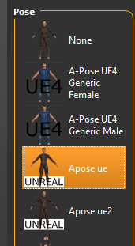

 

 * Finally, from one of the poses documentations I found this comment: This pose is a near drop in fit for the Unreal mannequin using a generic male with standard proportions and 187.5 cm height.
   (You should probably use this, I have been using a height of 168-190, where the better result came from 190) 

And this is it! But there is one 'important' option you need know about - you need to **uncheck** the Smooth button!

The smooth button/option: 

 should be unchecked... that will make your character a bit less attractive, but this will preserve the shape-keys! 

Makehuman comes with some 50-60 **shape-keys''' and these will all be available as '''morph-targets** in UE4. I will show you how to make more shape-keys, using makehuman+blender!

Now it is time to save your base-character - even though you have made very few changes to the file you should save this file under the save tab and name it 
<your-name>-base (say averagedude-base), you can even add your very own tag 'base' to this. 

When you save the file like this you will be able to reload it, and we need that later!

### =Choose Topology/Shape keys## 
When you make your base character without smoothing you get shape keys, and you want to share these between different characters. Specifically you would probably want to share face morphs between male and female characters - and there may be other base character variations, say old/young/child etc. 

Later I will focus on how to make new shape keys, using blender - depending on how you want to do this you may want to **chose Topology that is compatible between the different characters!**  That is you may be able to transfer one "shape" from a male character to a female character, but the result will depend on ''topology compatibility''. I will/may thus update this section to make sure 

**Shape key names** will be the same for all of the base characters, as they come from  - however you will be able to make new keys. You must name these keys the same for all MH characters, like these share the same skeleton (MH_Skelton) they must hold all the same shape keys names. If they don't your game may "break"....

### Export your base-character#  
You can now take a break - or you can export your work. There are really tree options for you to look at: 

* Save the FBX file directly - make sure to chose the binary file format, if you want to import this file to UE.  
* Save a MHX2 file (you may need to install this as a option/utility, find our elsewhere!) 
* Load the character to **Blender** directly via the link (I will get back to what can be done using that!)  

I suggest that you save your base-character now, in both formats - FBX and MHX2! Make a specific 'Base-Characters' folder, because you will need it!

When you export the FBX use these options:

  

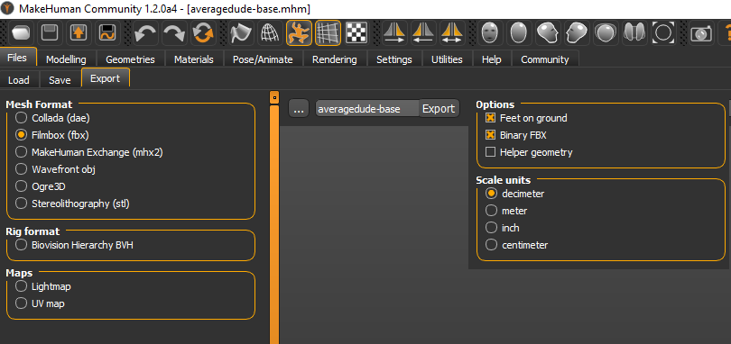

This is the result for me, you should see something like this also: 

  

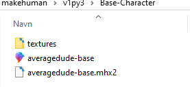

You should also see that there is a sub-folder, called Textures - this is where the different textures are saved and it should now look like this: 

  

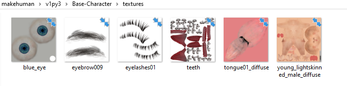

You can now go over all of the different textures, so you will have a wide selection to chose from. Textures are saved every time you save a FBX file!
Say, I change the base-characters textures, saved the FBX - and this is what I got:   

  

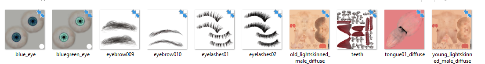

### Import your base-character to UE4 - FBX#  
The FBX file will actually import directly to UE4, but there are a few problems! You should export your FBX file as Binary FBX, and you will get the most out of it. After this you can get to this result (after adjusting the materials, as seen below): 

 

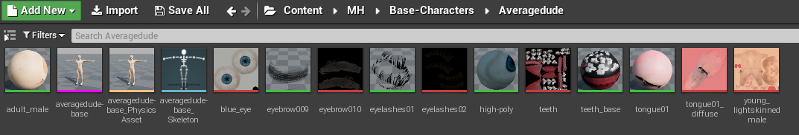

Your character can look like this (after adjusting materials) - pretty good: 

  

**HOWEVER, you have lost the morph-targets! And as you probably noticed, the UE4 standard FBX import do import them!** 

I will get back to what to do about the shape-keys... but let make the materials first?

## Makehuman UE4 materials=
The details for setting up materials was moved to this section: **[[Documentation:Saving models for Unreal Engine Materials|Materials]]**

### =Customization##  
The skin can now be modified using a simple interface in the game. The prototype for this can be seen here: [[Documentation:Unreal_MHC|Unreal MakeCustomization]].

### More materials?# 

You can simply drag and drop more textures from the the base-character/textures folder, then duplicate and rename the materials, and apply different textures to the renamed materials. At some point I want to be able to customize/randomize (NPC) characters, but I have not yet done that. 

Also you can make materials instances with parameters... I will show you howto, but first we need to turn shape-keys into morph-targets.

# Use Blender v 2.80 to get more!!
For some reason the exported FBX file is not organized in a way so you will get the shape-keys imported directly to UE4. However when you follow the next steps, you will not get the correct materials imported, so I recommend that you run FBX import as shown above, and save the textures/materials in a separate folder.

If you are new to Blender please run a few tutorials specifically on on how to import/export, and also get to know about collections - you can do a lot in Blender and you can get confused!

## What will be done here?=
I will show you how to: 

* Import your MHX2 files, to preserve the shape-keys
* Export FBX files, so UE4 will import correctly with morph-targets
* Apply expressions etc. to your base character
* Import these to your Blender file and apply the expressions as **new shape keys**  

## But, first import and inspect FBX and MHX2!=
As you may remember you exported two files, the FBX file and the MHX2 file. You want to import both of these files into Blender, so you need two Collections, called FBX and MHX2. You right-click on the 'Scene collection' select 'New' and rename the collections to 'FBX' and 'MHX2'... I also added Scene collection and dragged the Camera and Light there (as I deleted the box). After this you should see something link this (the small Icons may be different):

 

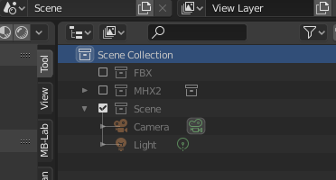

When you import your FBX file select/highlight the FBX collection, so the FBX data get imported into that collection. You can use the standard import options. For MHX2 you need to change the setting to match those you see below - when you find they are correct you can click the + sign, marked with a yellow arrow, and save the setting with your own setting-name. 
(You may notice that the character you imported is out of proportions, some 17-18 meters high, we will correct that when we export to UE4!)
 

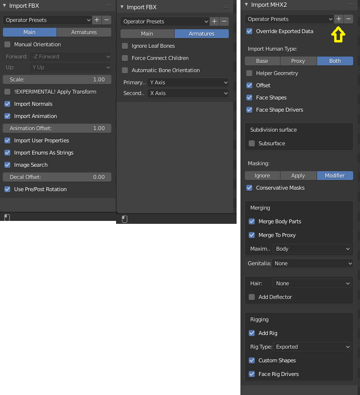

### Inspect the results, in Blender# 
Now is a good time to save the Blender file. You should save this in the same folder as the FBX and MHX2. I call this file averagedude-base.blend.   

If you did this approximately as described the result should be munch like below. And you will probably notice that there is some structural differences. You can see that by looking at the small icons 

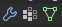

, that represent where modifiers, vertex groups and Object data is stored! Specifically the Object data holds the shape-keys and those were not imported. (perhaps because I did not use the correct FBX import options - but the same happens in UE4!).  

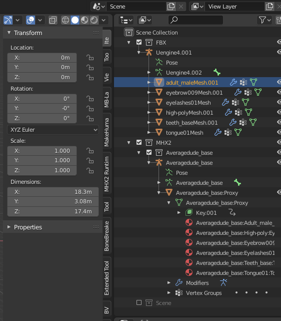

You will notice that the MHX2 version of your character holds the Object data (the triangle) and that shape-keys can be seen there!

## Export the FBX for your base character, and import to UE4=
The next step is crucial for getting things to work in UE4, it is not very complicated but you need to have a plan. 

When you did this correctly you should be able to get the following results: 

* Import your base character into UE4
* Create retargeting for your common skeleton - called MH_Skeleton
* Retarget the Maniqin animations to your base character(s)
* Get additional Mixamo animations
### FBX export settings# 
**Important!''' Before you go any further you should rename your base character to '''main_root**, like this: 

 

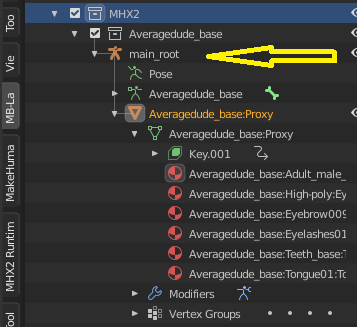

.... you should do this for all base characters! main_root will be the root bone in your skeleton. When you do it like this, all of your base characters will be able to share the same skeleton! 

Now select the MHX2 collection where you have the character, and go to Export FBX.

I have made a 'Operator preset' for the FBX export, this is the options you need to set: 

 

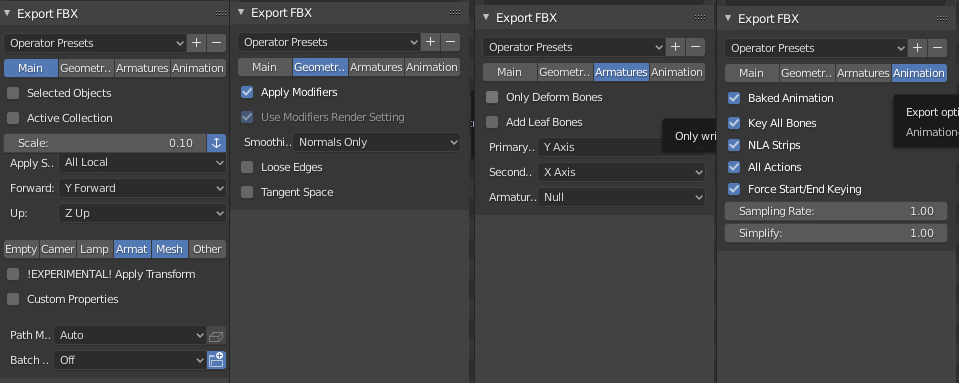

Place the FBX file in the same folder as where you placed the original FBX and the MHX2. You probably do not need the FBX that you made with Makehuman, and you can always make it again?
(You may however want to export more FBX files from Makehuman, simply to get all of the textures. We will look more into how you can use the skin textures!)

## UE4 import, and retarget =
Go to your UE4 project and make a MH folder containing a new avaragedude folder, and import your base character there!
During the import of the FBX file from Blender into UE4 you must enable the **Import Morp Targets** checkbox manually (expand the Mesh section)!

Observe that this character looks very much like the one you did already import from the original FBX, there are little difference - yet you want to set up this as your real base character. 

Also you want to rename the skeleton to **MH_Skeleton**! And you want to open the skeleton, and retarget it to the humanoid rig... this should look like this: 

 

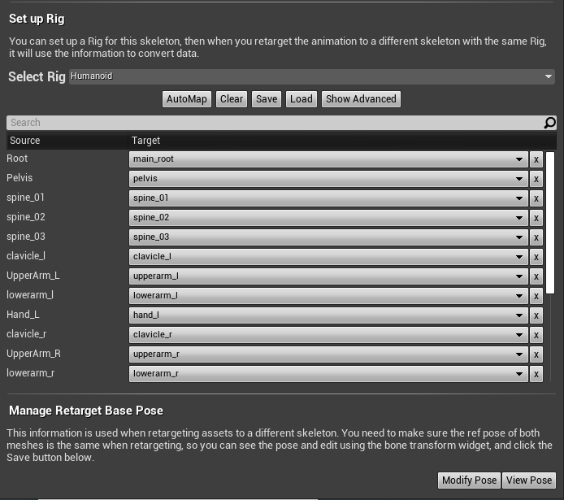

Make sure that your character is in T-Pose, as you want to retarget the Mannequin animations to your characters MH_Skeleton!
Make a animation folder in your MH, perhaps even Mannequin folder?  

You go to the UE4 folder: Content/Mannequin/Animations and right-click on this animation: **ThirdPerson_AnimBP**

Select retarget and choose MH_Skeleton as your target - also select the animation folder you made before, something like this: 
 

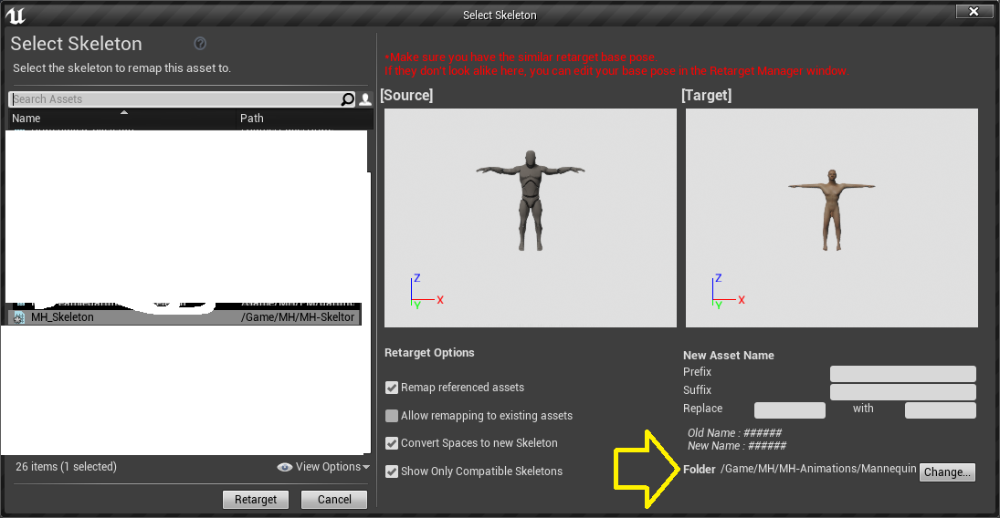

  **Important update:''' You want to use the Pose called '''"UE4 A-Pose for generic male"** - that can be downloaded from the Community/Download assets/pose.   

You may want to rename your new ThirdPerson_AnimBP to **''MH''_ThirdPerson_AnimBP** - or perhaps simply MH_AnimBP?

### Translation Retargeting# 
After the retargeting the animations will still look odd. You go to the skeleton tree, then check off the "Show Retargeting Options" and set those at and below the spline to Skeleton (recursively) - that looks something like this: 
:(Make sure to set the translation to skeleton for ALL bones, but the two first ones)

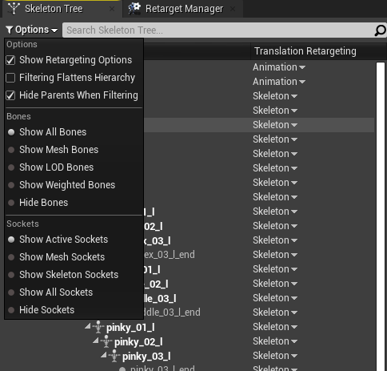

# More shape keys, made in Blender 2.8
I have not yet made any target in MH, also I have not had much luck in using the two blender addons. Frankly I don't really understand what the different buttons does, most of them are not active... perhaps they make sens if you use Blender a lot?

But I will show you different ways to get expressions, targets and skeleton animations(!) to shape keys, so then will be new morph targets in UE4!

Before you get started you should probably look at a few Blender tutorials regarding this - these are good: 

### Tutorials# 

General introduction to MHX2 import and animation. However **do not** import the resulting characters into UE4? 

{{#ev:youtube|2P1t_nogbGs}}

Short general introduction to using shape keys in Blender 2.8: 

{{#ev:youtube|e675Ulc7QL4}}

## Expressions and targets=
Make sure that you have your original base character saved and load it into Makehuman. Remember to check that your base character is in the T-Pose, do not change that!

 **Just in case:** I recommend that you keep a copy of this file as well as all the blender file etc.

You should also have Blender open and load the .blender file where you saved both your FBX and the MHX2.
Before you go on do as follows: move the MHX2 character to x 10m, so the entire character moves to the left (right to your front view) - this will make it more easy for you to work with! (Save the blender file!)  
 

**This is the general workflow for transfer of expressions:**

Makehuman:
* Go to the Pose/Animate tab and select Expressions. From the list select the first expression, Anger01.
* Save the character as .mhx2 - but to a different file name: averagedude-base-expression.mhx2. 

Blender:
* In blender, deselect all the collections
* Import the file you made, using the same operator presets as yo saved them.
* Activate your Base character collection and you will have two characters side by side - one base character and a very angry one!
* Go to object mode
* **Left-click-select''' the angry guy first, then '''shift-left-click** your base character. 
* Go to the vertex tab/shape key, and click on the little down arrow, and select the ''Join as shapes'' - like this:
  

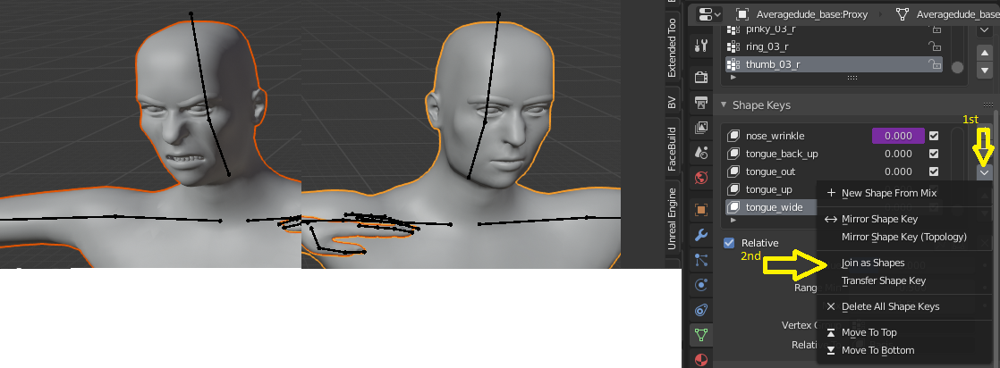

  This will make a brand new shape key: Averagedude_base_expression:Proxy

* You rename the shape key by a double-click and call it **Exp_Anger01**.. 
* ... and assign the Vertex group to head 
  

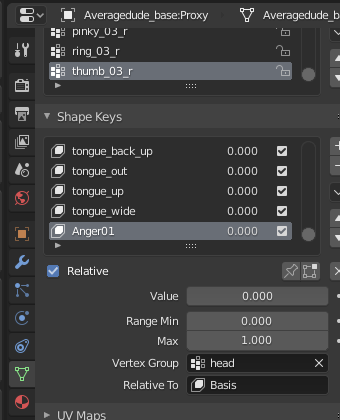

In case you can not select ''Join as shapes'' the two characters were not selected in the right order, or perhaps the topology is not the same. Blender will show this as a message some where at the bottom of the screen. I this happens try the blender workflow, in this paragraph only , again!

You can now try to change the value for the shape key, and you should see that your base character can get angry!

When this worked for you you can save the blender file! And you should now do your very first re-import of the FBX. You save your base character in a FBX and Import it to UE4. To be 100% safe you can save and import to different names and folders, but in the end you will re-import the base character each time you do one or more new shape keys. 

When you see this working in UE4, you can go on to the next expressions - I simply delete the Averagedude_base_expression collection and save the next expression in  the same file. You can naturally do as many expressions as you want. leave some out etc... as you like!

## Observations about Blender 2.8=
You may notice that you can mess this up, so please save your blender file and back up! Say you can easily merge your base character with the expression MHX2 or do something else to corrupt your work! 

Please also note that the Vertex Group/relative to, **head''' and '''Basis**,  are rather important! The shape key will change the entire body, to the T-Pose, if head is not set. Likewise you can make some shape keys relative to an other shape key - this will be important a bit later, when we do more "advanced" stuff!

# Blender 2.8 - a bit more advanced?
This is very fine - we can make your base character use all the expressions, and they can be combined! Also you can tamper with them in UE4, say you can combine them and you can even set minus values, or extreme values not "allowed" in Blender. But you obviously want more than that? 

Perhaps you can find some special "targets" you want to use?