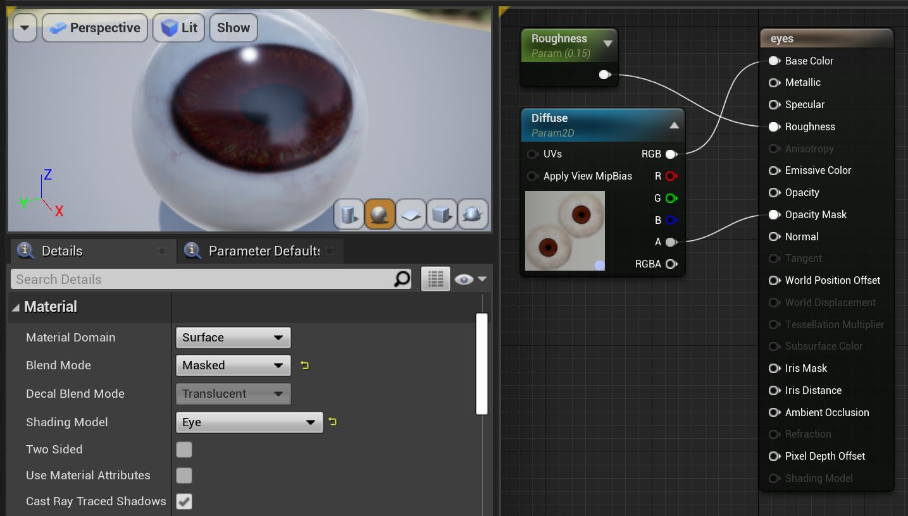
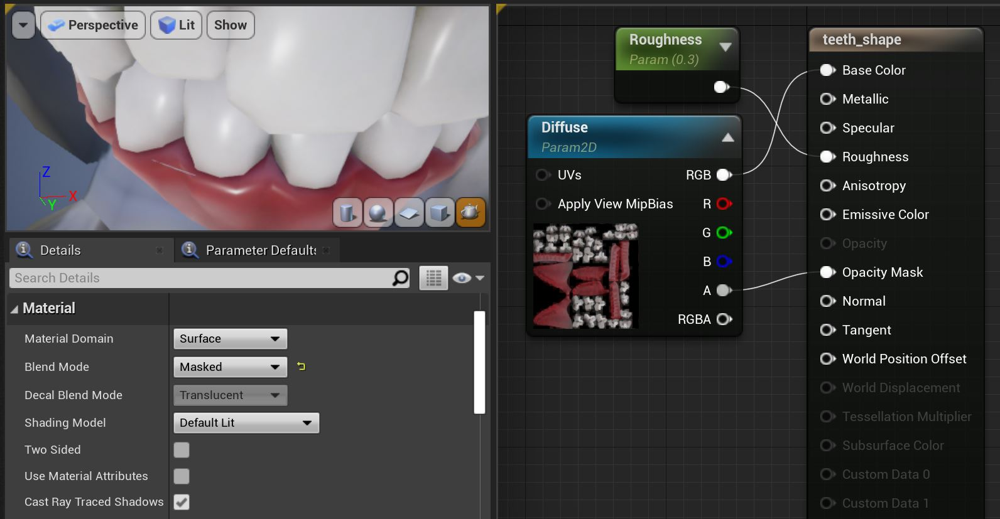
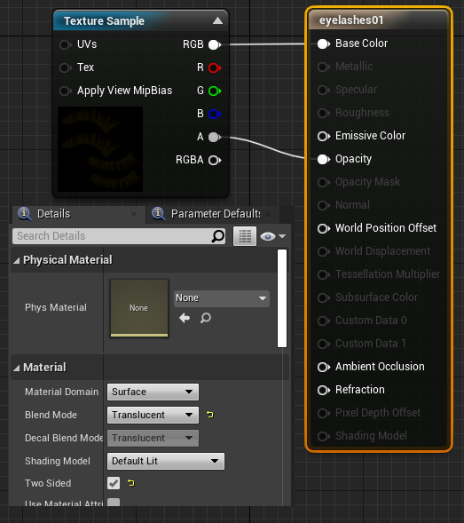
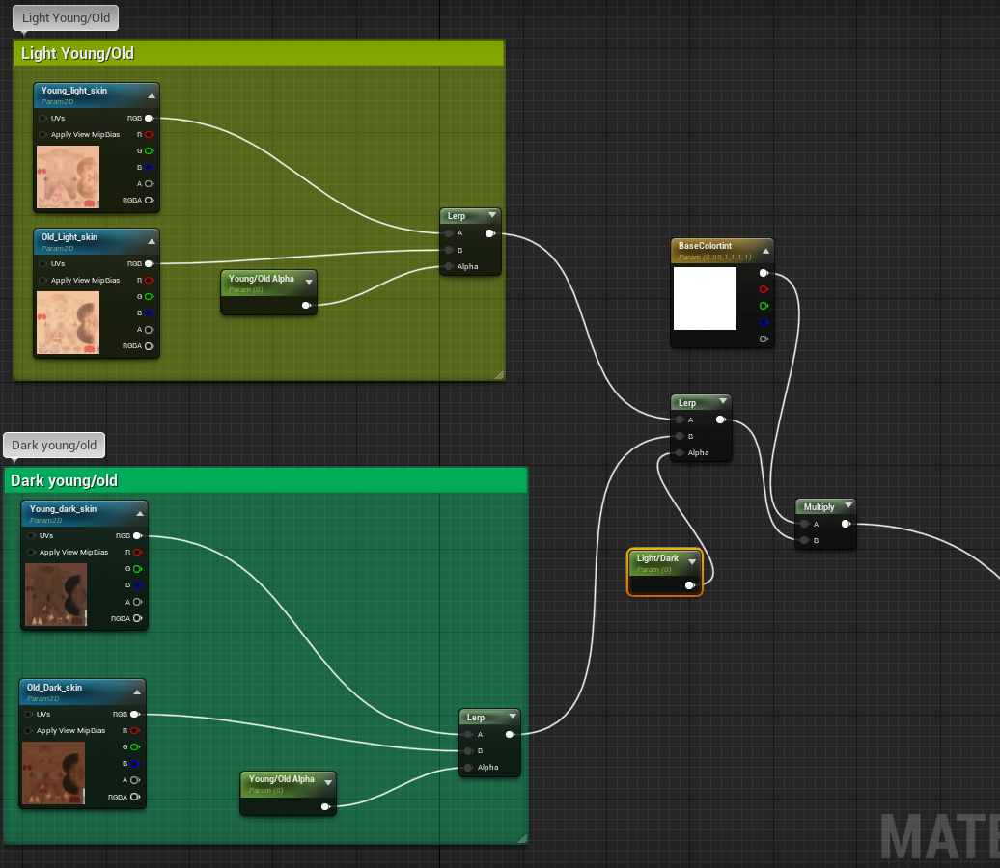
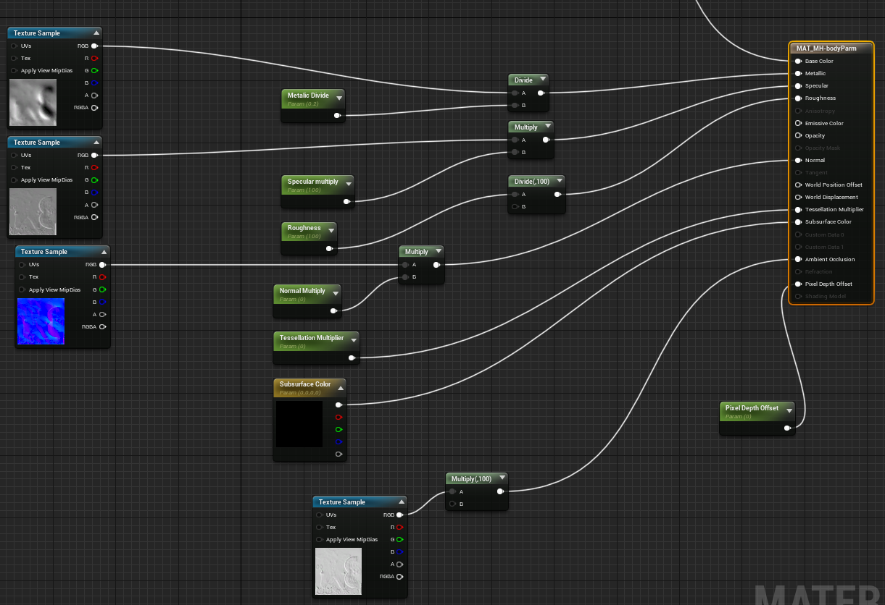

When you import the FBX made you exported from Makehuman, both textures and materials are made. You will also notice that UE4 will try to match the materials correctly to the material slots, as seen above in the 'Asset Details' of, in my case, averagedude-base (do not worry about the physics and the skeleton yet!).

To get you started, we need to take a look at the Eye, Eyelashes and Eyebrow materials... 

## Getting started=
You will notice that when you import the original FBX file and Import it into Unreal, the "correct" materials are created. You can thus, in principle, export/import all the skin variations to Unreal in this way. BUT, you can also go to the **makehuman\v1py3\Data\skins** folder and locate the texture files needed there, and then import them directly to Unreal. For the "upcoming" [[Documentation:Unreal MHC|Unreal MH Character customization]] tool you will have options register the texture files and use then from there. 

## Specifics for the individual Materials=
### Eye and teeth materials# 
First you can rename the **high-poly''' material '''high-poly-''blue-eye''** - or to whatever color you chose! You will probably make more eye materials.

Next you can double-click the material, to open the material-editor and change it to look something like this: 

 

Your teeth material should look like this: 

 

Other parts of the materials my need to be setup like this also. Please add more suggestions, and feel free to edit this page!

### Eyelashes and Eyebrow materials# 
Likewise you can set up the eyelashes, and the eyebrows are the same only you do not need ''two sided'' for the bows: 

  

!?You may want to play with the shading model.

### Normal and Experimental Skin material# 
I wanted to have a very diverse skin material, that can be used for making a wide range of NPC characters. After experimenting a lot, I found that you can setup parameters and still keep the skin material quite simple. I ended up with a master material, that can be used as an instance... from where I can manipulate ink color and age! 

 Please note! These are not working all that good! There are some obvious errors. The skin appears to mismatch especially on the back and on the back of the head. 
 If you know how to correct this please make comments or post the correct solution.
 In case you need your characters to be better than this you should **not** use the lerp functions as seen in this example?    

The problems mentioned here stems from the top part of the materials, you can thus simplify this and simply use specific materials for all the variations old/young/light/dark etc. (Still trying to figure out how to do this with "advanced" materials.) 

### =Old/young and age!## 
The "master material" looks like this in details - in the first part you can combine young/old+light/dark skin with age.. the textures are all from make human.  

### =Old/young and color!## 
In the 2nd part you have all the other material parameters. I made the various textures for this using at normal map generator. 

### =Customization##  
The skin can now be modified using a simple interface in the game. The prototype for this can be seen here: [[Documentation:Unreal_MHC|Unreal MakeCustomization]].

### More materials?# 

You can simply drag and drop more textures from the the base-character/textures folder, then duplicate and rename the materials, and apply different textures to the renamed materials. At some point I want to be able to customize/randomize (NPC) characters, but I have not yet done that. 

Also you can make materials instances with parameters... I will show you howto, but first we need to turn shape-keys into morph-targets.