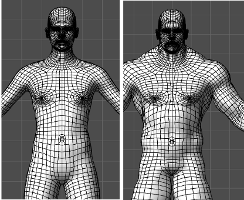
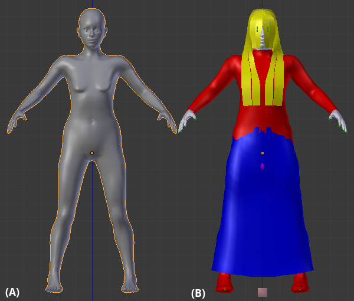
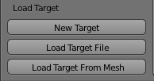
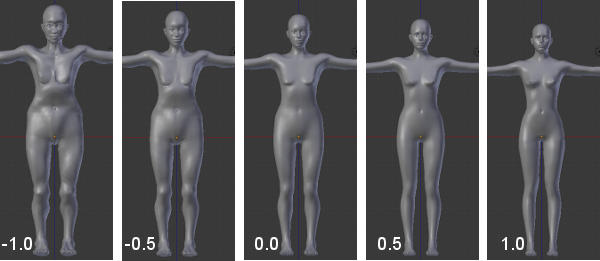
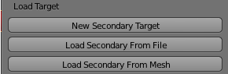
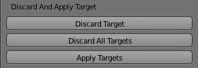
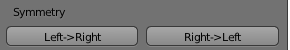
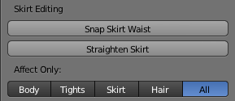
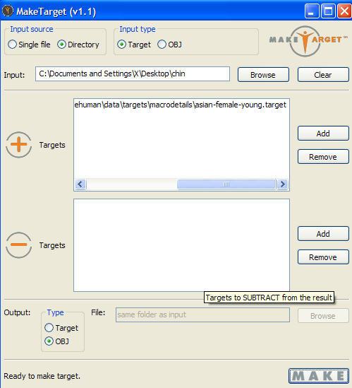

### MakeTarget

This section describes the blender version of MakeTarget. There is also a standalone version of MakeTarget, see further down on the page.

For the information below to make sense and be useful, you will need to first install BlenderTools.

## Introductory videos

If you find this page, this is a youtube video which might be useful:

{{#ev:youtube|X13k7H3dNHo}}

A longer and somewhat more gentle intro is provided by VScorpianC. If you're new to the subject, it will probably make sense to watch this:

{{#ev:youtube|CqH_Ec5NKNE}}

## What is a Target?  The MakeHuman Morphing Process.

 

 The principle is simple. A target is a modifcation to a base mesh shape that does not alter the mesh itself but that stores information that permits the base mesh to be transformed into the target shape using ‘morphing’.  Targets are what allow the slider controls in MakeHuman™ to take a single base mesh for a character and morph the shape of that character based on a variety of different feature target files.  The many target files used by MakeHuman™ can alter a single human base form into characters with features as different as those distinguishing male from female to as subtle as varying the shape of a single earlobe.

A target contains the offsets by which vertices of the human base model (base.obj) deviate from the original to achieve a specific feature. eg. a long nose could be a target.  These targets can be combined and MakeHuman™ uses them by blending targets together and gradually applying them to the base mesh to create a nearly endless variety of human forms.  Below are examples of target blending obtained by choosing a target that defined the character as male and combining that target with the extreme settings for other targets that determned the muscle tone or weight of the character.
  
MakeHuman™ handles morphing with a special file format, ".target".
 
## Loading the Base Mesh

 

 While it is possible to create targets using Blender without using the MakeTarget™ tool for Blender; that tool has many useful features that simplify the target creation process and will be explained by the help that follows.  Once the MakeTarget™ add-on has been enabled (see the previous "Get and Install MH Addons for Blender" section), a panel labelled MakeTarget™ version 1.xx appears in theBlender User Interface, to the right of the viewport. The visibility of the Blender User Interface can be toggled on and off with the N-key.
 

## MakeTarget 1.31

 

 Prior to loading any targets, the initial the MakeTarget™ panel consists of three main buttons. The first two buttons load the base human mesh, respectively with and without the special fitting tools. The third button labeled "Set As Base" sets an existing mesh (that must be MakeHuman™compliant and derived from the A8_v74.obj file distributed with the MakeTarget™  release within the maketarget/data/ folder) as a human base mesh.  This third option is for users that have done editing of the base mesh in another 3D modelling program and that have saved or exported the model as a Wavefront .obj file.

Loading the "Human + Fit Tools" will import the base human +mesh helpers(image below, B). The "helpers" are special geometries, used in MakeHuman™ as a reference to correctly fit clothes, hair and accessories.  These helpers can be annoying during the modelling of the character, so usually our artists first work on the pure body, loading the human only with the first button (image below, A), and then, in a successive step, they fit the helpers.
 
 

 

 

 

## Basic usage

### The MakeTarget™ Version 1.09 Panel (After Loading The Target Mesh)

 

 

After the mesh is loaded into the scene, the MakeTarget™panel layout will change, showing three new buttons that handle setting up the morphing targets. The first button creates a new empty target which will just be the original base mesh loaded in the previous step.
The second button loads the morphing from an existing target file. Do not attempt to load target files from the previous MakeHuman™versions, as these files are not compatible with the current base.
The third button creates a new target from an existing base mesh that is MakeHuman™compliant (derived from the A8_v74.obj file provided with the MakeTarget™release distribution), for example, a character modelled with an external tool (Maya, Max, C4D, etc..) and then saved or exported so that it can be imported into Blender as a wavefront obj file.  To correctly use the third button, it is necessary to first select the imported base, then the MakeHuman™ base, and then press the Load Target From Mesh button.  When the steps have been done correctly and that button is pressed the imported base will disappear and its transformations will be transferred onto the MakeHuman™ base.

 

### Editing The Target And The "Save Target As" Button

After a new empty target is initialized or an existing one is loaded/imported, the MakeTarget™ panel layout will change again, offering a rich set of new options (image below). For the basic use of the MakeTarget™ tool you may ignore all of these options except for the "Save Target As" button.
To create a custom target, the artist has to alter the base mesh, which is done in the usual way within Blender.  First start edit mode, and then select one or more vertices, moving them to reshape the mesh.  You may use the full power of Blender to create your morphing target design.The only rule, in order to create a valid morphing target, is to never add or delete a vertex, face or edge. The topology must be absolutely preserved.After the modelling process is completed, the MakeHuman™morphing target can be saved by pressing the "Save Target As" button on the MakeTarget™panel.  By default this will save all of the offset deviations of every vertice from the base mesh into the target file.

## Advanced usage

### The MakeTarget™Version 1.09 Panel (After Loading A Target)

During the creation or the editing of a target, as mentioned previously, the MakeTarget™panel shows a new layout with a rich set of options. Depending on whether the mesh is loaded without the fit tools (image below, left) or with the fit tools (image below, right), the panel offers different options.

 

 

 

 At the top of the panel there is a numeric slider that determines the amount of morphing to apply from the target. The maximum value is 1.0, which means that the target morphing is fully applied. A value of 0 will show the original base mesh without any target morphing.  The minimum value of the slider is -1.0.  Using negative values usually creates weird effects as a projected inverse of the target morph is applied, but these settings are useful to subtract unwanted morphing results when multiple targets are combined. The effect is shown in the image beginning on the left with the full inverse of the morphing target, to the original base mesh in the middle, and finally to the fully applied morph target design on the right.

 

### Load Target Section (After The First Target Is Loaded)

 

 

The three buttons now in the "Load Target" section are used in exactly the same way as they were before any target was loaded, except that any targets that are now created or loaded with these buttons become a secondary target that can be applied to the previously loaded one.  These buttons are used to append one or more additional targets to the first target and combine them in various proportions.

 

### Discard And Apply Target Section

 

 
 
The first two buttons under the "Discard And Apply Target" section will either discard all of the targets (returning you to the original base mesh) or only the last target appended (which will either be the last secondary target applied or the primary target if no secondary targets have been applied).  The button "Apply targets" under the "Discard And Apply Target" section is used to join all targets into a single unique morphing target combination.

 

### Symmetry Section

 

 

The two buttons in the "Symmetry" section are modelling tools, and are very useful.  They have been designed to produce very reliable target results. Using the symmetry buttons will cause the mesh to become symetrical on either side of the X axis, with the option to apply edits from the left side of the character to the right side (Left->Right), or vice versa (Right->Left).  Pressing these buttons will also align center vertices that have been unintentionally moved away from the center back to their center position.

 

### Save Target Section

 

 

Finally, press the "Save Target As" button to save the .target file once all secondary targets and edits have been completed.

The checkbox labeled "Selected verts only" is a very important option.  This option when checked will permit you to select a set of vertices in edit mode and then save only those vertices into the target file. Such targets are useful when you want the target to only morph the selected vertices and leave all other vertices completely unaffected by the morphing target.  For example, an artist could design a morphing target that is limited to the hands only, a single hand only, or to the head only, and save a target containing vertices that will only morph those body parts, while having no effect on other parts of the body that were not explicitly chosen by the artist.

The checkbox labeled "Active Target Only" will cause the "Save Target As" button to only save the last target only.  This option normally applies when one or more secondary targets have been added using the Load Target section after adding the initial target.

 

### Additional Fit Helper Buttons

 

 

 

 

When the fit helpers have been included as part of the target, the additional options of the MakeTarget™ panel shown in the images above appear.  These buttons are included to work with the helper objects.  When the helpers have been loaded, an additional button labeled "Fit Targets" is available under the Load Target section.  This button should be pressed after making alterations to the body that disconnect it from the helper objects, but prior to making modifications to those objects.  This button will refit the clothing to the body, and if pressed when the default All option under the "Affect Only: section is selected, all clothing helpers will be refitted to the body.  However, the refitting process will cause any modifications previously made to a refitted helper objects to be lost.  To limit the Fit Target button behavior to a single helper object, you should specify the object that you want to have refitted under the Affects Only section appearing at the bottom of the panel.  This will cause the refitting to only affect the chosen helper (for example the Hair), while leaving all other helper objects unaffected, preserving your edit modifications to those helpers (for example, the Tights and Skirt helpers will not be refitted and your modifications to those helpers will be preserved if the Hair Affects Only option is set).

The additional helper options also include buttons that improve the fit of the skirt specifically by snapping the skirt to the character's waist ("Snap Skirt Waist" button) or straightening the skirt ("Straighten Skirt" button).  It is recommended that you still select the Skirt as the Affects Only option prior to pressing either of these buttons.

 

### MakeTarget standalone

=### Making Wavefront .obj Files MakeHuman™ Compliant

The following procedures should be followed to create Wavefront .obj files that comply with the requirements of MakeHuman™ using modelling software programs such as 3dMax, Maya, XSI, etc. 
* * Download the 1.x base mesh  base.obj file from MakeHuman!LINK!https://bitbucket.org/MakeHuman/makehuman/src/c40af22cebf2d5372b931b485f60588f42f24480/makehuman/data/3dobjs/base.obj?at=default -- HG repository!/LINK!
* Import it into your preferred modelling software
* Modify it in order to create your final character
* Export it as .obj (of course with a different name than base.obj)
During editing of the base mesh be careful about 3 things!You have to pay attention that:
* The import/export does not alter the number of vertices, the faces, does not split the obj, etc. The topology has to be the same as the original one.
* When modifying the base, you do not delete or add vertices, do not add or remove faces, etc. The topology has to be the same as the original one.
* The 3D program used also preserves the exact order of the vertices.

=### There are no other limitations on the .obj files used.

=### Making Targets with MakeTarget™ StandAlone

=### Using the MakeTarget GUI program

To obtain the MakeTarget GUI program, download and install either the Windows version or the Linux version at the bottom of the download page of the MakeHuman website at: !LINK!http://makehuman.org/content/download.html -- http://makehuman.org/content/download.html!/LINK!
Looking at the GUI of MakeTarget, you can notice other elements: the (+) and (-) lists, the possibility to process whole directories and to have .obj as output.
These are batch tools, designed for MakeHuman developers. Let’s go on to describe an usual scenario.
  
Assuming you have 30 “chin”  targets modelled on the young caucasian female. These targets will create artifacts when applied on a young asian female. So our artists have to process 30 targets in order to create an asian version from all of them.
  
The steps are:
* For each chin target, do: asian-female-young.target + chin.target and save the result as .obj.
* Import each .obj in a modelling software, fix the artifacts by hand and export the corrected .obj.
* For each corrected .obj, subtract the asian-female-young.target and save the rest as asian version of the chin target.
For step (1) we will process an entire directory, choosing “Directory” as “input source” and targets as input type. Then we will “add” the asian-female-young.target, loading it in the (+) section. Then will choose “Obj” as “Output type”.
 

 
Pressing the “Make” button, the entire folder will be processed, and in the same directory of targets we will see the newly created .objs. At this point, we can copy the folder, renaming it as “chin_fixed” and deleting the original targets.
For step (2), we have to import, edit and export each .obj individually, as showed previously for the single target. After completing step (2), all .objs in “chin_fixed” will be fixed and ready to be converted into targets.
So, it’s time for step (3). Again, we will process the entire directory, but this time the input type will be “Obj” and the output “Target”. Also, this time we will subtract the asian target, in order to obtain only the chin morph.
 

 
Pressing the “make” button, this time we will obtain a series of .target, with the same name as the original objs, placed in the “chin_fixed” folder. That’s all!

=### Command Line Usage

This tool allows wavefront .obj files to be used that were edited using any 3D program. The only limitations are that the edit stems from the original base.obj file and that no vertices, edges or faces are added or removed. The 3D program used also needs to preserve the exact order of the vertices. There are no other limitations on the obj files used.
Usage:
There are a commandline version and a version with graphic user interface. Both do exactly the same thing.
Here follows the explanation of how to use the commandline version.
Options:
 -i --in     input obj or target
  
-o --out    output obj or target
  
-s --sub    target to subtract from obj
  
-a --add    target to add to obj
  
-d --dir    input folder to load all objs or targets from
  
--intype    type of file to be input, obj (default) or target  only applicable if --dir is used
  
--outtype   type of file that will be output, obj or target (default)
  
-h --help   this info
  
-v --verbose    verbose mode, shows extra information   
Usage scenarios: 
Load foo.obj as input, compare it with base.obj and output the  difference as foo.target.
Load foo.obj, subtract foo1.target from it, and output the difference  between the resulting obj and base.obj as foo.target.
Load foo.obj, add foo1.target to it, and output the difference  between the resulting obj and base.obj as foo.target.
Load all objs from myfolder, save the difference between the base.obj and each of the input objs to a target file with the same name as the input obj.
Load all objs from myfolder, subtract foo1.target from each of them, and save the difference between base.obj and each of the resulting objs to a target file with the same name as the input obj.
Load all objs from myfolder, add foo1.target to each of them, and save the difference between base.obj and each of the resulting objs to a target file with the same name as the input obj.
Load foo.target, apply it to base.obj and output the resulting obj as  foo.obj.
Load all target files from myfolder, apply each of them to base.obj and  save the result of each to obj with the same name as the target file.
Load all target files in myfolder, apply each of them to base.obj while also subtracting foo1.target from the result. Save each combination to   an obj with the same name as the input target.
Load all target files in myfolder, apply each of them to base.obj while also adding foo1.target to the result. Save each combination to an obj with the same name as the input target.
This is the usage information as can be obtained by running the "maketarget.py --help" command. Some additional scenarios that are not documented are possible with the tool.
  
The user is protected from issuing commands that make no sense (eg. do nothing) as the tool will warn you about this.
Also note that files are never overwritten. Upon encountering an already existing file this file is backed up as original_filename.bak. Additional backups of the same file are named in order original_filename.bak.0 original_filename.bak.1 etc.
The GUI version of the tool does exactly the same thing. The exact same options (except help and verbose) are available in the GUI. The only difference between commandline and GUI version is that the GUI demands you specify an --in or --dir parameter. With the commandline tool you can do without as long as you specify some --add or --sub targets.

=### Compiling Binaries

For the ease of distribution a pyinstaller configuration is supplied to create a self-contained binary executable for both windows and linux. (MAC OS might work but is untested). For running this executable, the user does not need to install python or any other libraries (such as wxwidgets) on his computer. For building the package, however, you need to have those dependencies
  
installed, and need to build the package on the target OS. There are two build files available:
* compilePyinstaller.bat,for building a windows executable
* compilePyinstaller.sh        for building a linux executable (might work for OSX   too)

In order to use them you need to create a folder called "pyinstaller" in the makehuman/tools/standalone/maketarget folder. The build configs were tested with pyinstaller 1.5.1, but might work on future or older versions too.
  
Additionally these dependencies are needed for the respective operating systems:
Windows:
* Python 2.7
  !LINK!http://python.org/ -- http://python.org/!/LINK!
  I recommend using python 2.7 as I had issues with 2.6 and pyinstaller. The tool works fine with python 2.6, however
* pywin32
  !LINK!http://sourceforge.net/projects/pywin32/ -- http://sourceforge.net/projects/pywin32/!/LINK!
  Python extensions for windows. Needed for pyinstaller to work.
* wxpython2.8
  !LINK!http://www.wxpython.org/ -- http://www.wxpython.org/!/LINK!
  WX Widgets libraries and python wrappers for windows. Installable as one singe package.I recommend using the wxPython2.8 win32 unicode package for python 2.7.
* UPX (optional)
  !LINK!http://upx.sourceforge.net/ -- http://upx.sourceforge.net/!/LINK!
  This is a tool for compressing the executable and reduce its size. Compression will happen automatically if UPX is installed.  To install UPX copy upx.exe to C:\WINDOWS\system32
  Note: you will need at least UPX 1.92 beta due to incompatibilites  with the Visual Studio compiler, with which newer versions of python are   compiled on windows.   
Linux:
* Python 2.6
  !LINK!http://python.org/ -- http://python.org/!/LINK!
  Version 2.7 works fine too.
* python-wxgtk2.8
* libwxgtk2.8
  !LINK!http://www.wxpython.org/ -- http://www.wxpython.org/!/LINK!
  !LINK!http://www.wxwidgets.org/ -- http://www.wxwidgets.org/!/LINK!
  WX Widgets libraries and python wrappers for wx
* UPX (optional)
  !LINK!http://upx.sourceforge.net/ -- http://upx.sourceforge.net/!/LINK!
  This is a tool for compressing the executable and reduce its size. Compression will happen automatically if UPX is installed
        
  
The pyinstaller script will create all the files that need to be distributed in a folder called dist/ (this will be an .xrc file, the executable, and a resources/ folder containing images used in the GUI).
  
You can archive the contents of the dist/ folder and distribute these freely as a standalone application.       
### wxWidgets specific information
The GUI of this tool has been made using the python version of wxWidgets. The GUI form itself is not created using application code, but is instead loaded from the maketarget.xrc file that declares the GUI. This file was built using wxFormBuilder (!LINK!http://wxformbuilder.org/ -- http://wxformbuilder.org/!/LINK!). The file maketarget_gui.fbp is the source file that can be opened in formbuilder. The xrc file is output generated using the formbuilder application. However, the xrc could be edited manually too (but this would cause fbp and xrc file to go out of sync).
### More information
For more specific details you can contact the author Jonas Hauquier at the makehuman.org website.
 

### MHBlenderTools: MakeTarget

=### What is a Target?  The MakeHuman Morphing Process.

The principle is simple. A target is a modifcation to a base mesh shape that does not alter the mesh itself but that stores information that permits the base mesh to be transformed into the target shape using ‘morphing’.  Targets are what allow the slider controls in MakeHuman™ to take a single base mesh for a character and morph the shape of that character based on a variety of different feature target files.  The many target files used by MakeHuman™ can alter a single human base form into characters with features as different as those distinguishing male from female to as subtle as varying the shape of a single earlobe.
 

 
A target contains the offsets by which vertices of the human base model (base.obj) deviate from the original to achieve a specific feature. eg. a long nose could be a target.  These targets can be combined and MakeHuman™ uses them by blending targets together and gradually applying them to the base mesh to create a nearly endless variety of human forms.  Below are examples of target blending obtained by choosing a target that defined the character as male and combining that target with the extreme settings for other targets that determned the muscle tone or weight of the character.
  
MakeHuman™ handles morphing with a special file format,.target.

=### Loading the Base Mesh

While it is possible to create targets using Blender without using the MakeTarget™ tool for Blender; that tool has many useful features that simplify the target creation process and will be explained by the help that follows.  Once the MakeTarget™ add-on has been enabled (see the previous "Get and Install MH Addons for Blender" section), a panel labelled MakeTarget™ version 1.xx appears in theBlender User Interface, to the right of the viewport. The visibility of the Blender User Interface can be toggled on and off with the N-key.
 

 
The MakeTarge™ Version 1.31 Panel (Initial Settings)
 

 
Prior to loading any targets, the initial the MakeTarget™ panel consists of three main buttons. The first two buttons load the base human mesh, respectively with and without the special fitting tools. The third button labeled "Set As Base" sets an existing mesh (that must be MakeHuman™compliant and derived from the A8_v74.obj file distributed with the MakeTarget™  release within the maketarget/data/ folder) as a human base mesh.  This third option is for users that have done editing of the base mesh in another 3D modelling program and that have saved or exported the model as a Wavefront .obj file
 

 
Loading the "Human + Fit Tools" will import the base human +mesh helpers(image below, B). The "helpers" are special geometries, used in MakeHuman™ as a reference to correctly fit clothes, hair and accessories.  These helpers can be annoying during the modelling of the character, so usually our artists first work on the pure body, loading the human only with the first button (image below, A), and then, in a successive step, they fit the helpers.
 

 

=### Basic usage

### The MakeTarget™ Version 1.09 Panel (After Loading The Target Mesh)
 

 
After the mesh is loaded into the scene, the MakeTarget™panel layout will change, showing three new buttons that handle setting up the morphing targets. The first button creates a new empty target which will just be the original base mesh loaded in the previous step.
The second button loads the morphing from an existing target file. Do not attempt to load target files from the previous MakeHuman™versions, as these files are not compatible with the current base.
The third button creates a new target from an existing base mesh that is MakeHuman™compliant (derived from the A8_v74.obj file provided with the MakeTarget™release distribution), for example, a character modelled with an external tool (Maya, Max, C4D, etc..) and then saved or exported so that it can be imported into Blender as a wavefront obj file.  To correctly use the third button, it is necessary to first select the imported base, then the MakeHuman™base, and then press the Load Target From Mesh button.  When the steps have been done correctly and that button is pressed the imported base will disappear and its transformations will be transferred onto the MakeHuman™base.
### Editing The Target And The "Save Target As" Button
After a new empty target is initialized or an existing one is loaded/imported, the MakeTarget™ panel layout will change again, offering a rich set of new options (image below). For the basic use of the MakeTarget™ tool you may ignore all of these options except for the "Save Target As" button.
To create a custom target, the artist has to alter the base mesh, which is done in the usual way within Blender.  First start edit mode, and then select one or more vertices, moving them to reshape the mesh.  You may use the full power of Blender to create your morphing target design.The only rule, in order to create a valid morphing target, is to never add or delete a vertex, face or edge. The topology must be absolutely preserved.After the modelling process is completed, the MakeHuman™morphing target can be saved by pressing the "Save Target As" button on the MakeTarget™panel.  By default this will save all of the offset deviations of every vertice from the base mesh into the target file.

=### Advanced usage

### The MakeTarget™Version 1.09 Panel (After Loading A Target)
During the creation or the editing of a target, as mentioned previously, the MakeTarget™panel shows a new layout with a rich set of options. Depending on whether the mesh is loaded without the fit tools (image below, left) or with the fit tools (image below, right), the panel offers different options.
 

 
At the top of the panel there is a numeric slider that determines the amount of morphing to apply from the target. The maximum value is 1.0, which means that the target morphing is fully applied. A value of 0 will show the original base mesh without any target morphing.  The minimum value of the slider is -1.0.  Using negative values usually creates weird effects as a projected inverse of the target morph is applied, but these settings are useful to subtract unwanted morphing results when multiple targets are combined. The effect is shown in the image below beginning on the left with the full inverse of the morphing target, to the original base mesh in the middle, and finally to the fully applied morph target design on the right.
 

 
### Load Target Section (After The First Target Is Loaded)
 

 
The three buttons that now in the "Load Target" section are used in exactly the same way as they were before any target was loaded, except that any targets that are now created or loaded with these buttons become a secondary target that can be applied to the previously loaded one.  These buttons are used to append one or more additional targets to the first target and combine them in various proportions.
### Discard And Apply Target Section
 

 
 
The first two buttons under the "Discard And Apply Target" section will either discard all of the targets (returning you to the original base mesh) or only the last target appended (which will either be the last secondary target applied or the primary target if no secondary targets have been applied).  The button "Apply targets" under the "Discard And Apply Target" section is used to join all targets into a single unique morphing target combination.
### Symmetry Section
 

 
The two buttons in the "Symmetry" section are modelling tools, and are very useful.  They has been designed to produce very reliable target results. Using the symmetry buttons will cause the mesh to become symetrical on either side of the X axis, with the option to apply edits from the left side of the character to the right side (Left->Right), or vice versa (Right->Left).  Pressing these buttons will also align center vertices that have been unintentionally moved away from the center back to their center position.
### Save Target Section
 

 
Finally, press the "Save Target As" button to save the .target file once all secondary targets and edits have been completed.
The checkbox labeled "Selected verts only" is a very important option.  This option when checked will permit you to select a set of vertices in edit mode and then save only those vertices into the target file. Such targets are useful when you want the target to only morph the selected vertices and leave all other vertices completely unaffected by the morphing target.  For example, an artist could design a morphing target that is limited to the hands only, a single hand only, or to the head only, and save a target containing vertices that will only morph those body parts, while having no effect on other parts of the body that were not explicitly chosen by the artist.
The checkbox labeled "Active Target Only" will cause the "Save Target As" button to only save the last target only.  This option normally applies when one or more secondary targets have been added using the Load Target section after adding the initial target.
### Additional Fit Helper Buttons
 

 
 

 
When the fit helpers have been included as part of the target, the additional options of the MakeTarget™panel shown in the images above appear.  These buttons are included to work with the helper objects.  When the helpers have been loaded, an additional button labeled "Fit Targets" is available under the Load Target section.  This button should be pressed after making alterations to the body that disconnect it from the helper objects, but prior to making modifications to those objects.  This button will refit the clothing to the body, and if pressed when the default All option under the "Affect Only: section is selected, all clothing helpers will be refitted to the body.  However, the refitting process will cause any modifications previously made to a refitted helper objects to be lost.  To limit the Fit Target button behavior to a single helper object, you should specify the object that you want to have refitted under the Affects Only section appearing at the bottom of the panel.  This will cause the refitting to only affect the chosen helper (for example the Hair), while leaving all other helper objects unaffected, preserving your edit modifications to those helpers (for example, the Tights and Skirt helpers will not be refitted and your modifications to those helpers will be preserved if the Hair Affects Only option is set).
The additional helper options also include buttons that improve the fit of the skirt specifically by snapping the skirt to the character's waist ("Snap Skirt Waist" button) or straightening the skirt ("Straighten Skirt" button).  It is recommended that you still select the Skirt as the Affects Only option prior to pressing either of these buttons.