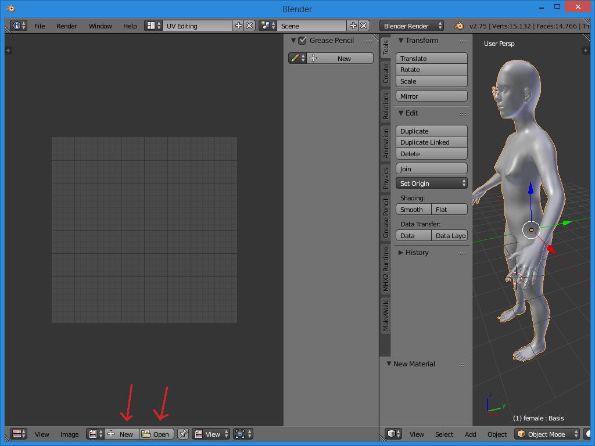
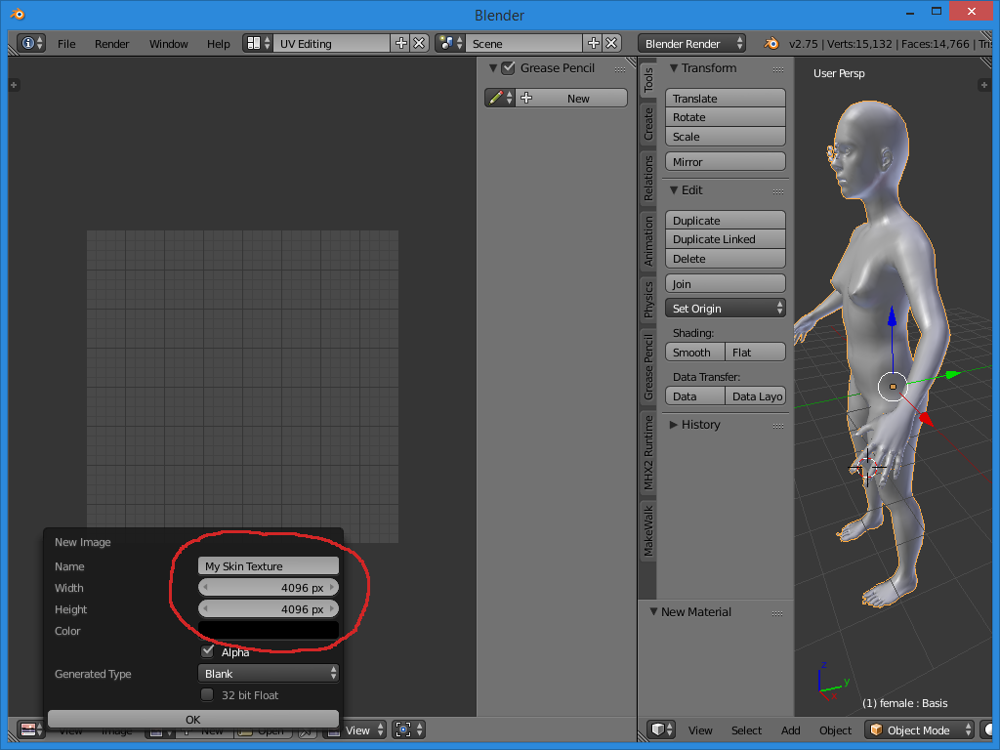
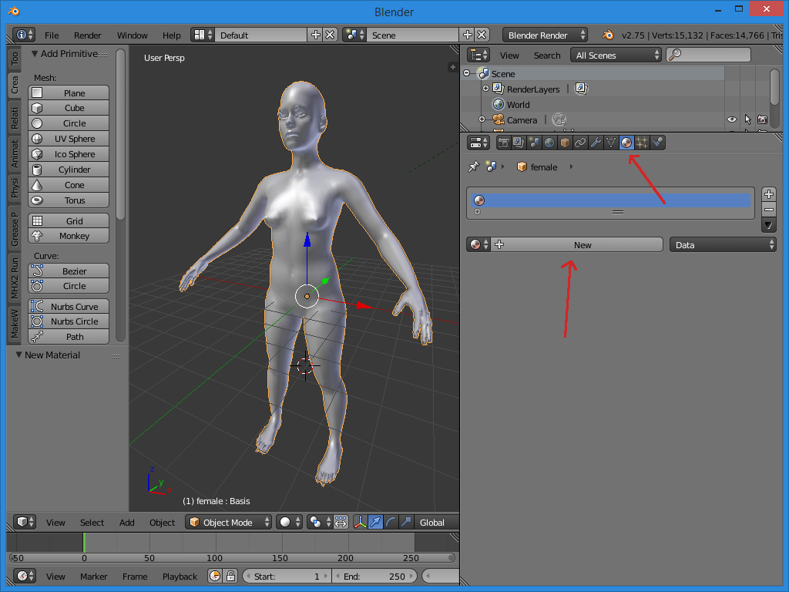
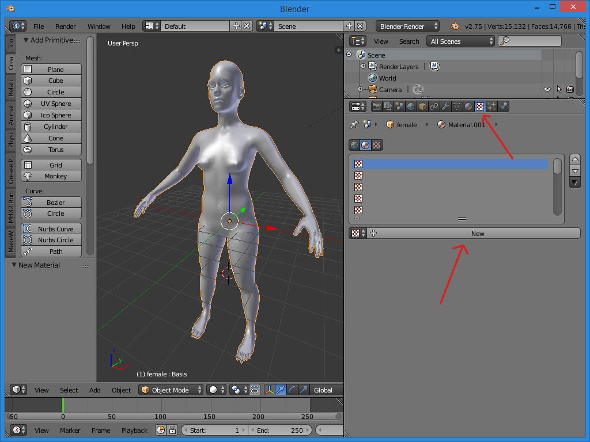
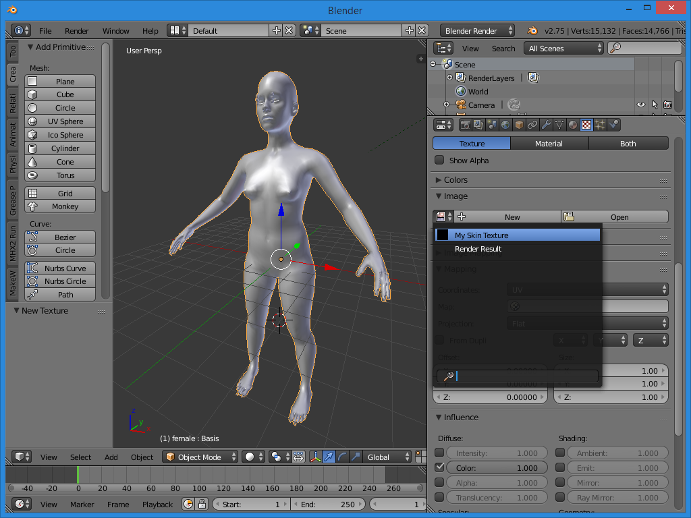
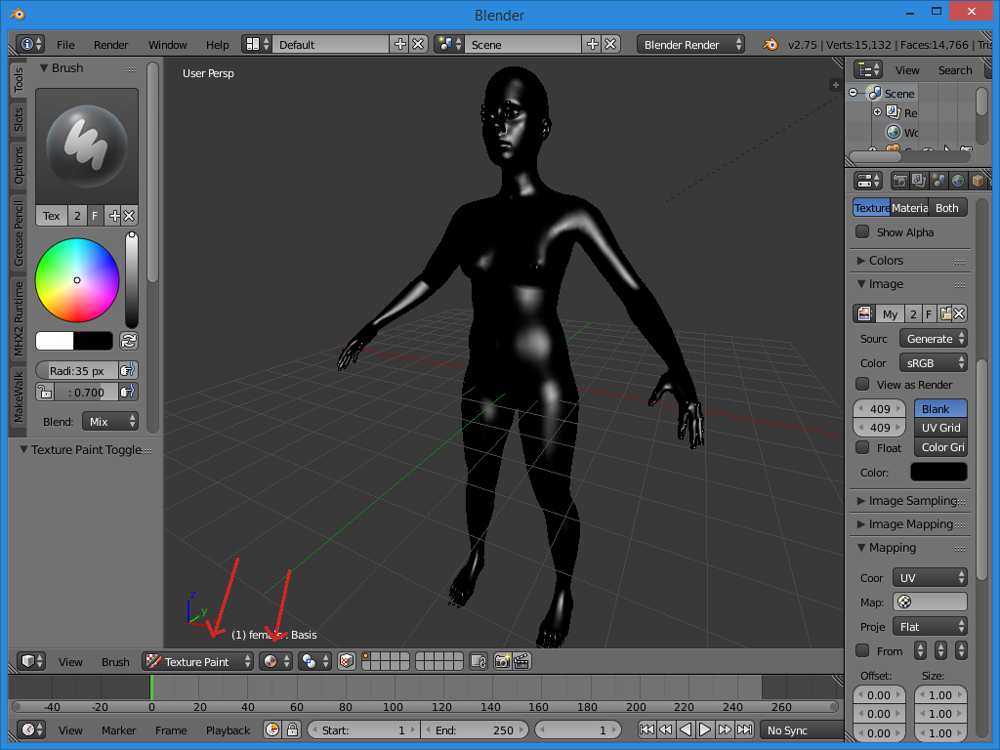
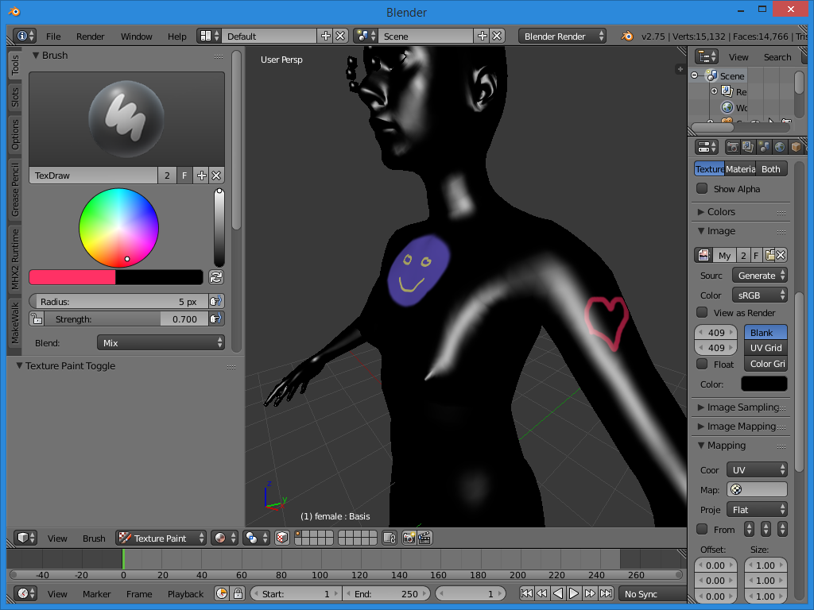

To start a texture painting project, we are best off switching to "blender render" mode (rather than cycles). This is not required, but for various reasons it is somewhat simpler and more efficient. 

We also want a human to paint the skin on. If you have MakeTarget or MakeClothes installed, simply click the "load human" button. Otherwise, import a human from MakeHuman as usual.
 

To create an image to use as texture, we can switch to the "UV Editing" (and image painting) view in blender. You could have created this through other means, but we might as well learn how to find this now. 
 

Here we can either "open" an existing image, or create a new one by clicking "New". For the sake of this tutorial we create a new blank texture.

As a hint: If you want a demo skin to modify rather than create one from scratch, you could download the "Annotated Skin" from the skin repo and open it here. That skin has clear markers and labels explaining the different areas of the skin.
 

You should give it a sensible name and decent dimensions. Textures are usually quite large, otherwise they'll look grainy on close-up renders.
 

Go back to the default view.
 

Mark the human toon and create a material for it. The material properties doesn't matter much at this point, but a sensible name is useful.
 

Create a new texture channel for the material.
 

Assign the image we created previously (or pick one that you have opened). 
 

In the main view, select the "texture paint" mode and the "material" display. Missing the latter is something that tend to confuse first-time skinners, as forgetting it will often prevent you from seeing what you're doing.
 

You should now be able to simply draw anywhere on the body.
 

If you want to see the resulting texture image, or if you want to paint faces in 2D mode, switch to the "UV editing" layout again. To be able to paint on the 2D surface, you need to switch to "paint" mode. 
 

Don't forget to save your image. The first time, choose "save as image", on later saves use "save image". 
 

You should now have an image texture. If you want to use it inside MakeHuman, see [[FAQ:How can I create skin textures?]].