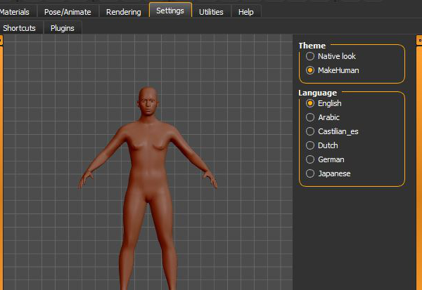
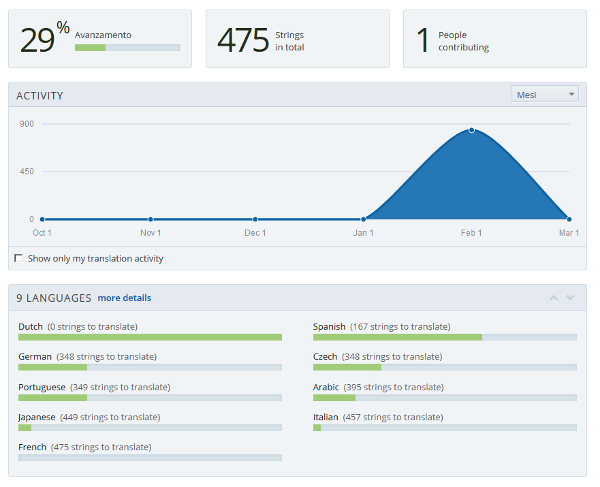

Our GUI is available in many languages, but translations are not yet complete. 
Anyway now contributing in order to add a new language is very easy, since the MakeHuman project is now available for translation on!LINK!http://www.transifex.com/organization/makehuman/ -- Transifex!/LINK!.

Transifex is a web application for localization in an easy and agile way.

If you want to help the MakeHuman project by translating the GUI into your language, you first need to create an account on Transifex. Then, when logged in, you can go to!LINK!https://www.transifex.com/projects/p/makehuman/ -- the MakeHuman Transifex page!/LINK!and click on the appropriate language you want to translate. Then click the "Join team" button. Now you can click the current release name (for example  "Alpha 8") entry and click "Translate now".
If you want to make a translation in another language that is not yet listed, click "request language" on the!LINK!https://www.transifex.com/projects/p/makehuman/ -- MakeHuman transifex page!/LINK!. We will make sure to accept it as fast as possible, so you can start translating.
Translating is quick and easy. You can select the "Untranslated strings" filter to show only the things left to translate. Click the first word on the left, and in the center of the screen enter your translation in the input box. When done typing, simply press the TAB button on your keyboard, and it automatically goes to the next entry. Repeat this process untill everything is translated.
  
You can leave things open you are uncertain about, and leave them for later. Perhaps others know a good solution. You can interrupt your work at any time and continue working later, or leave it for others to finish.
If you already have a translated file on your hard disk (for example you made modifications to an already existing language .ini file of MakeHuman, or you have filled in a .missing language file), you can upload it as translation and Transifex will automatically include it in the translation.
You will be also able to download the json file of your language, in order to put it in makehuman/data/languages. On restarting MakeHuman, the new language will be available as an option under "Settings".