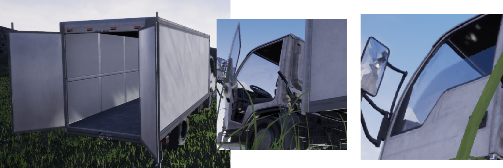
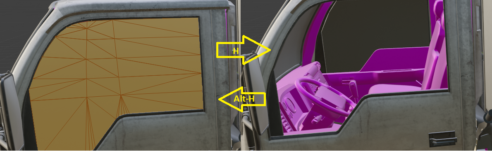
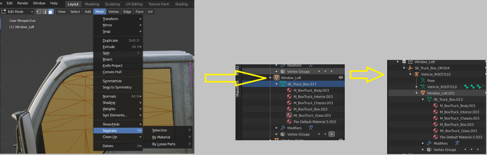
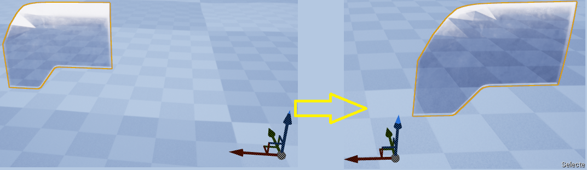
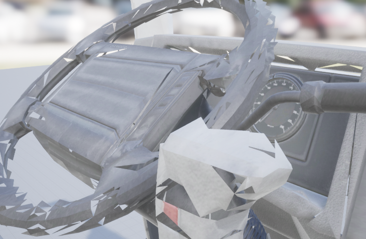
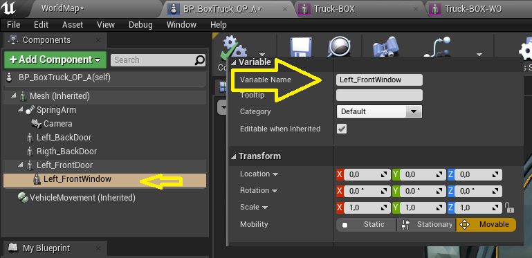
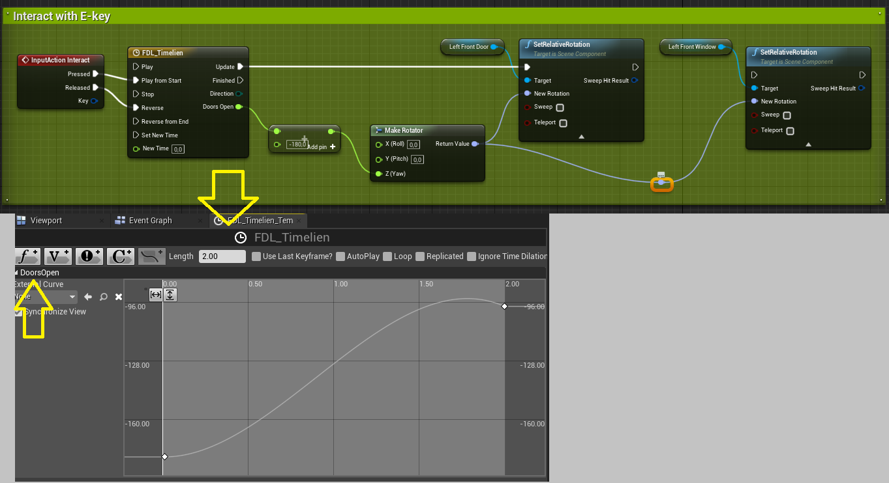
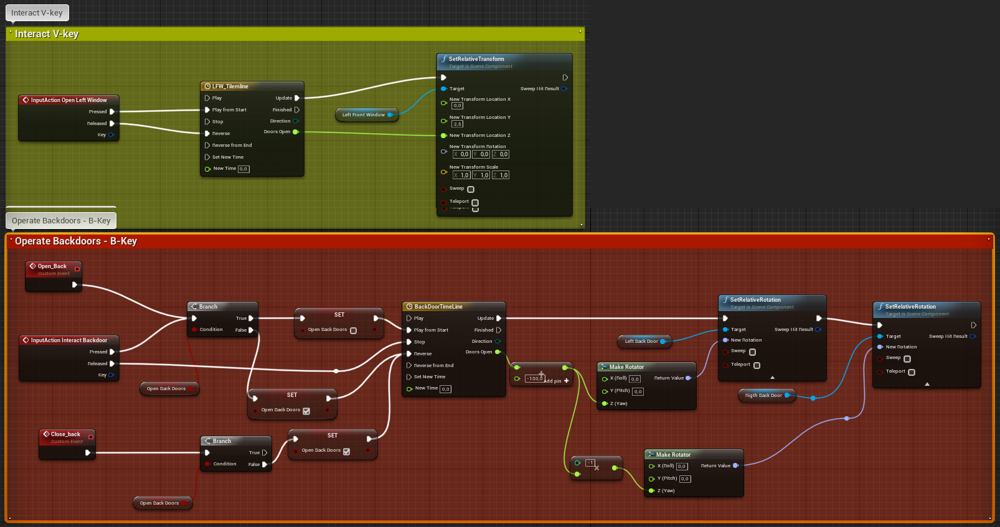

Your character should have some kind of transportation - and UE4 comes with some help [Vehicle Variety Pack](https://www.unrealengine.com/marketplace/en-US/product/bbcb90a03f844edbb20c8b89ee16ea32). However I wanted to get access to the car and to the interior of the box van... Since you need to use Blender for that, I think this gives us a better way of learning a bit about getting props, using Blender in combination with UE4.

This is the tasks I intend to describe: 

* Getting SM_Truck_Box into Blender! and split the mesh into separate parts!
* Saving the separate parts
* Failed experiment, with morph targets 
* Pivot points... when going to UE4
* Save the work and import to UE4 
* New blueprint for the Truck

The end result should be that you can open back doors of the Truck, also you can open the left front door and you can roll down the left window. 
These are some screen shots of that: 

 

## Getting SK_Truck_Box into Blender and split it!=

 Please note that I am NOT working with Blender everyday. I realize that there are better/easy ways of doing the selection/delete/cut process. If you want your final result to be perfect please run a fre tutorials on how to use the Edit mode/selection options etc.   

You should be able to install the package into UE4 and from there you go to Skeletons and export SK_Truck_Box. You can probably get even better results using SM_Truck_Box, but I did the SK_ version. 

Go to Blender 2.8, and import the skeleton in it's separate collection. Use the standard import setting for this. Save the .blend file in a separate folder!
Duplicate this collection and start working on the 

The trick here is that you should now go to edit mode and select all parts that you want as a separate mesh in UE4. Please start with the from left window! 
This can be rather tricky, and it will be very tricky doing the front door. These are the shortcut you can use for selection: 

* Left-mouse+shift clicks selects (Vertex/Edge/Face) - the selection is highlighted
* Ctrl-+ selects what is connected to the current selection, this is not always logic to me but it seldomly fails. 
* H-hey, hides your currently selection - when you have something hidden the H-key the visible selection to that.
* Alt-H, unhide showing your current selection 
* Ctrl-Z will undo selections etc. (the result you see is not always logic) 

In the end you can jump between H and Alt-H to ensure that you have the full selection.... remember to save once in a while! When the window is selected correctly you should be able to do this: 

 

Notice that the entire Mesh for the window is two layers, so you first select the outside layer then the layer. And take well care that you do not select some of the internals! 

Now this is the important part, you can now split-up the mesh like this:

* Still in Edit-mode, use the Mesh-menu/Separate/Selection option... This will split up the mesh so you have the window in a separate part. Rename the Window part to window_left. 
* In the current collection you can now hide/see the window/Truck using the eye icons. 
* Duplicate the collection, and for the new collection delete all the parts that is not under the the window. 
 

 

IMPORTANT: Rename the item in the hierarchy to Vehicle_ROOT, and export the entire thing as an FBX.... using the same [export settings](http://www.makehumancommunity.org/wiki/Documentation:Saving_models_for_Unreal_Engine_and_how_to_import_them_there#FBX_export_settings) you used for your makehuman FBX - but scale should be changed form 0.1 to 1.0.

**This is a good time to save your .blend file!**

## Failed experiment, with morph targets=
The end result should be that you can open/close windows and doors. My first attempt was using morph-targets. Like whit the Makehuman characters this require that you do two truck collections and select/shif t-selec the two meshes and "join as shapes" - the selection process is much the same, but the results was very poor, as the doors do not animate to scale, they actually **morph**, not very surprisingly!

## Pivot points... when going to UE4=
When you import the Window you must realize two things: 

* Invent a name standard for your meshes and your files. You will have a lot of FBX files, and you need to keep a bit of track of what you did and how you imported all of your assets.
* Your Window will not have the correct pivot point! 

The trick here is to position the mesh, in Blender, precisely you you can rotate the window with the door... 

In your first attempt, this is how it will look in UE4 - but you want the transform/rotation/size gizmo to sit like you see it to the right!
 

To do this you need to go to Blender and position your mesh close to position 0, 0, 0 - oddly enough, the pivot point in Blender has no effect on the one imported to UE4. 

However since we want the window to move **with** the door, you want the rotation point to sit to the left of the window. Tip: You can simply find the exact position when you have the left door positioned correctly to it's rotation point, you can then position the window "on top" of the door and save the two in separate FBX files. 

The process of getting the left front door selected is rather tricky - so I suggest you start with the windows (do both) and then move on to practice on the back-doors! When you get the hang of this it is just work-work-work! The Blender navigation, and selection, is not easy... ? 

You can save the same Collection for each part you separate out, then duplicate... and delete the stuff you do not need. In the end you will have one collection holding all the parts and several other collection holding the parts. Naturally when you are finished you duplicate the collection one "last" time and delete all the small parts.. so you have the Truck body in it's own collection.

Remember: 
* Save your .blend file often, perhaps even in versions
* Rename say, Vehicle_ROOT.010 to Vehicle_ROOT - for all of your FBX files.

## .... import to UE4=

You will, at some point discover that not every thing works fine. You will, by now, know how to make the materials from textures - but you can also re-use those that comes with the package. Somehow the textures will fit correctly to all of your imported assets... I really don't fully understand textures and UV, but it works! 

The Vehicle models are top quality - but when you import them they look "jacket" - some thing like this: 

 

There is a reason for this, and two solutions: 

* Under the wrench Icon you see a modifier, this was imported from UE4.... and you can either delete this modifier, before saving all the FBX files - or 
* Don't use ''Preserve smoothing groups'', when you import! 

I do not know if you will need the modifier at some point, so perhaps you should save everything in a separate .blend file?

For some reason the mirrors are corrupted after import, not very important - but yet!!

Now for the fun part!!

## Setup driving...=
You will need to setup a few blueprints and some retargeting for this to work: 

* BP_BoxTruck you make a CHILD blueprint of this and you need to add meshes etc. as shown below!
* AB_BoxTruck must be retarget to the new SK_Truck_Box skeleton, give it a new name!
* You may also need to retarget the original Skeleton to the new one? 

When this has been done you can drive the Truck directly, as instructed for all the vehicles. Wheels should be turning and you can animate. Now for your modifications of the BP_BoxTruck blueprint, for each mesh you need a separate Skeletal mesh component (like when you make modular characters). In this case it looks like this: 

 

Please note two thing! The window is placed under the front door. I found that that will work nicely and you do not need to worry about the transform/rotation. This will require that you saved both the door and the window correctly, with the correct pivot-point, as described above! The pivot must be correct for the rotation, but you can adjust the transformation as needed (in UE4). 

I have set up a few interaction Inputs, note that you can use the same key board key for different interactions. The space key is here used for Vehicle Handbreak, but for jump when in ThirdPerson! 

I also have the E key sending the "Interact" InputAction. And that specific blueprint, under your BP_BoxTruck child blue print, should look something like this: 

 

Please note that because the left window was attached **under** the left door, it will rotate with the door. If you try to rotate both (as when you connect the last SetRelativeRotation it will swing oddly/double... this is a standard door open BP, you can use it in many places - given that the pivot is correct! In this case the left front door opens when you hold E-key and it colse again when you let go of the E-key. 

You can also make variations over this, say I made the window go down, when using the V-key. I had to adjust the Y transform - as the window will not fit into the door the "animation" looks odd when seen from inside. Also a made the double back-door open/close with B-key, in this case there is a bool to check what you want to do and you can naturally do the same for the window/door. 

 

# Makehuman!

The next step will be to add the character to the vehicle, that is he should be able to interact with the Truck - adding event overlap to the front/back doors, and some animations to climb/enter/exit in the correct ways - perhaps he can even interact with goods in the box, or an existing driver? 

I will get back on that...