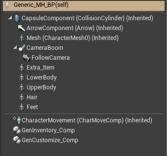
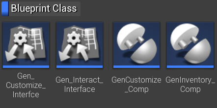

Once you have the character inside Unreal you want to utilize the shape keys to customize your character. 

I am working on a generic solution that will allow you to do just that, this is the first preview! 

::**Please take a look at this page: [[Documentation:MH4UE|MH4UE]] - to get an overview of things you can use to get your Makehuman characters into Unreal Engine!** 

## Parameter Setup and Parameter Functions=

In order to make the customization work you need to make a table containing all the parameters that can be adjusted. This is a bit complicated, but you need to do this once only.. The parameters are imported into Unreal and from there the customization components should handle the rest! The parameter setup is done in a CSV file - I use a google sheet for this, but you can use any tool that works for you and Unreal. 

The parameters/functions can be listed like this: 

* Shape key grouping 
* Customize option 
* Randomize
* Randomize grouping  
* Randomize exclusive grouping
* Clamp min/max
* Display name  
* Tool tip
* Comment 
 
The exclusive grouping can be used at group level, so you can group shape keys that does not mix well - say one major body shape will corrupt an other shape. You will be able to exclude/clamp the other shapes to prevent this from happening.

# MHC - UE4 Generic Character customization for MakeHuman, and other characters

I am making a Generic Customization package that can be used for MakeHuman. This is an overview of the functionality, introducing the components that are available in the package. 

## Introduction=
If you follow the [[Documentation:Saving models for Unreal Engine and how to import them there|instructions]] on how to import your MakeHuman characters to Unreal there is still a lot of work to do. In general you will need a generic blueprint to "assemble" your character and the cloth element, also you need a basic clothing system, and you need some basic interface to work with the "morph targets". Some of the morph targets will affect the basic shape of the character, while others can handle the general expressions. 

The prototype for this can be seen below, in this you can see the shape keys as well as the buttons where you can change the base-tint parameter. 

The basic parts leads to two different components for your character blueprint one for customizing the character shape and a system for cloth, hair and other modular attachments. Also the system should be able to handle different character types, say you may have several "base characters", characters of different genders etc. 

This page contains a general introduction to the MHC components, breaking down what you need to know to understand and setup the system with your own characters.

## Package components - GenCustomize_Comp=

This is what the Blueprint for the MH generic character looks like, currently.  

This first version of MHC only contains the **GenCustomize_Comp''', but the one that i going out will not yet contain the '''GenInventory_Comp**. (The GenInventory_Comp will come with a few Widgets new and it will allow your character to pickup "items" and "cloth". But in the current version you will not yet be able to set that up.) 

In addition to these components there are two interfaces - the Interact interface will enable item pickup and other interactions, while the Customize interface will allow the customization - like setting the morph targets and base tint color. (Others will follow). 

Special to the customization is that you must provide/build a table holding the skeleton mesh specific information for morph targets. This will allow you to setup the customization specific to your MakeHuman character. (Also you need a specific material if you want to enable the color tint.) 

If your base characters holds different morph targets your "Morph Table" must contain that specific skeleton reference, more details in the technical section on that topic: 

You can do this in two ways, either you drag/drop the BP into the level, or you can make a subclass of it -  add the morph table to either of these. 
Also there is a debug option, to be used for your own code... or for that in the customize blueprints. 

