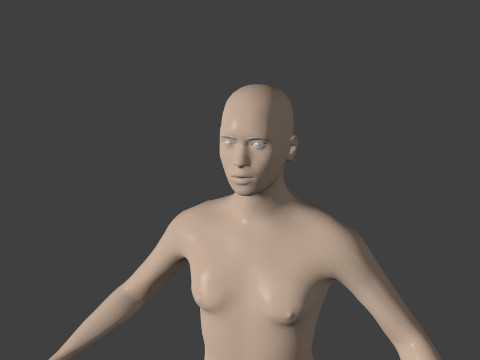
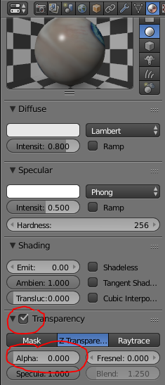
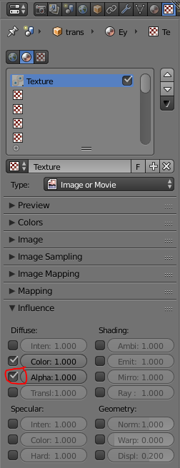
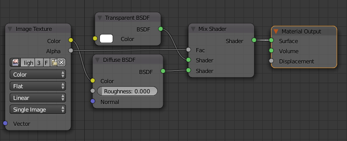

## The problem

If you have made an import via Collada, you will soon find that some textures are not working properly. Specifically, eyes will look odd.

The problem is that Collada blender import isn't bright enough to recognize that textures can have transparency. This needs to be fixed up manually after import.

This guide is only relevant for Collada. If you use [MHX2](https://bitbucket.org/ThomasMakeHuman/mhx2-makehuman-exchange) for example, these things are handled automatically.

The resolution is somewhat different depending on whether you use Blender Internal or Cycles.
  

## Blender internal

If you made the import while in Blender Internal mode, the materials are set up largely correct. All that needs to be done is to enable the transparency.

Select the mesh (for example the eyes) which is misbehaving, and go to the materials tab. Here enable transparency and move the alpha slider to 0.

  

In the texture tab mark that the texture should influence the transparency of the material

  

## Cycles

In cycles, you probably have larger problems, since the Blender Collada importer seem to have no concept at all of nodes-based materials. So you will have to set up the materials manually.

It is usually a better idea to import in blender internal mode and then switch to cycles, with or without using something like [the Convert Materials to Cycles] plugin. This was superseded in 2016 by the [https://developer.blender.org/T48642 Material Utils Addon] but the last update of the original converter plugin can be found in [https://developer.blender.org/diffusion/BAC/browse/master/materials_cycles_converter.py;3f433bbe91fdbb65feebdccc5b868a8df5be50a5?view= this rBAC commit](http://wiki.blender.org/index.php/Extensions:2.6/Py/Scripts/System/Convert_Materials_to_Cycles).

In any which way, a reasonable basic setup for the eye texture would look like this with nodes:

  

You might want to add glossy shaders etc, but with this setup at least the texture will look ok. 

## Results

Having done the above, the eyebrows and eyes (which are the usual suspects) will start to behave in renders:

