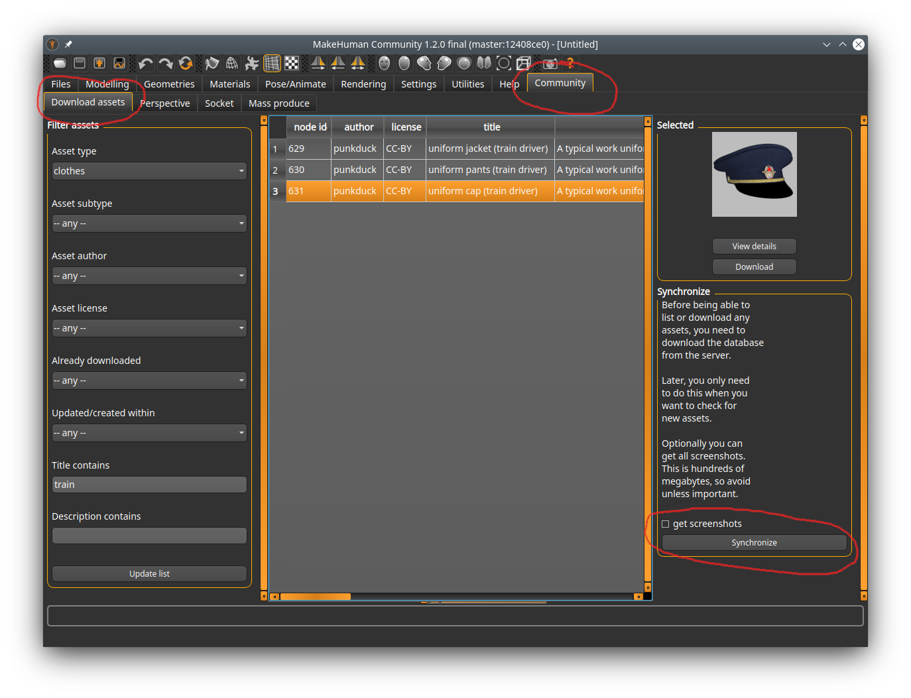

There are two main methods of downloading assets

## Using the asset downloader

This is the recommended method. However, this method only works for 1.2.0 and later. It will not work on 1.1.0.

In MakeHuman, go to the community -> download assets tab. The first time you open this tab you will be informed that you need to click the synchronize button to get information about which assets exist. Once having done so, you can search for assets, select them and download them with the download button. A downloaded asset will be immediately available once you switch to, for example, the clothes tab.

## Downloading manually

Before using this method, see [[FAQ: I can't download from the user repos, all files are saved as HTML]]

The basic procedure for how to download assets manually can be seen in [[FAQ: I downloaded third party clothes. How do I install them?]]