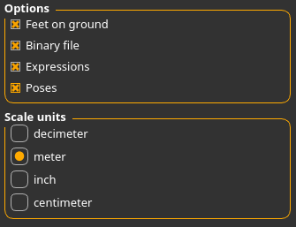
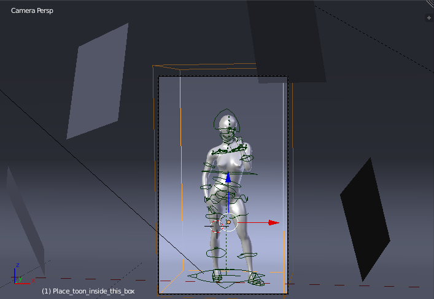
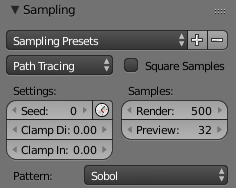
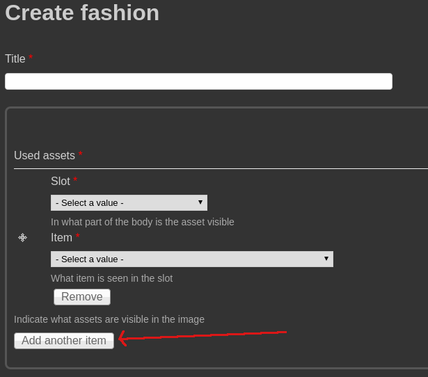
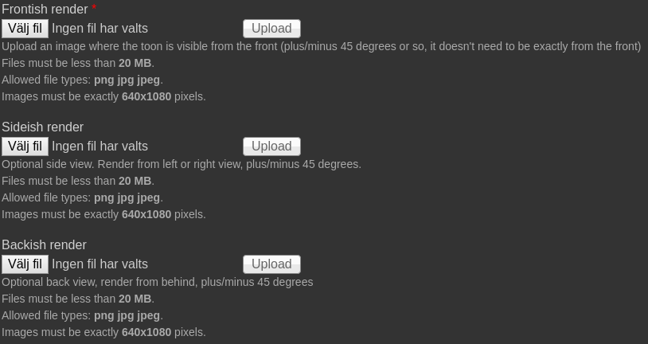

## The short version

Download the [LightRoom2.blend](http://www.jwp.se/files/LightRoom2.blend) file. Import a toon with the assets you want to demo. Hit the render button. Go to 
[the fashion render list](http://www.makehumancommunity.org/fashion.html) and click "add". Then follow the instructions.

## The long version

The intention with the fashion render is to give the user a completely honest idea about an asset, and to enable comparison of assets. Thus, you are very limited in what you are allowed to change in the scene. 

### Rules

What you ''cannot'' do for the front/side/back renders:

* You can't move light sources or change their intensity
* You can't move the camera or change it angle
* You can't edit the backdrop mesh
* You can't change the settings for sky backdrop or ambient occlusion
* You can't change the materials from how MHX2 made them look upon import (with the exception that you are allowed to manually add bump maps / normal maps if MHX2 failed to set them up correctly)
* You can't edit the meshes of the assets (with the exception that if two clothes pieces from different authors intersect each other, you are allowed to delete a few of the offending vertices)

What you ''can'' do for the front/side/back renders:

* In the rare circumstance an asset is built for flat shading rather than smooth, you are allowed to set the shading to flat (this is not possible to handle via materials atm)
* You are allowed to use whatever toon shape you want
* You are allowed to use whatever pose you want (although for practical reasons, poses where the toon is lying down should probably be avoided)
* If you so desire, you can add a subdivision modifier both on the toon and on the assets
* Change the color of the backdrop (might be necessary if there is too little contrast between the clothes and the backgrount)

When you upload your renders, there is a file slot called "touched-up render". This follows the same rules for scene, lights and camera, but for this image:

* You are allowed to do whatever you want with the materials
* You are allowed to do minor touch-up on the meshes
* You are allowed to use particle systems where you feel it is appropriate

### Instructions

Model the toon to your liking in MakeHuman, and equip it with the assets you want to demo. If there is a pose you would like to use, you might as well assign it too, otherwise you will need to pose the character inside blender later on. 

Upon export, use MHX2 unless you have strong reasons not to. Be sure to set "scale units" to "meter".

In blender, import the toon. It should appear in roughly the appropriate position. If not, move it so that it fits inside the box named "place_toon_inside_this_box".

The file defaults to 2000 samples, GPU compute. If this is too heavy for your machines, adjust these settings, but please do not go below 500 samples.

Render the scene. Save image with an appropriate file name. If you want to do renders from the side and/or from the back, then rotate the toon, re-render and save. 

Optionally, if you want to make a touched-up version, edit the materials to your liking and re-render.

With the files in place, go to [the fashion render list](http://www.makehumancommunity.org/fashion.html) and click "add". 

In the upload form, enter a title. This should be a very short description of what the render is about, for example "new gown". 

For each asset you have used in the image, list what slot it is in and what asset it is. The asset is selectable in the "item" drop down, which will display a list of asset names, sorted on name but split up by asset category (note that hair will appear as clothes). To add more rows to list assets in, click "add another item".

You do not need to list items which came bundled with MakeHuman (these aren't available in the item drop down list anyway). 

For each image you want to add, select it in the appropriate slot. It is probably best to click the "upload" button each time you selected an image, otherwise you might get a server error on the submit of the post. 

If you so desire, you can add some comments about the renders. But these comments will only be visible of the full post is shown, not in the fashion render list.