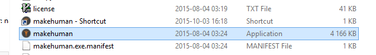
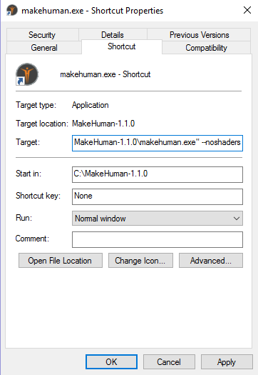

First, see if the instructions here are of any help: [[FAQ: The interface looks broken]]

**This page is only relevant for MH 1.1.x. If you experience the same problem with MH 1.2.x, please make a bug report and include the log file.**

If you experience this problem and are still using MH 1.1.x, please consider testing MH 1.2.x to see if it solves your problem. MH 1.1 and 1.2 should be possible to run side by side on the same machine.

The problem is that your graphics card drivers doesn't agree with the somewhat quirky way MakeHuman uses OpenGL with shaders.

This is a common problem of many graphic cards from all common producer (AMD, Intel, NVIDIA). From Intel.com:

"OpenGL* is an API (Application Programming Interface) for 3D graphics that is used by many games. OpenGL enables hardware acceleration of 3D graphics, so support is required from the graphics drivers for optimum performance. The latest graphics drivers will usually provide the best compatibility with games that use OpenGL. Graphics drivers that come with Microsoft Windows or that are downloaded from Windows Update typically do not support OpenGL."

On possible solution is to check the vendor official site download and install latest graphics drivers for your card.

If all else fails, MakeHuman has a fallback mode that disables all shaders and takes you back to good old 2003 fixed function shading. To enable this, run makehuman with the following commandline option:

**makehuman --noshaders**

In windows, the easiest way to do this is to create a shortcut:

And then edit it and add "--noshaders"

