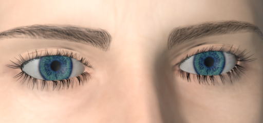
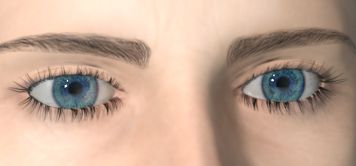
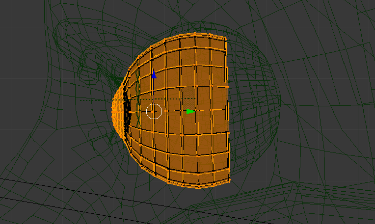
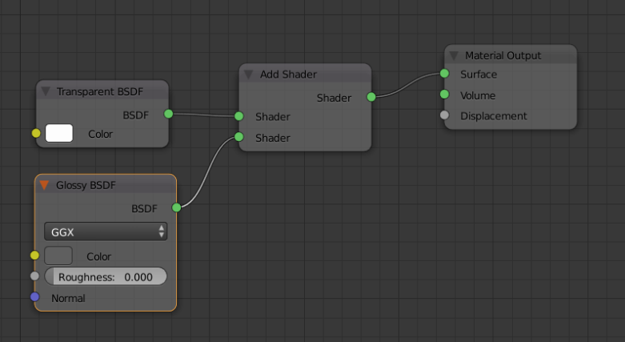

The default MHX2 material is a least common denominator, and you'll most likely want to tweak it a bit for the eyes. 

There are usually two problems. 

The first is that the eyewhites look gray, which is because you have too little light entering the eyes. To solve this, try to increase the light, ambient or otherwise, which shines on the eye area. 

The second is that eyes usually have "reflective shine", in the sense that the outer surface looks wet and has hard glossy highlights. 

By default the MHX2 eyes material looks like this when rendered:

With with relatively easy means, you can add "reflective shine" so that the eyes look like this:

To achieve this, select the outer layer of the high-poly eyes:

And assign a new transparent material with an "add" shader adding a hard glossy:

