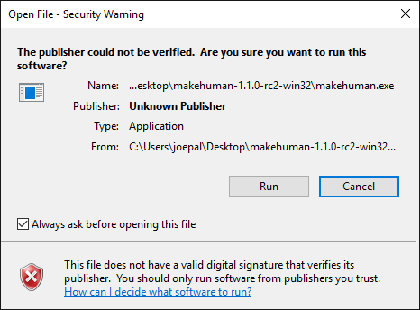

This is because Microsoft expects all software authors to pay money to certificate authorities in order to get rid of the warning. There's no way around it, short of paying up.

Even "small" recurring sums are insurmountable for an open source project which does not have a budget. So this is not going to be fixed anytime soon. 

The upside is you can simply ignore the warning and run anyway. Nothing bad will happen.