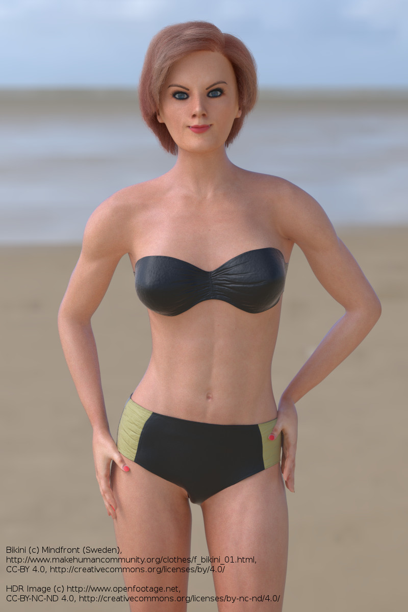

Note that the following is a practical summary of the CC-BY license. If you want to get into the details, you should start at https://creativecommons.org/licenses/by/4.0/ and then also read the full license text at https://creativecommons.org/licenses/by/4.0/legalcode. It is your responsibility to ensure you follow the terms of the license. MakeHuman is not in any way a part in the legal agreement between you and the author of the asset you use, so what is written below is merely an interpretation from a third part.  

MakeHuman as such only includes CC0 assets. However, that only applies for content that was provided by MakeHuman as such. Specifically it does ''not'' apply to assets you downloaded separately from the user contributed asset respositories. 

In those repositories, you will find assets that come licensed in two forms: CC0 and CC-BY. 

If an asset is licensed CC0, you can use it in the same way as you use all other MakeHuman assets: you don't need to do anything in particular at all when using the asset. 

If an asset is licensed CC-BY however, you must live up to the obligations of that license. You are granted usage of the asset only under the premise that you ''tell end users of your work that you used the model in question, and who you got the model from''. 

It is also etiquette, but not legally required, to say ''where'' you downloaded the model. 

## Examples of how to live up to the CC-BY license

**Youtube**

When producing a video, it is etiquette to include info about the asset inside the video, for example in rolling credits at the end. If this is not possible to do, then as a last resort it is acceptable to include the information in the video description where you posted the video (for example in youtube's "description" field). Let's use one of Punkduck's assets (http://www.makehumancommunity.org/clothes/godkiller_sword_wonder_woman.html) as an example. A functional formulation would be:

''This video uses the "God-killer Sword (Wonder Woman)" asset by Punkduck, shared under the terms of Creative Commons Attribution 4.0'''

**Closed-source game**

In applications and games, you will most likely have an "about" or "legal info" menu entry or popup box. This is an appropriate place for information about the usage of CC-BY assets. 

As a last resort, it would be acceptable to include information about the used assets in a bundled README.txt file. But then only if users are likely to find and read that file.

**Rendered image**

If at all feasible, include info about the assets as stamped-on text in the image as such. Let's use Wolgade's demonstration of MindFront's bikini asset as an example:

 

If it is not feasible to include the information in the image as such, it is acceptable to add the information in text alongside the image where you post it.