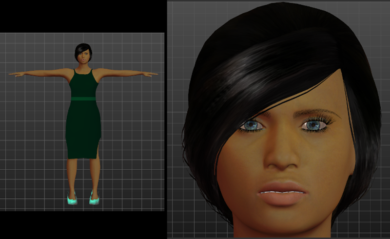

## Summary

More often than not MakeHuman users will want to move their creation into another program to continue the creation process.  This section provides information on how to achieve this for common target programs.  The ''Background and Technical Consideratins'' section provides some background that are common to all workflows.  It is not essential to read the introduction before going straight to the program of interest, but doing so might help you understand ''why'' certain steps work or are necessary. In many cases there can be more than one way to accomplish the same thing.  The method described here may not be optimal for your situation, but it should help get you started.

## [[Background and Technical Considerations]]=
[[Background and Technical Considerations]]

This subsection will provide some general information on "trouble spots" when trying to take your MakeHuman work and use it in a downstream application.  Many of the problems discussed are topics that always arise when moving assets between 3D programs.

*Introduction [Considerations [http://www.makehumancommunity.org/wiki/Background_and_Technical_Considerations#Format_Considerations](http://www.makehumancommunity.org/wiki/Background_and_Technical_Considerations#Introduction]
*Format)
*MakeHuman Shader and Asset Rendering [transformation: MakeHuman Coordinate System, MakeHuman Skeletons, and MakeHuman Scales [http://www.makehumancommunity.org/wiki/Background_and_Technical_Considerations#Spatial_transformation:_MakeHuman_Coordinate_System.2C_MakeHuman_Skeletons.2C_and_MakeHuman_Scales](http://www.makehumancommunity.org/wiki/Background_and_Technical_Considerations#MakeHuman_Shader_and_Asset_Rendering]
*Spatial)
*Working with Rigs and Skeletons [Assets with transparency [http://www.makehumancommunity.org/wiki/Background_and_Technical_Considerations#MakeHuman_Assets_with_transparency](http://www.makehumancommunity.org/wiki/Background_and_Technical_Considerations#Working_with_Rigs_and_Skeletons]
*MakeHuman)

## Illustrating the Export Process for Subsequent Import=

For the purposes of illustration we will take a straight forward MakeHuman character that has been given a skeleton, a pose, a skin material, clothing, eyes, eyelashes, eyebrows, hair, tongue and teeth.  We will then export it for import into a number of popular downstream applications.  For each application, our goal will be to get the character to look similar to its original look in MakeHuman.  We will pay particular attention to the head and face because this is the area of greatest difficulty for dealing with transparency and shadows. The character has the default skeleton and has been set in the T-pose which is a common starting pose for animation-based work. The image we will be exporting looks like this in MakeHuman:

**Figure 1.**  MakeHuman character as viewed from within MakeHuman prior to export.

In subsequent sections, we will discuss the steps needed to reproduce this look after importing into specific downstream programs.

## [[Moving Assets into Autodesk Maya]]=
[[Moving Assets into Autodesk Maya]]

This subsection describes the restoration and use of MakeHuman's transparency and skeletal assets after importing in Autodesk Maya.
*Introduction [and Initial Setup [http://www.makehumancommunity.org/wiki/Moving_Assets_into_Autodesk_Maya#Importing_and_Initial_Setup](http://www.makehumancommunity.org/wiki/Moving_Assets_into_Autodesk_Maya#Introduction]
*Importing)
*Basic Repair of Eye Transparency [for other Transparent Assets [http://www.makehumancommunity.org/wiki/Moving_Assets_into_Autodesk_Maya#Repeat_for_other_Transparent_Assets](http://www.makehumancommunity.org/wiki/Moving_Assets_into_Autodesk_Maya#Basic_Repair_of_Eye_Transparency]
*Repeat)
*Raytrace Shadows ["Fixed MakeHuman Assets" from Maya after saving in FBX format [http://www.makehumancommunity.org/wiki/Moving_Assets_into_Autodesk_Maya#Re-importing_Intermediate_FBX_files_from_Maya](http://www.makehumancommunity.org/wiki/Moving_Assets_into_Autodesk_Maya#Raytrace_Shadows]
*Re-importing)
*Adopting MakeHuman Skeletons to Maya [http://www.makehumancommunity.org/wiki/Moving_Assets_into_Autodesk_Maya#Adopting_MakeHuman_Skeletons_to_Maya]

--------Skeleton subsection still to be written--------

## [[Moving Assets into Autodesk 3DSMax]]=

[[Moving Assets into Autodesk 3DSMax]]

This subsection describes the restoration and use of MakeHuman's transparency and skeletal assets after importing in Autodesk 3DSMax.

*Units Considerations [FBX into 3DSMax [http://www.makehumancommunity.org/wiki/Moving_Assets_into_Autodesk_3DSMax#Importing_FBX_into_3DSMax](http://www.makehumancommunity.org/wiki/Moving_Assets_into_Autodesk_3DSMax#Units_Considerations]

*Importing)

*Restoring Transparency for the Eyes [Transparency on the Other Assets [http://www.makehumancommunity.org/wiki/Moving_Assets_into_Autodesk_3DSMax#Fixing_Transparency_on_the_Other_Assets](http://www.makehumancommunity.org/wiki/Moving_Assets_into_Autodesk_3DSMax#Restoring_Transparency_for_the_Eyes]

*Fixing)

*Repairing an Imported MakeHuman FBX file that was previously Exported after Fixing [MakeHuman Skeletons into 3DSMAX [http://www.makehumancommunity.org/wiki/Moving_Assets_into_Autodesk_3DSMax#Importing_MakeHuman_Skeletons_into_3DSMAX](http://www.makehumancommunity.org/wiki/Moving_Assets_into_Autodesk_3DSMax#Repairing_an_Imported_MakeHuman_FBX_file_that_was_previously_Exported_after_Fixing]

*Importing)

## [[Moving Assets into Blender]]=

[[Moving Assets into Blender]]

This subsection describes the import of transparent assets after importing in Blender.  The initial focus will be on using the Blender Internal Render engine.  The use of Cycles render engine will be handled separately.  The Blender tools (MakeClothes, MakeWalk, MakeTarget) for designing and working with MakeHuman internal assets are described elsewhere.

## Moving Assets into Unreal Engine 4=
The documentation for how to work with Unreal Engine is available in [[Documentation:Saving_models_for_Unreal_Engine_and_how_to_import_them_there|"Saving models for Unreal_Engine and how to import them there"]].

## Moving Assets into Unity Game Engine=

The documentation for how to work with unity is available in [[Documentation:Saving_models_for_Unity_and_how_to_import_them_there|"Saving models for Unity and how to import them there"]].

## Moving Assets into Sketchup Pro=

## Preparing assets for use with Second Life=

## User contributed assets. Sharing your creations with the community=

You finally managed to model a cool piece of clothing or something else? You would like to share it with others? Great! A few words before you start loading up:

MakeHuman is available for more than one OS. Users live in different countries using different language settings. This has some consequences to think about before you upload your asset.

*Avoid non-ascii characters in your filenames. Depending on language settings some characters might lead to trouble. Stick to English in your file names and you're safe.
*Don't use spaces in file names. Today, on most platforms you can use file names like "My Asset.mhclo", but a lot of scripts won't be able to handle it. They consider the space after "My" as a delimiter and fail. Instead of "My Asset.mhclo" "My_Asset.mhclo" would be better. 
*"My_Asset.mhclo" is still a bad filename. On Windows file names aren't case sensitive. On Linux they are. On Windows "My_Asset.mhclo", "my_asset.mhclo" and "My_Asset.MHCLO    " all refer to the same file. On Linux they are three completely different files. You want your stuff to work on all platforms. Avoid uppercase letters. "my_asset.mhclo" is a good filename.
*These rules are true for all files that belong to your asset. 
*Consider using the same base name for files belonging to your asset. For example, if you have a "my_asset.mhclo", it'd make sense to give a material belonging to it the name "my_asset.mhmat" rather than "some_other_random_name.mhmat". 
*Use self-explanatory file names for your graphic files. For this example "my_asset_diffuse.png" would be a good idea for the diffuse texture. Don't use just "diffuse.png". If there's more than one asset using this lazy naming convention files will be overwritten on export.
*This one's obvious, but often forgotten: After renaming your files, open the .mhclo and .mhmat files and change the referenced file names to your new file names.