## Units Considerations

We will use the file created in the “Illustrating the export/import process” section to illustrate how to get your MakeHuman ready for use in Autodesk 3DSMax.  During export the FBX exporter was set to ASCII and the scale was set to inches.
  
Autodesk 3DSMax has two types of units: “system units” and “display units”.  By default, Autodesk uses inches as its “system units”.   It is essential that 3DSMax “system units” be set to their FINAL value BEFORE importing any asset.  Once set, do not change them again for that scene.  If a 1 cubic foot cube object is imported, and then the system units are changed from inches to meters, the cube will become 1 cubic meter in volume.

The use of imperial inches as system units can complicate the process of FBX export/import, but if you export from MakeHuman using inches and import into 3DSMax using “automatic settings”, things should work well. [edit RWB: this needs rechecking after finalizing MH unit handing for FBX].  This is the straight forward approach for architectural work in the U.S. where imperial units are common.  The Autodesk web site discourages changing the system units of 3DSMax from default, but makes an explicit exception when importing assets from sources constructed using metric dimensions [http://knowledge.autodesk.com/support/3ds-max/learn-explore/caas/CloudHelp/cloudhelp/2015/ENU/3DSMax/files/GUID-7ECD378E-5A3F-4722-B32B-8A0EB581824A-htm.html][http://knowledge.autodesk.com/support/3ds-max/learn-explore/caas/CloudHelp/cloudhelp/2015/ENU/3DSMax/files/GUID-DFE074D9-FF5E-4AAC-B3F8-AB53ADCDC124-htm.html].  

If you are importing many metric objects into 3DSMax from other programs, it may make sense to change your “system units” to either centimeters or meters, and export your MakeHuman character in FBX format with the corresponding units.  System units and Display units in Autodesk 3DSMax can be accessed from the Customize | Customization | Unit Setup menu:

 

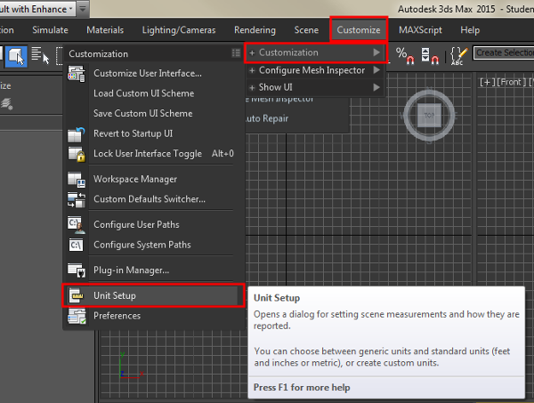

**Figure 1**

In the Units setup dialog choose “System Units”, and in the System Unit Setup dialog choose your desired units.  Notice that in the figure below that although the “system units” are set to the default units of inches (right dialog), the display units are set to meters (radio button next to metric in left dialog).  Imported assets are scaled into system units.  System units are then converted to display units for the purposes of the 3DSMax ruler display, but remain stored internally in original system units.
 
 

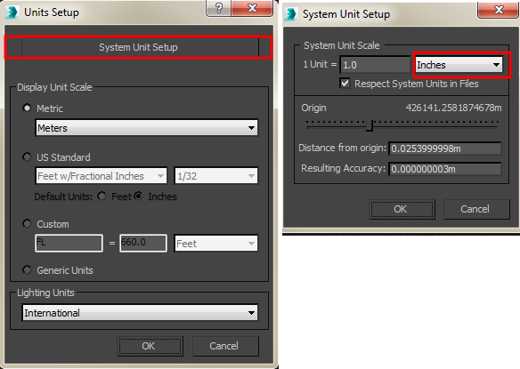

**Figure 2**

With this understanding of how to control the 3DSMax side of things, let’s import our MakeHuman character.  We will leave 3DSMax set to inches, and export our MakeHuman FBX file using inches as units as well.

## Importing FBX into 3DSMax

From the 3DSMax application menu choose Import |Import, and navigate to FBX file you exported from MakeHuman using inches.

 

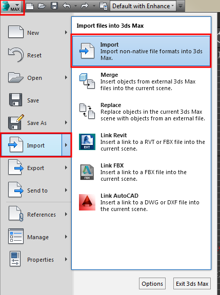

**Figure 3**

By default, the exported file will be found in ~/makehuman/v1/exports/SomeName.fbx (where ~ is the user home directory).  The textures for the exported file will be found in a subfolder called textures of the folder where the .fbx file is stored.  3DSMax can import either ASCII or binary FBX files, so either type of export can be used for MakeHuman  export.  [RWB Note: as of this writing there are still some issues with direct FBX binary export, but those are expected to be repaired going forward].  When the file is initially imported into 3DSMax it looks like this:

 

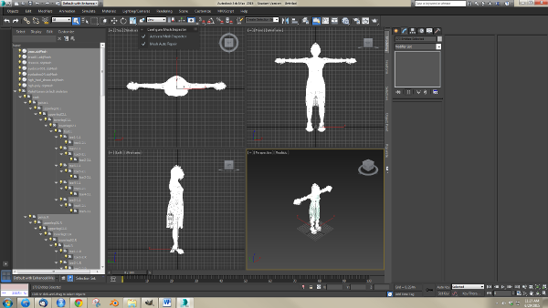

**Figure 4**

Click on the word [wireframe] in the top left of a viewport and choose realistic (or hardware in older versions) to see the material displayed with maps.  The shortcut key is SHIFT-F3.  

 

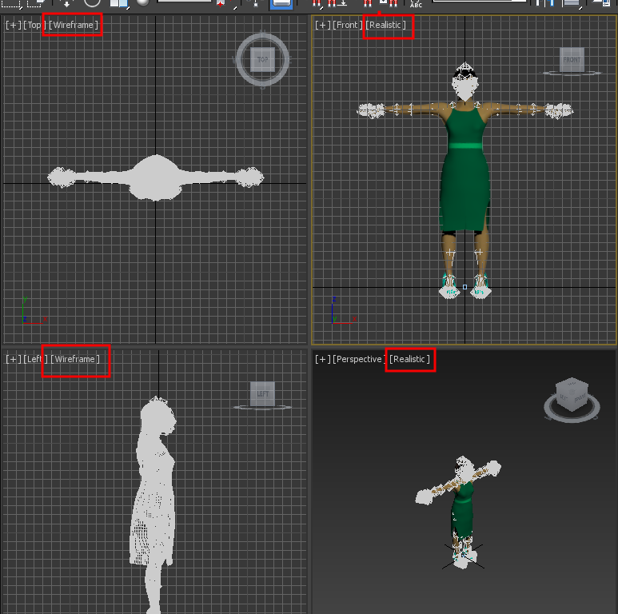

**Figure 5**

To maximize the front viewport, left click on the front vieport to make it active and type ALT-W. Use the scroll wheel and middle mouse drag to zoom in on the face.

 

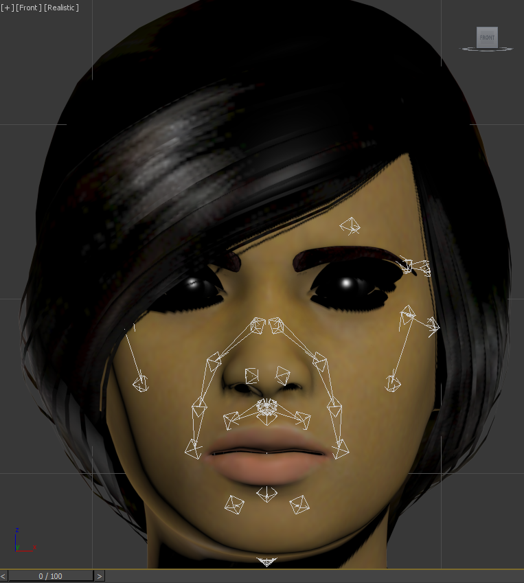

**Figure 6**

 
Finally, it is helpful to hide the rig of the MakeHuman skeleton.  In the panel on the right, select the Display icon and click on the put a check "helpers" in the "Hide by Category" panel.

 

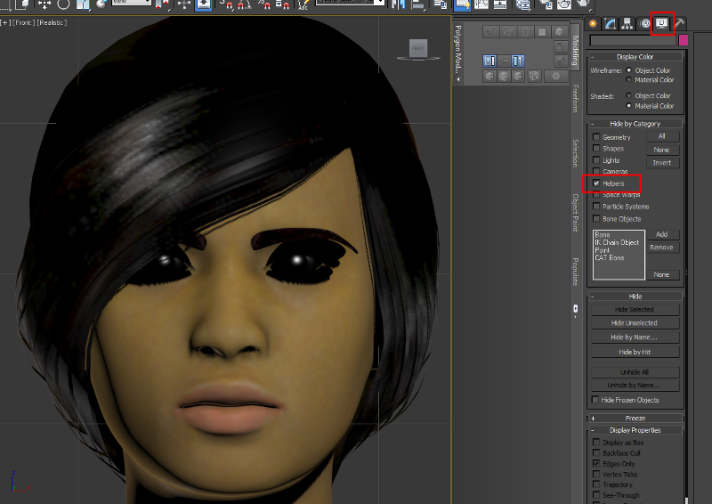

**Figure 7**

## Restoring Transparency for the Eyes

You should now have a relatively unobstructed view of the imported MakeHuman character.  You will notice upon zooming in that there are significant issues with the transparency for eyes, eyelashes, eyebrows, and hair.  We will illustrate the steps for the eyes.  They can be repeated for the other 3 assets that use transparent materials.

Here are the steps to fix the eyes:

1. Left-click the eyes to select them. 

 

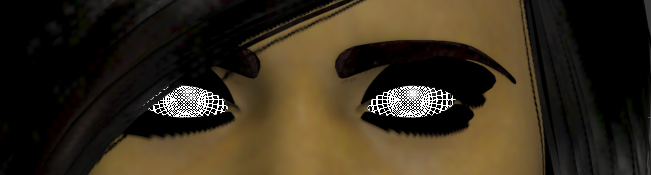

**Figure 8**

2. From the menus select, Materials | Create/Edit Materials | Edit selected Object’s Material.  The Slate Material Editor will open with the [high poly] eyes node selected.  [Note: If the compact material editor opens instead, use the Mode menu to go to the Slate Material Editor.] Click on the slate editor window to make it active. Spin the scroll wheel toward you until you see the texture map (Blue_eye_png in this case) attached to the Diffuse node on the eye material.  Shift-middle mouse drag may help you center this pair in your viewport.

 

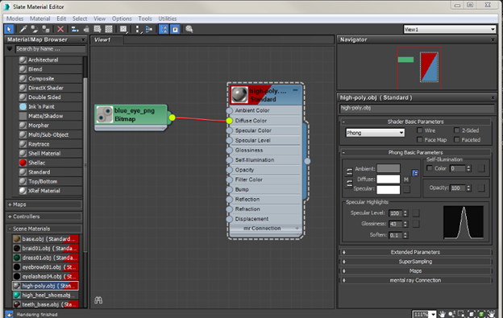

**Figure 9**

3. Drag the output connector of Blue_eye_png bitmap to make a second connection with the opacity input node of the high poly obj node (standard).

 

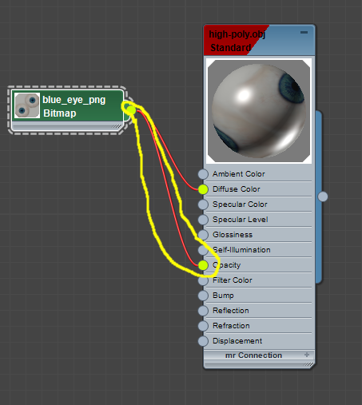

**Figure 10**

4. Now double left-click on the Blue_eye_png bitmap node to reveal the transparency settings for the eye transparency settings for the eye texture map.  Of course, if you used a different eye texture, the name of your texture map will differ, and you should double click on the corresponding texture bitmap.

 

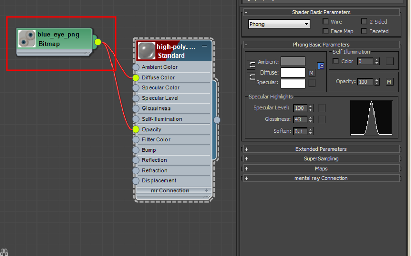

**Figure 11**

5. Under bitmap parameters (right panel) set Mono Channel Output to alpha, set Alpha Source to Image Alpha, and confirm that RGB Channel Output is set to RGB.

 

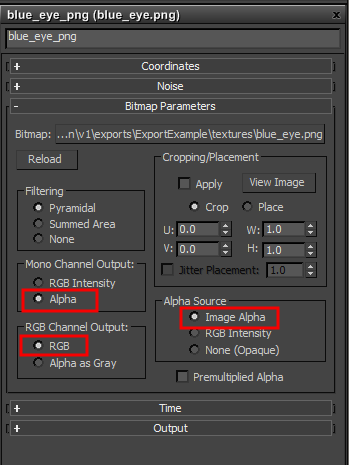

**Figure 12**

The eyes should now appear as the natural color with which they were exported from MakeHuman.

 

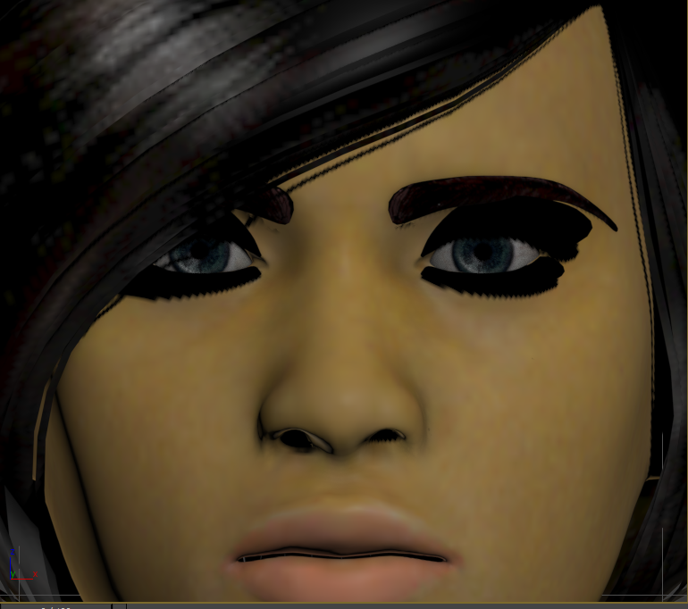

**Figure 13**

## Fixing Transparency on the Other Assets

To fix the eyebrows, eyelashes, and hair, repeat steps 1 - 5 as described for the eyes with each other asset with that asset selected in turn.  After completing the eyebrows, out model looks like this:

 

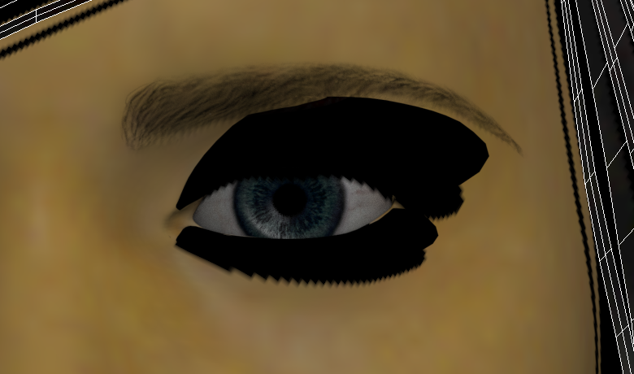

**Figure 14**

After completing the eyebrows and the eyelashes, our model looks like this:

 

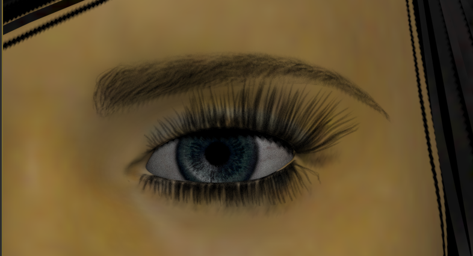

**Figure 15**

After completing everything, our model looks very similar to the look it had upon export from MakeHuman.

 

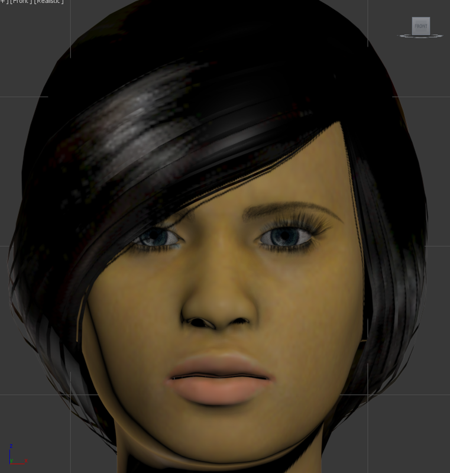

**Figure 16**

## Repairing an Imported MakeHuman FBX file that was previously Exported after Fixing

At this point if you save the file using Autodesk 3DSMAX native.max format, it can be read in again with no additional correction necessary.  However, if you export the file as in FBX format and then read the file back into a new session it will have semi-transparent hair and now eyelashes or eyebrows.  You may have a similar experience if you export the file as FBX from another program such as Maya.  What has happened is that the "mono channel output" setting has changed from alpha to RGB.  The face looks like this after importing:

 

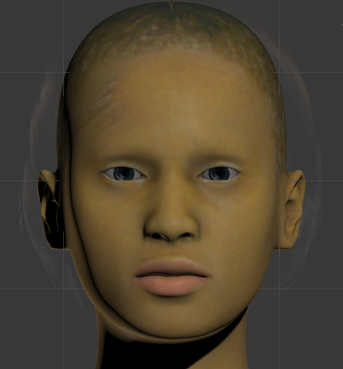

**Figure 17**

Fixing this problem is relatively straight forward, although it seems that sometimes the slate material editor needs resetting to properly show what has happened to the "Mono channel output" setting.  The steps to repair this problem should be done for the eyes, eyebrows, eyelashes, and hair, each in turn.  The 3 steps are as follows:

1. Left-click to select the eyes.  Start the slate material editor by either using the menu **Materials | Create/Edit Materials | Edit Selected Object's Material**, as before, or by simply clicking on material editor icon on the right of the icon bar.

 

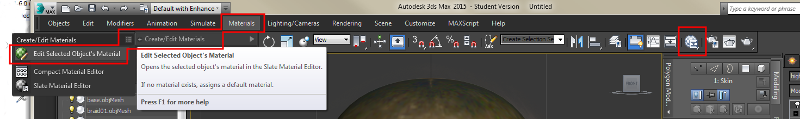

**Figure 18**

2. Sometimes it is useful to refresh the slate material editor by selecting all from the select menu (or shortcut CTRL-A) and then refreshing using **Edit | Auto update selected Previews** (or shortcut CTRL-U).  This seems to make the status of the Mono Channel Output appear accurately in step 3.

3. Double click the blue_eye.png bitmap node (or the corresponding eye texture for you MakeHuman asset).  Left click to check the "alpha" setting under Mono Channel Output.

 

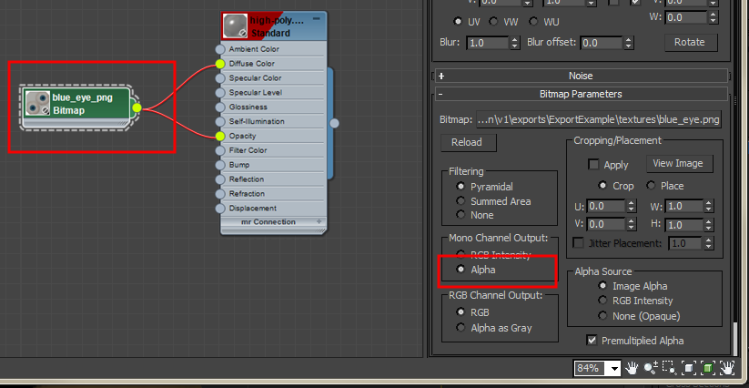

**Figure 19**

Upon completing steps 1-3 for the eyes, the face will appear like this:

 

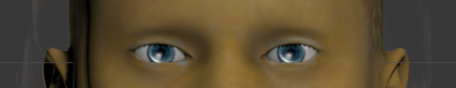

**Figure 20**

Repeat the steps above to restore the Mono Channel Output setting to alpha for the eyebrows, the eyelashes, and the hair.  You MakeHuman character should now again look essentially like the original that was in MakeHuman.

 

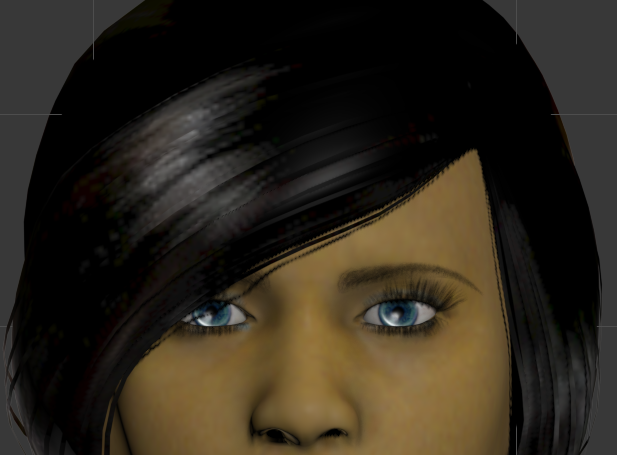

**Figure 21**

## Importing MakeHuman Skeletons into 3DSMAX

TO BE WRITTEN