## Introduction
We will use the file created in the “Illustrating the Export Process for Subsequent Import” section.
The FBX export settings used for Maya import should include setting the scale units to centimeters on export.  Maya can import either ASCII or binary FBX files, so either type of export can be used for MakeHuman  export.  <nowiki>[RWB Note: as of this writing there are still some issues with direct FBX binary export, but those are expected to be repaired going forward]</nowiki>.  By default the exported file will be found in ~/makehuman/v1/exports/ (where ~ is the user home directory).  

## Importing and Initial Setup

When the file is initially imported into Maya it looks like this:
 

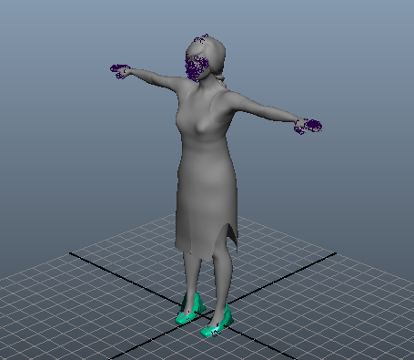

**Figure 1**

The only color in the viewport is the shoes which had a simple diffuse material which was not associated a texture.  By clicking the textured icon at the top of the viewport, the viewport shows a preview of how the rendered, textured image would appear:

 

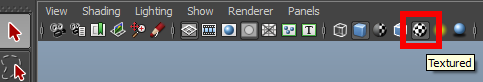

**Figure 2**

Holding down Alt and scrolling with the middle mouse wheel allows us to zoom in and see the problems with the imported eyes, eyelashes, eyebrows, and possibly the hair:

 

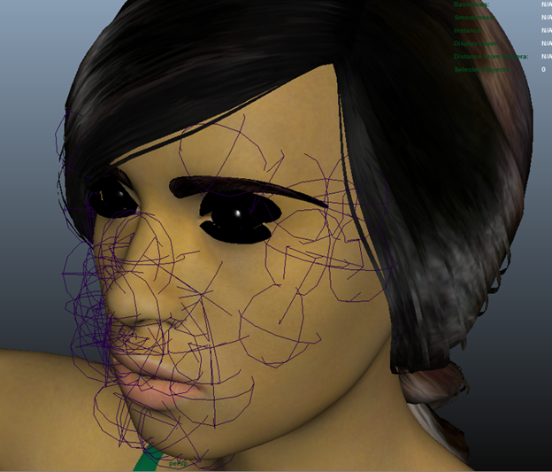

**Figure 3**

The thin lines on the face are an artifact of having included the facial rig by choosing the default skeleton.  The process of fixing the **eyes, eyelashes, eyebrows, and hair** is the same in each case.  We must tell Maya to use transparency from the corresponding alpha channel when rendering the corresponding mesh.  It can be hard to select the facial mesh objects in perspective view so it is advisable to go into orthographic front view.  One way to do this is with the panel menu just above the viewport.

 

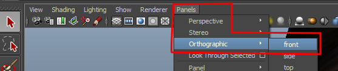

**Figure 4**

## Basic Repair of Eye Transparency =

Once in front view, left click to select the eye meshes, and perform the following steps:

 

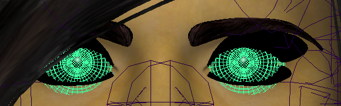

**Figure 5**

1. In the attribute editor on the right side of the screen, use the right arrow key to make sure the right-most tab is visible and click it to show the corresponding attributes.

 

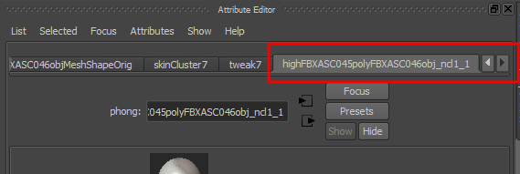

**Figure 6**

2. In the phong shader section, open the Common Material Attributes section and click on the checkered button to the right of transparency.

 

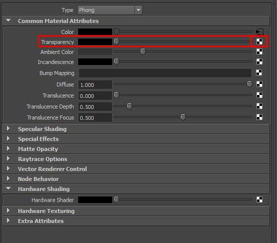

**Figure 7**

3. In the Create Render Node dialog box that pops up, click on file. 

 

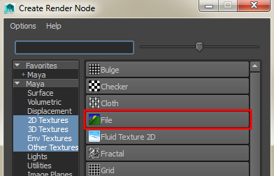

**Figure 8**

4. The checkered button next to transparency (see Figure 7) turns into an arrow, 

 which you can click to allow the attribute editor to locate the texture map for your eyes. In our example, this texture is called blue_eyes.png.  You navigate to this file by left clicking on the yellow folder file attributes section as shown in the image below:

 

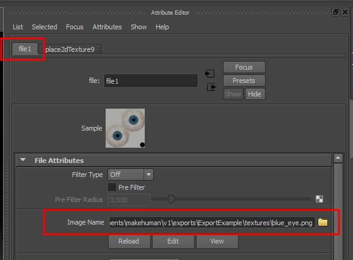

**Figure 9**

5. This step for transparency will probably will NOT be needed if you import straight from MakeHuman, but it may be needed if you do intermediate work in another program like 3DSMax.  Open the color balance section on the same file1 tab of the attribute editor and verify that “Alpha is Luminance” is unchecked (Figure 10 below).  Uncheck it if it is checked.

 

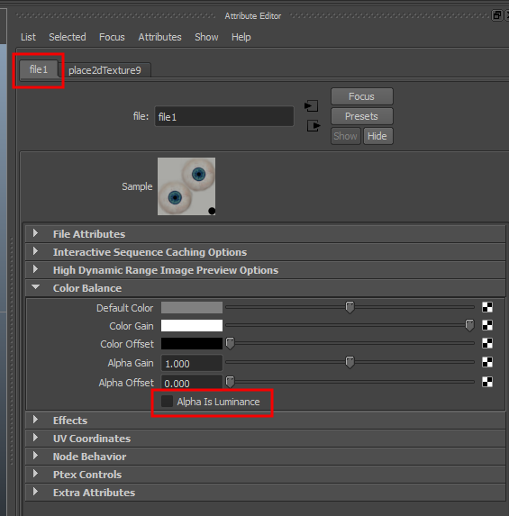

**Figure 10**

The eyes in our image now look like this:

 

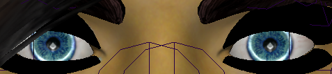

**Figure 11**

----

##  Repeat for other Transparent Assets=

You need to **repeat steps 1-5''' after selecting the '''''eyebrows''''' in the viewport, after selecting the '''''eyelashes''''' in the viewport, and after selecting the '''''hair''** in the viewport.  When we finished these steps on each of the assets of our test model, the face is a nice approximation of what we started with in MakeHuman and looks like this:

 

**Figure 12**

----

##  Raytrace Shadows=

Depending on the lighting you are using in Maya, you might have one additional adjustment to make. To avoid transparency shadows, it is necessary to return to the phong section of the attribute editor by left clicking on the eyes in the viewport.  In the phong shader section, open the raytrace options panel and move the shadow attenuation slider from its default of 0.5 to zero.

 

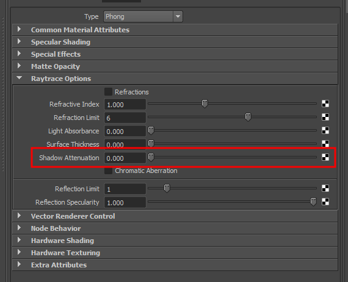

**Figure 13**

At this point the MakeHuman model can be saved in standard Maya .mb binary file and easily brought back into Maya. 

##  Re-importing Intermediate FBX files from Maya=

If the file is exported from Maya as an FBX file and read back into Maya, it imports with partially transparent assets and will look like this:

 

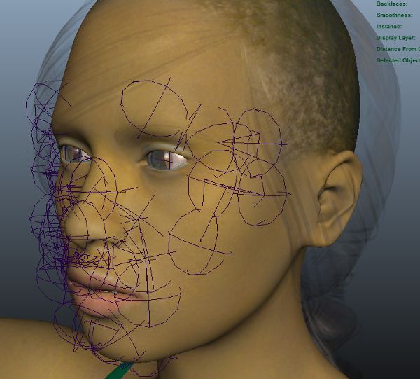

**Figure 14**

You may also see partially transparent assets if your asset pipeline involves an intermediate program between MakeHuman and Maya and you use FBX to import the workflow into Maya.  To once again restore it to its intended look, **take the eyes, eyelashes, eyebrows, and hair, and fix each in turn, as follows:**

1. Select the asset by left clicking on it, then click the right most tab in the asset editor panel on the right side of the screen.  Click the small arrow to the right of the transparency slider.

2. On the file tab that appears, open the Color Balance section and uncheck alpha Is Luminance.

3. It may also be necessary to click each of the four assets and under the Raytrace Options section of the Phong shader in the Attributes editor, change the shadow attenuation slide back to zero (refer back to figure 13).

 

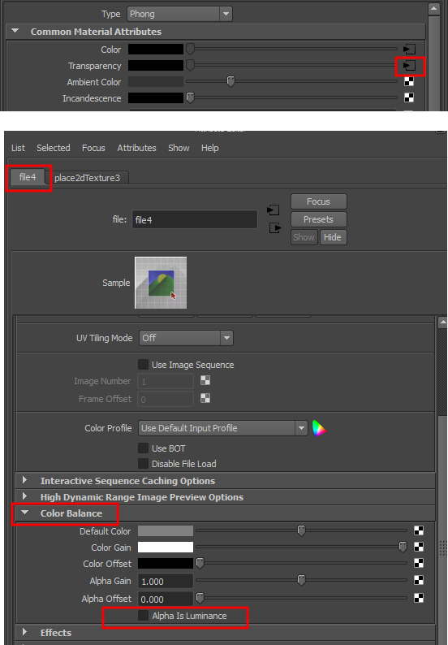

**Figure 15**

When you have re-done these steps for each of the four transparent MakeHuman assets the character should once again look like it did in MakeHuman.

## Adopting MakeHuman Skeletons to Maya

TO BE WRITTEN

----