## Introduction

''Note that the information in this page is somewhat outdated, and that you may be better off using MPFB, see [[FAQ: What is MPFB (MakeHuman Plugin For Blender)?]]''

We will use the file created in the “Illustrating the Export Process for Subsequent Import” section.
The MakeHuman export settings used when targeting Blender import should include setting the scale units to meters.  Blender is capable of importing either Collada (.dae) format or Autodesk FBX format files. The import results and handling are quite similar regardless of which you choose to use, and both will require similar fixes for transparent assets on the eyes, eyebrows, eyelashes, and hair.  Collada files are text based, and thus, are often quite large.  Makehuman assets with textures will be exported with those textures saved in a folder named "textures" in the same folder as the parent folder.  By default, on Windows If you move the collada file to a new computer or directory, you must move the "textures" folder to that same folder. By default the exported file will be found in ~/makehuman/v1/exports/ (where ~ is the user home directory).

Blender can import only binary FBX files at present, so ideally, binary would be checked for MakeHuman FBX export.  <nowiki>[RWB Note: As of this writing there are still some issues with direct FBX binary export, but those are expected to be repaired going forward.  In the meantime, a viable workaround for those wanting to use FBX format is to export an ASCII FBX file, convert it with the Autodesk FBX converter, and import it into Blender]</nowiki>.

Because of the ASCII --> binary issues that currently exist with the FBX format, we will describe moving assets from MakeHuman to Blender using collada (.dae) format. When exporting for subsequent import into blender, the best choice of export scales is usually meters.

## Importing a MakeHuman Collada File

The collada file is imported into Blender using the File | Import menu and choosing collada.  The default settings at the bottomof the left, T-tool panel will generally not need to be altered.

Once imported the file is likely to appear gray in the 3D viewport when in object mode and shading set to solid (Figure 1, left panel).  If shading is set to rendered with blender internal (BI) selected in the render drop down menu, the image will show the materials for many assets, but the eyes, eyebrows, eyelashes, and hair which contain transparent texture maps will not render properly.     

 

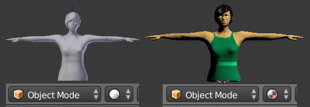

**Figure 1: Imported file as viewed in Blender 3D viepowt with Object mode and "solid" or "render" mode shading**

More often if we wish to select objects in the scene we will set the shading mode to 'texture' instead of 'render'.  By default the model will appear gray/white in texture mode by default.  To improve this, bring up the N-tool panel by typing N with the cursor located over the 3D viewport or by selecting View | Properties from the 3D menu.  On the toolbar, locate the shading panel and click on 'Multitexture' to change the setting to 'GLSL'.  The image should now show non-transparent materials properly (Figure 2). 

 

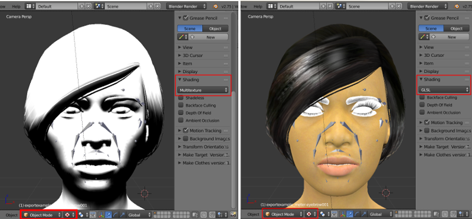

**Figure 2**

In some cases, you might gain additional benefit in displaying materials for the eyes by going to the Object data tab (cube).  This is located on the far right properties panel. For each of the transparent assets (eyes, eyelashes, eyebrows, and hair) select the Display panel and check 'Draw all Edges' and 'Transparency' in the bottom row.  The benefit of this step for improving trasparent assets will depend on exactly how you imported the file, the lighting, and possibly other settings.  What you see in the viewport is close to what you will see if you choose Render | OpenGL Render from the Info editor at the top of the screen.

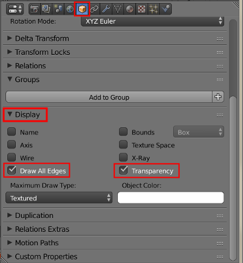

**Figure 3: Object data**

## Preparing for Render with Blender Internal Renderer

The appearance of the MakeHuman model in the Blender Internal Renderer will depend on a number of things that will include transparency settings for materials, choice of lighting type, and shadow settings.  We will illustrate this by first changing the default point light to a hemi light.  Right click on the point lamp in the viewport and in the right properties panel select the lamp tab and choose hemi (Figure 4).

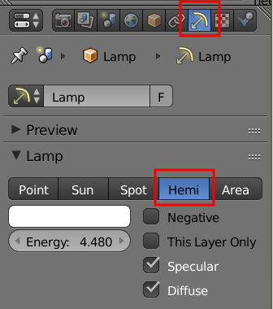

**Figure 4**

To make transparent objects (eyes, eyebrows, eyelashes, and hair) render properly in the Blender Internal render engine, we need to change some settings on the material tab of each object and the material tab of each object.  We will start with the material tab.  The two panels that require adjustment are the transparency and shadow panels. Start by selecting the material tab in the properties panel (figure 5).

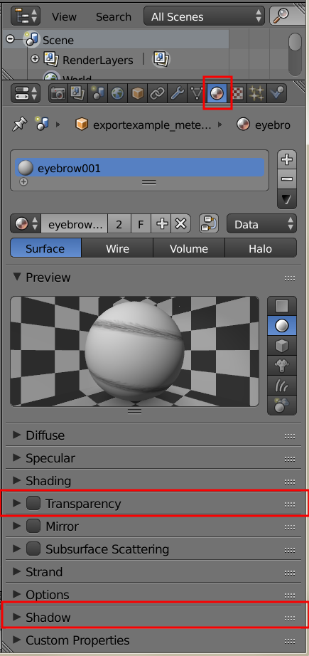

**Figure 5**

**Step 1.**  Right click on one of the eyes in the 3D viewport to select them. In the transparency panel, set both the
alpha and specular sliders to 0 (Figure 6).  

**Step 2.**  In the shadow panel, check 'Receive tranparent' (figure 7)

<table>
<tr><td>

![ImpExp56.png]]</td><td>[[File:ImpExp57.png](ImpExp56.png]]</td><td>[[File:ImpExp57.png)

</td>
<tr><td>
**Figure 6'''
</td><td>
'''Figure 7**
</td></tr>
</table>

Now go to the texture tab of the properties editor (checkered tab) and open the Influence panel (Figure 8). 

 

**Figure 8: **

**Step 3.**  On the influence panel check alpha (Figure 9).  Leave the value at its default of 1.0.

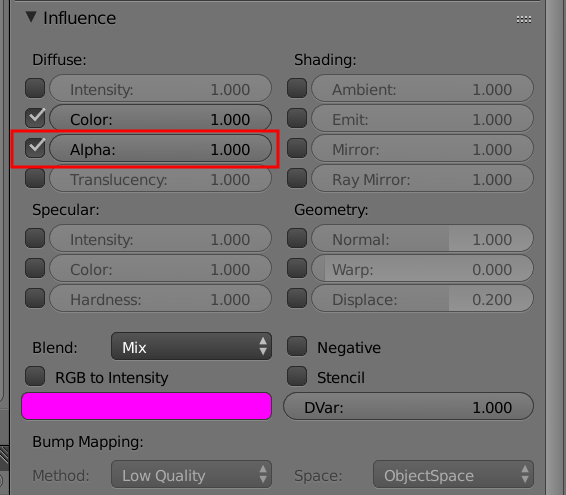

 

**Figure 9: **

After completing these three steps, the eyes should be transparent (Figure 10)

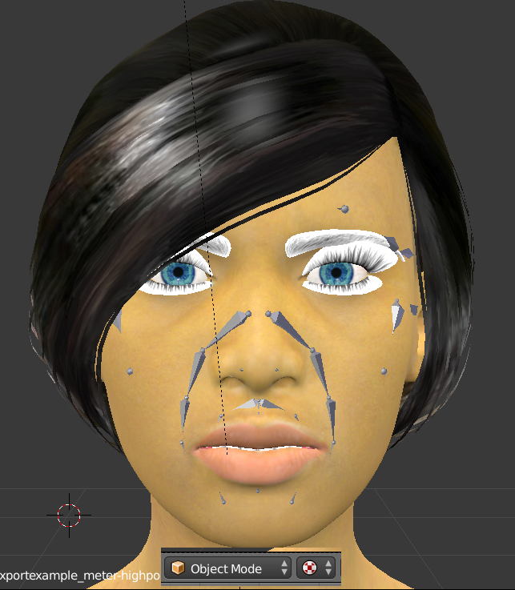

 

**Figure 10: **

Repeating steps 1-3, in turn, for the eyebrows, eyelashes and hair, respectively, should produce results similar to the panels of Figure 11. 

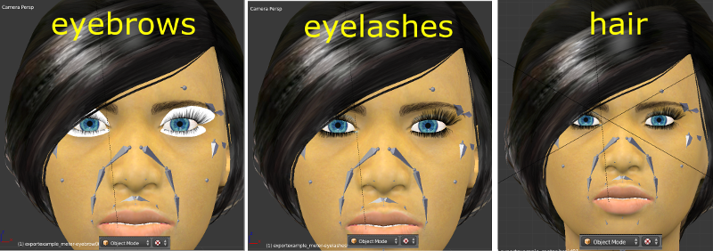

 

**Figure 11: **

When rendered with the Blender internal engine the image should look similar to the original human that was exported.

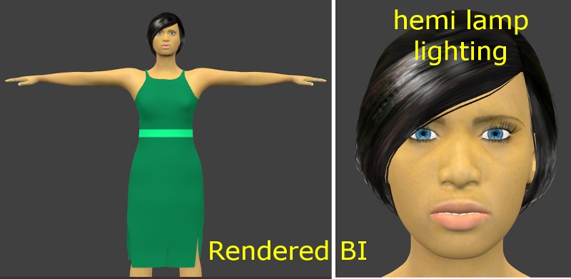

 

**Figure 12: **

## Adapting to Different Light Sources for Blender Internal

If we now right click on the hemi lamp in the scene, and restore it back to the default point lamp type in the lamp properties panel, we are now faced with additional shadow problems. In this example, the point lamp is the single source of illumination.  Note that, depending where your point lamp is located, it may be necessary to turn up the point lamp intensity to produce a bright enough render. The hard shadows from this lamp produce unreal darkening shadows of the eyelashes and eyelids when rendered with Blender Internal engine. The look is unlikely to be usable for any real purpose (Figure 13)

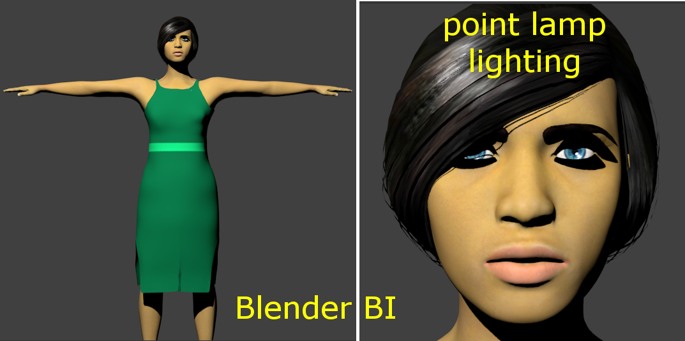

 

**Figure 13: **

To make the eyelashes, eyebrows, and hair appear realistic, it is necessary to let the skin base mesh receive shadows.  If you used collada to export and import into Blender, the skin name in the Outliner panel will end with '...-base.obj'.  Select the skin by either right clicking directly on the skin in the 3D viewport, or by clicking on the '...base.obj' name in the outliner panel.  In the properties editor, select the Materials tab and check 'Receive Transparency' in the shadow panel (Figure 14).  The eyebrows and eyelashes (and sometimes hair) will now appear realistic, albeit with hard shadows (Figure 15).

<table>
<tr><td>

![ImpExp64.png]]
</td>](ImpExp64.png]]
</td>)

 
</td></tr>
<tr><td>
**Figure 14 '''
  </td>  <td> 
'''Figure 15: **
</td></tr>

</table>

If the hard shadows are inconsistent with the look you hoped for (Figure 15 and Figure 16, top), it is possibly to fix this.  For eyebrows, eyelashes, and hair you need to turn off cast on the shadow panel of the materials tab of the properties editor.  After doing this, the shadow effect will be similar to what we got with the hemi lamp and what the human originally looked like when exported from MakeHuman.

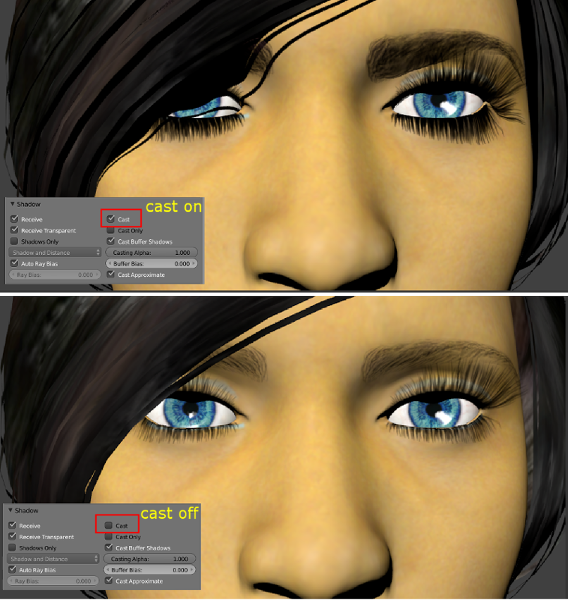

 

**Figure 16: **

Blender internal render engine is the default still with Blender 2.75a, but Blender Cycles has rapidly become the render engine of choice for advanced users.  We will consider next how to set up a basic node system for getting approximately the same look we had when inside MakeHuman.

## Preparing for Render with Blender Cycles Renderer

            ** TO BE WRITTEN **

## Working with Skeletons in Blender

At present, most MakeHuman skeletons import well into Blender.  To do animation based on Biovision Hierarchy (BVH) motion capture files, use the MakeHuman Blender tool [[Documentation:MHBlenderTools:_MakeWalk|MakeWalk]].  This tool is designed to import .BVH files from the Carnegie-Mellon collection (CMU-BVH) and the female files of the Ohio State University, [Advanced Computing Center for Arts and Design collection (ACCAD-BVH)](http://accad.osu.edu/research/mocap/mocap_data.htm).  It is worth noting explicitly that the male ACCAD files use a BVH format that does not currently work well inside Blender with MakeWalk.

## Installing the Unofficial MHX2 plugin for MakeHuman and Blender

            ** TO BE WRITTEN **

## Using the Unofficial MHX2 plugin for MakeHuman and Blender

       ** TO BE WRITTEN **