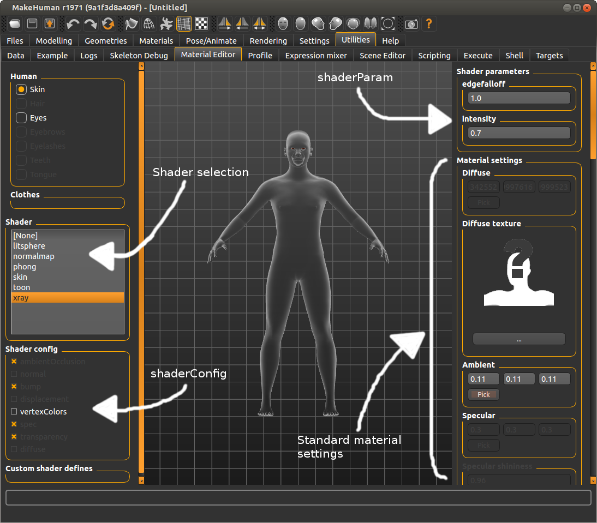
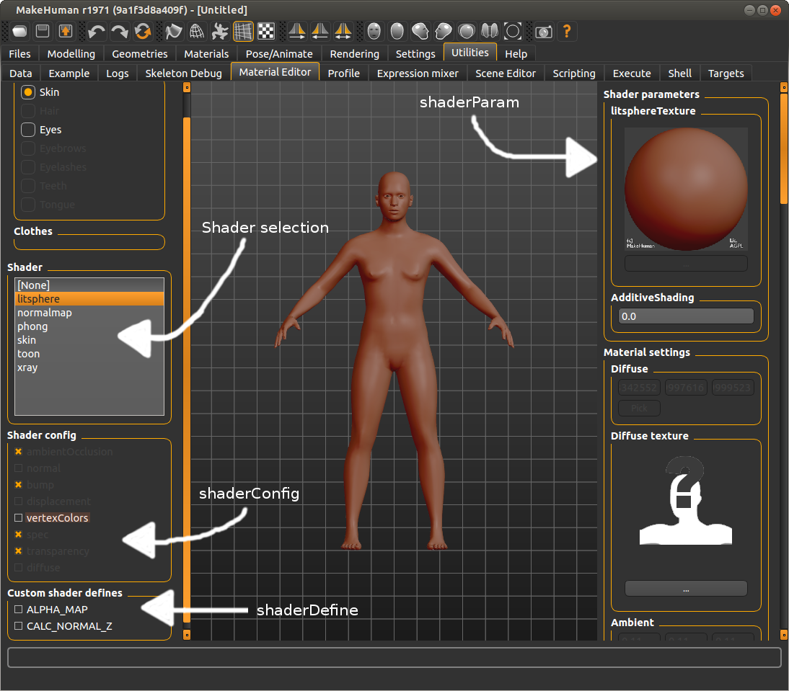

## Vertex weights

With vertex weights we intend a weighted mapping of vertices of a mesh to a bone of a skeleton. The weight is a value between 0 and 1, the sum of these weights for each vertex should be normalized, which means they should sum to 1 (note: no euclidian distance, just simple addition of all weights). A weight map in MakeHuman is expressed as a bone name (becomes a bone index internally, using the index of the bone in a breadth-first list relative to skeleton structure), a vertex name and a floating point weight between 0 and 1. This weighted vertex to bone mapping is used for skinning (posing and animating, using vertex skinning, smooth skinning or linear blend skinning algorithm). For the skinning algorithm to work correctly it’s required that the weights are always normalized, otherwise you will see vertices move out of place disproportionally (though the weight loading code in MakeHuman ensures that this normalization always happens, so this is not a concern to the artist that defines the weights). The vertex weights can be exported to external tools as well using formats such as collada (DAE), FBX, Ogre3D meshes or MD5 quake meshes.

### Vertex weights and skeletons
Vertex weights are defined for the default “master” skeleton or rig. They are defined in a json file with jsonw extension. They link each vertex of the basemesh including helpers to a named bone of this master rig, together with a certain weight.
The weights loader automatically removes doubles and normalizes the weights (so that they sum to 1). It also reports what the maximum number of bone weights per vertex is, additionally it allows compiling the weights to a reduced set with n number of bone weights, and automatically renormalizes those weights so they, again, sum to 1.
When loading weights, any vertex that receives no weighting is assigned to the root bone, as this is needed for skinning to prevent all those vertices jumping to the origin (0*pos #  0).
Alternative skeletons can define their own weights, by referencing a weights file just like the master rig, or they can choose to derive their weights from the master rig, through so called reference bone mappings. Skeletons will derive their weights from the master rig if they do not specify a weights file explicitly. Custom vertex weights in alternative rigs override those defined on the master rig, except in the case where a proxy defines its own vertex weights. See section Vertex weights for proxies for more details.

### Reference bones for vertex weights and poses
Reference bones are defined on alternative rigs, they are a list of names of bones contained in the master rig. Every bone of an alternative rig can have such a list of reference bones. An alternative rig can also omit these references if it uses the same name as bones in the master rig, in which the mapping is implicit. Having a list of bone references always overrides the implicit mapping. Reference bone mappings are required for two purposes.
They are used for mapping poses defined on the master rig to other rigs. All poses are defined as BVH files that pose the master rig, so they reference only the bone names of the master rig. Poses are applied to all other rigs by using the reference bone mapping: all the rotations that the pose applies to the referenced bones are combined (in the order in which the references were specified -- note: rotations are NOT commutative) and are applied to the alternative rig bone.
Reference bone mappings can also be used for determining vertex weights of custom rigs. If the alternative rig does not explicitly define its own vertex weights, the mapping of reference bones is used to infere a set of bone weights for each bone: All the weights of the reference bones on the master rig (with the weights definition of the default/master rig) are combined and apply to the bone of the alternative rig. Doubles are merged, and weights renormalized. Any vertex that is not weighted will be assigned to the root bone. Watch for messages in the log to verify this.

### Vertex weights for proxies
Generally proxies are mapped to basemesh geometry, that means either to the body or to helpers, or a combination of both (though this is unusual). Proxies derive their vertex weights from the vertices on the basemesh on which they are fitted. A proxy defines its fitting as a 3d offset from one or three vertices on the basemesh, allowing it to deform as the human deforms. This mapping is used to transfer the vertex weights from basemesh to proxy: a proxy vertex referencing three basemesh vertices gets the bone weights of those three vertices. Doubles are merged and the weights are normalized, so that the influence factors are averaged or smoothed. In this case the weights applied to proxies are always those defined on the skeleton: either the weights explicitly defined on the skeleton, or the weights obtained from remapping the master rig weights to this skeleton using the reference bone mapping mentioned in the previous sections. There is an exception to this, which is explained in the next paragraph.
A proxy can explicitly define its own vertex (to bone) weights. In this case it overrides the weights that would be obtained through the proxy mapping, and replaces them by its own custom definition of weights. These vertex weights are always defined to reference the bones of the master rig (default skeleton), so they need to be remapped to other skeletons using reference bone mapping. This also means that the custom weights of a proxy override any custom weights mapping that might be loaded with an alternative rig (but only for that proxy item). Custom proxy weights should be avoided if possible, but are in some cases required, eg. for properly rigging shoes which are rigidly fitted to feet, or an alternative topology which defines very accurate rigging on the face. The general advice for custom rigs is therefore to stay as close to the master rig as possible, reusing as much bones identically as possible, to achieve the best results for proxies with custom weights.
In case of custom weight, the mhclo file must contain a line to indicate the weight file to use, using the keyword “vertexboneweights_file”, with the syntax:
vertexboneweights_file filename.jsonw

## Targets and modifiers

MakeHuman applies targets on the human by means of modifiers. Such a modifier has a value (usually between [0, 1] or [-1, 1]) that determines the effect that it will have on the human mesh. A modifier can control one or more targets and it will apply the mixed sum of those targeys on the mesh. Some modifiers.

### Organization of targets
To make sure targets are linked to the right modifier, or to make managing targets easier, a certain discipline has to be observed in managing them. Targets are ASCII files in the data/targets or data/custom folder (in either the program or user folder) and they haave file extension of .target.
The file name and folder that targets are in implicitly determine their group name. A group is identified by a sequence of tags or tokens, which are taken from the file and folder name of each target. These tokens are delimited by “-” symbols, to include multiple tokens in a single file or folder name. The lib/targets.py module takes care of loading all the names of the available targets and assembles them into groups. All targets with the same tokens end up in the same group. This allows easy querying and requesting of targets. The creator is pretty much free to decide what groups to create for their targets. By passing the name of the target group to a modifier, they can make sure that modifier controls the targets belonging to this group. It does not matter whether you use folders or - delimited file names for creating groups.

An example:
data/targets/cartoon/eyes-large.target    is categorized in group (cartoon, eyes, large)
data/targets/cartoon-eyes-large.target    is also categorized in group (cartoon, eyes, large)
Most simple modifiers work by specifying a group (for example cartoon-eyes) and a set of two tokens to append at the end, depending on the position of the modifier slider (eg. small, large which would allow controlling the targets cartoon-eyes-small and cartoon-eyes-large by moving the slider to the left or right).

### Reserved group tokens
Some of the tokens in the file or foldername of targets are linked to values that variables of the human can have. Such variables are for example age, weight, muscle, gender.
This table lists all the reserved tokens, and the variables they belong to.

{| class="wikitable"
|-
! Reserved token (value)
! Variable
|-
| female,male
| gender
|-
| baby, child, young, old
| age
|-
| african, caucasian, asian
| race
|-
| minmuscle, averagemuscle, maxmuscle
| muscle
|-
| minweight, averageweight, maxweight
| weight
|-
| minheight, averageheight, maxheight
| height
|-
| mincup, averagecup, maxcup
| breastsize
|-
| minfirmness, averagefirmness, maxfirmness
| breastfirmness
|-
| uncommonproportions, regularproportions, idealproportions
| bodyproportion
|}

Note that it is not a good idea to use simply “max” or “min” as a reserved token name, because they need to be unique (otherwise it would not be possible to determine whether they are a minimum for, for example, weight or height). These reserved tokens are declared in the lib/targets.py module. The variable can be set and queried on the human object, for example human.getAge(), human.setMuscle(0.7), human.getProportion().

The reserved tokens are NOT included in the group name, so you should at least include some other, non-reserved tokens in the file or folder names to assign your target to some meaningful group. The inclusion of these reserved tokens in your target names or paths makes it convenient to create macro modifiers.

### Macro targets and modifiers
Macro modifiers are modifiers whose effect (the combination of targets they apply on the human) is influenced by macro variables set on the human (eg. human.set/getAge()). Therefore, macro modifiers often control a large set of targets (20 or even more). It’s also common for multiple modifiers to control exactly the same set of targets, for example the standard age/gender/race sliders all control the set of targets in the ‘macrodetails’ group. Each slider modifies a different variable (eg. human.setAge()) controlling the set of targets, and then reapplies a combination of the same set of targets on the human.

### Macro modifier dependencies
There are other macro modifiers that can also depend on the same variables age, gender, race that is controlled by the main macro modifiers, as discussed above. For example the macro modifiers that influence the weight and muscle mass of the human, controls the targets group “macrodetails-universal”, the universal token is added by prepending “universal-” to all the file names of related targets, which all reside in the folder “macrodetails” (thus macrodetails-universal ends up being the group name). They could have been included all in the “macrodetails” group, but are kept separate for performance reasons, so that the “macrodetails” group of targets (which already contains some 40 targets or so) can be applied in realtime while moving the slider.
 
Of course a change in the variable that these age/race/gender modifiers control will have an effect on the macrodetails-universal modifiers (because they control targets that depend on age -- their targets include -young-  -old- etc. tokens in their filenames). This means there are inter-dependencies between macro modifiers, if one is updated, another one that depends on it should be refreshed. These dependencies can be desceibed as follows: one macro modifier controls exactly one macro variable (such as age). It (or rather, the targets it controls) can however depend on multiple macro variables. The trivial case is where a macro modifier only depends on the macro variable that it controls itself. The tracking of these dependencies and deciding which modifiers must be updated when another is changed happens automatically. Dependencies are automatically tracked as soon as you add a modifier to the human (by calling modifier.setHuman(human)). To make this enhance performance in real-time, the propagation of updates to modifiers is limited while sliders are dragged (see realtimeDependencyUpdates in apps/humanmodifier.py).

As you might have understood, creating modifiers that depend on human variables is almost automatic. The only thing you need to do is create some targets that resolve to the same group name, add variations for all the macro variables you want and add the proper reserved tokens to the file or folder name (refer to the left column in the table above), and create a modifier with this group name. Once added to the human, the dependencies are tracked automatically.

Some more documentation about how macro modifiers resolve macro variables to actual variables can be found in this bug report: http://bugtracker.makehumancommunity.org/issues/1083
Most of note here is probably how updateMacroTargets(), set<macrovariable>() and setDetail() interact, to build the targetsDetailStack, which can then be applied to the human geometry using applyAllTargets().

### Organization of modifiers
We already discussed how we organized targets in groups, to make it easier to connect them to a modifier. Now we will discuss how we can do a similar thing for modifiers.

Modifiers provide an easy way to manage targets. They allow reducing many of hundreds of targets to a more manageable number of controllable properties. But even then, we still have about 100 modifiers, which is still quite a lot. Therefore we group them in groups of categories, much like we do in the GUI. This makes it easy to get a grouped overview of all modifiers when using an alternative interface, think of command line or scripting. The way in which you declare the group and other properties of a modifier determines what target groups it gets its targets from.

Modifiers are declared with a group name, some intermediary “target name” and a number of tail tokens (2 or 3 usually, e.g., min/max). The group of targets controlled by these modifiers is composed as: groupname-targets_name-tail.
Macro modifiers are declared with a group name,  and a controlled variable. The groupname must be the same groupname of the targets they control.

### Declarative modifiers
Instead of hard coding what modifiers you want to instantiate, MakeHuman offers a data-based format to declare what modifiers should be created, and how they should be shown in a user interface with sliders.

A full declaration requires **three files''', all stored in data/modifiers. The '''first file** is the declaration of the modifiers (e.g., modeling_modifiers.json). This format lists a modifier group name, and all the modifiers with their macro variable (if they are macro modifiers) or target name and 2 or 3 (if they are a modifier with a center point) tail tokens.

The **second file** adds a description to the modifiers declared in the first file. It basically contains a key-value set, referencing the modifier name, and a textual description of what the modifier controls. A modifier name is constructed as follows: group/targets_name-all|the|tails and for a macro modifier: group/variable.

The **third file** defines how these modifiers should be shown in the user interface as sliders. It lists a set of categories, and the sliders to show in them, and how their values have to be saved in a mhm file (mainly a feature for legacy compatibility).

### Your own plugin with modifiers, sliders and targets
Using the declarative data format described in the section above, it’s really simple. Have a look at the plugin plugins/0_modeling_0_modifiers.py. Notice it’s barely 5 lines of code. Creating your own modeling plugin is as simple as that, pointing it to your own modifier data files.

### Binary targets
Because loading these ASCII target files, and iterating all target files and folders can be slow (especially on windows) in build versions, we compile all targets in the data/targets system folder into a single binary file, that furthermore acts exactly the same as multiple target files. The binary targets file is stored in the system data/ folder and is called targets.npz, it is created by running the compile_targets.py script, which is also automatically run in the build_prepare.py build routine. The file structure of the targets files is maintained in this binary file so that targets can be loaded from it in the same way as you would do with regular files. A change in the .target files, or newly added target files allow a recompilation of the targets npz file before the change is applied.

## Proxy format

A proxy is a fitting of an arbitrary mesh (for example clothes or a hairstyle) to the basemesh. A proxy asset is distributed as a mesh file together with this fitting file (what we call the proxy file), allowing this mesh to be fitted on different modeling variations of the human within MakeHuman.

### v1.0 format
The 1.0 format got introduced in the v1.0 release of MakeHuman, but was already present in the Alpha 7 (A7) release. The format got reworked a bit for 1.0, however.

=### Example
This is an excerpt from the fedora distributed with MakeHuman
    # Exported from MakeClothes (TM)
    # author Jonas Hauquier
    # license AGPL3 (see also http://www.makehuman.org/node/320)
    # homepage http://www.makehuman.org/
    uuid 566dbd52-71d1-4d76-a799-0474a5a384db
    basemesh hm08
    tag Hats
    
    name fedora
    obj_file fedora.obj
    x_scale 5399 11998 1.4800
    z_scale 962 5320 1.9221
    y_scale 791 881 2.3298
    z_depth 50
    material materials/fedora.mhmat
    verts 0
      251  5243  5244 0.60391 0.28706 0.10903 -0.00245 0.01323 0.03373
     7020 11853 11852 0.53311 0.29591 0.17097 0.00529 0.01134 0.03388
     7678  7000  7707 0.22571 0.34923 0.42506 0.00946 0.03331 0.04954
      984   983  1015 0.17322 0.18383 0.64295 -0.00575 0.03634 0.05443
     1014   226   982 0.12607 0.67880 0.19513 -0.00934 0.03289 0.04891
      250  5245  5232 0.54148 0.48285 -0.02433 -0.01273 0.01129 0.03202
     7746  7712 12153 0.16168 0.32394 0.51438 0.02696 0.11561 0.09667
     5556  5554  1013 -0.03554 0.63140 0.40413 -0.01650 0.11949 0.10646
     5560  5556  1020 0.34178 0.11896 0.53926 -0.03442 0.11513 0.09756
     1013  7712  7721 0.24117 0.40913 0.34971 0.03897 0.20473 0.13559
     1013   882  1029 0.71875 0.41604 -0.13479 -0.02631 0.22391 0.13840
     1029  1020  1013 0.36342 0.60536 0.03123 -0.03890 0.20439 0.13536
     7712  7721   882 0.21674 0.67896 0.10430 0.02804 0.23763 0.15510
     1013   882  1029 0.30269 0.87853 -0.18122 -0.02994 0.25488 0.15754
     1029  1020  1013 0.79483 0.03879 0.16638 -0.04433 0.23290 0.15424
     5370  5368   969 -0.08854 0.29827 0.79027 -0.01789 0.14173 -0.15713
    11971  7713   969 0.28241 0.33962 0.37797 0.01910 0.14921 -0.16563
    11971  7713   969 0.05967 0.69236 0.24796 0.01670 0.13045 -0.14480
     5370  5368   969 -0.07249 0.07305 0.99945 -0.01517 0.12017 -0.13323
      969  1021  5370 0.20926 0.73057 0.06018 -0.01674 0.13078 -0.14517
      969  1021  5370 0.33927 0.37782 0.28291 -0.01914 0.14955 -0.16600
     5379   969  7713 -0.00113 0.07709 0.92403 0.01192 0.06520 -0.14994
     1021   969  5379 -0.05590 0.97961 0.07629 -0.01124 0.06148 -0.14138
     1021   969  5379 0.96289 0.03946 -0.00235 -0.01195 0.06537 -0.15033
    11982 11981  7713 0.14728 0.42350 0.42922 0.01740 0.04655 -0.11033
     1021   969  5379 -0.03656 0.34361 0.69295 -0.00834 0.04564 -0.10495
     1021  5381  5382 0.43027 0.37607 0.19367 -0.01752 0.04687 -0.11110
    11981 11982  7738 0.30937 0.48274 0.20789 0.00929 0.00889 -0.07280
     5379   962  1022 0.56542 0.43776 -0.00318 -0.00327 0.01206 -0.08469

The rest of the file is very similar, it continues listing vertex fittings to the basemesh.

=### Vertex assignments
The format contains matchings in the following format:
    vIdx1   vIdx2  vIdx3 w1 w2 w3 d1 d2 d3
vIdx is an index of a vertex on the basemesh
w is a weight of the corresponding vertex
d1,d2,d3 are optional (default to 0) and defines an offset

The format contains one such lines for every vertex in the proxy mesh, the order of the lines is the same as the order of vertices in the proxy mesh.

The format also supports an alternative fitting, referencing exactly one basemesh vertex, which is used for exact fitting: the proxy mesh vertex is placed in the exact same location as the basemesh vertex it is associated with.
    vIdx
The file format allows mixing these two types of fittings on a per-vertex basis.

=### Properties
Every proxy should have a unique uuid (which can be generated using the python uuid module using uuid.uuid4()), a name, description, author and license information.
One or multiple tags can be added, each on a new line prepended with "tag".
A proxy references a material file and an OBJ mesh.

z_depth determines the rendering priority of the object (important for transparency) and the layer of clothing. It is used by face masking to determine which piece of clothing masks another.

The scale parameters define a bounding box referencing vertices on the human between which the proxy should be scaled. They are modified in makeclothes by selecting a clothing part.

### v1.2 format
Starting from v1.2, a new algorithm for handling proxies is introduced, based on Manuel Bastioni's Lab experiments.
The new format uses a local normal space instead of global coordinates, making it more stable, even across different poses. It is also a lot easier for an artist to create new proxies, as it requires only one button press, instead of having to deal with vertex groups.
Future MakeHuman versions will contain backwards compatibility support for v1.0 proxies, but the new format is recommended for creation of new content.

The layout of this format is largely the same as the old format, with a version parameter specifying that this file should be interpreted as a new style proxy.

=### Example
    # Exported from MakeClothes (TM)
    # author Jonas Hauquier
    # license AGPL3 (see also http://www.makehuman.org/node/320)
    # homepage http://www.makehuman.org/
    uuid 566dbd52-71d1-4d76-a799-0474a5a384db
    basemesh hm08
    tag Hats
    version 120
    
    name fedora
    obj_file fedora.obj
    z_depth 50
    material materials/fedora.mhmat
    verts 0
      vIdx1 vIdx2 vIdx3 vIdx4 dx dy dz

It looks a lot like the v1.0 format, only the scale is no longer needed, and the vertex assignments have a new format.
The "version 120" is required to indicate that this file should be interpreted to use the new proxy fitting algorithm.

vIdxi references the vertices of a polygon of the basemesh
dx dy dz is the distance (delta) vector between the polygon center and the proxy mesh vertex.

### Binary proxy
Proxies, as well as their meshes, can be compiled into a more compact binary variant that is faster to load and smaller to distribute. MakeHuman will do this automatically for proxies in the home path. Files in the installation path will have to be compiled manually by running the compile_proxies.py and compile_meshes.py scripts. Usually these scripts are ran when a distribution is created, so need not to be repeated by the end user, unless MakeHuman is used from source.

##  Material format=

### Introduction

MakeHuman material files have extension .mhmat and are simple ASCII definitions
of the material settings to use for rendering.
These material settings are primarily intended for configuring the material
system within MakeHuman, but they are usually carried out to other software as
well by the exporters.
Not all properties will be supported for all given combinations of shaders, nor
is there a guarantee that the exporters will honor all the properties in these
files.

Every 3D object in MakeHuman has exactly one material attached to it (multiple
materials are not possible, you need separate objects for that). Materials are
used for proxy meshes (clothes, hairs, ...) but also for the skin of the human
itself.

### The Material System

The MakeHuman material system is closely based on the [standard rendering equation](https://en.wikipedia.org/wiki/Rendering_equation)
as is used in OpenGL and DirectX forward rendering pipelines. MakeHuman supports
shaders and the material format contains the most commonly used extensions in
real-time rendering. As a consequence of this, users need to be aware of the
implications of setting values such as ambient too bright, or diffuse too dark.
All usual rules about rendering materials apply.

At the highest level, the material supports setting the most basic material
properties, such as diffuse, specular and ambient color. These are supported
both by shaders as well as the fixed function shading pipeline (which is used
when no shader is specified). Fixed function also supports the diffuse texture
option.

At a second level, a shader can be chosen. This refers directly to the filename
of a [GLSL shader](https://en.wikipedia.org/wiki/OpenGL_Shading_Language) as found in the data/shaders/glsl folder of MakeHuman.
The selected shader will determine what material options will be available.

At the third level, various additional settings become available, depending on whether or not the
chosen shader has support for these features, such as bump or normal mapping,
ambient occlusion, specular mapping, etc.
For most of these, a texture map and a scalar property between 0 and 1 can be
set, the latter determining the intensity or influence of the effect.

Finally, MakeHuman also contains a built-in offline renderer that supports some
additional properties such as subsurface scattering, for which some special
properties are available.

### Example
This is a full and complete (but fictional) example of a material file for MakeHuman, it shows all the available properties.
    # Example MakeHuman Material definition
    
    name Material_name
    tag some_tag
    tag another_tag
    description material description text here
    
    ambientColor 0.11 0.11 0.11
    diffuseColor 1.0 1.0 1.0
    specularColor 0.0470588235294 0.0470588235294 0.0470588235294
    shininess 0.96
    emissiveColor 0.0 0.0 0.0
    opacity 1.0
    translucency 0.0
    
    shadeless False
    wireframe False
    transparent True
    alphaToCoverage True
    backfaceCull False
    depthless False
    
    autoBlendSkin False
    
    castShadows True
    receiveShadows True
    
    diffuseTexture diffuse_texture.png
    bumpmapTexture bumpmap.png
    bumpmapIntensity 1.0
    normalmapTexture normalmap.png
    normalmapIntensity 1.0
    displacementmapTexture norm_displacement.png
    displacementmapIntensity 1.0
    specularmapTexture specular.png
    specularmapIntensity 1.0
    transparencymapTexture alpha.png
    transparencymapIntensity 1.0
    aomapTexture ambient_occlusion_map.png
    aomapIntensity 1.0
    
    # Sub-surface scattering parameters
    sssEnabled True
    sssRScale 5.0
    sssGScale 2.5
    sssBScale 1.0
    
    shader shaders/glsl/litsphere
    
    shaderParam litsphereTexture litspheres/lit_hair.png
    
    shaderConfig ambientOcclusion True
    shaderConfig normal False
    shaderConfig bump True
    shaderConfig displacement False
    shaderConfig vertexColors True
    shaderConfig spec True
    shaderConfig transparency True
    shaderConfig diffuse True
    
    shaderDefine ALPHA_MAP
    
    uvMap alt_uv_coords.mhuv

This is another example, this time a real one. It is the X-ray material, used for example when showing the skeleton:
    # Material definition for XrayMaterial
        
    name XrayMaterial
    ambientColor 0.1 0.1 0.1
    diffuseColor 1.0 1.0 1.0
    specularColor 0.3 0.3 0.3
    shininess 0.1
    emissiveColor 0.0 0.0 0.0
    opacity 0.1
    translucency 0.0
        
    transparent True
    backfaceCull True
    shadeless False
    wireframe False
    depthless False
        
    shader data/shaders/glsl/xray
        
    shaderConfig diffuse False
    shaderConfig transparency False
    shaderConfig normal False
    shaderConfig bump False
    shaderConfig spec False
    shaderConfig vertexColors False
    shaderConfig displacement False

### Explanation of material properties

=### Standard settings
''ambientColor'', ''diffuseColor'' ''specularColor'', ''emissiveColor'' are the standard colors
as used in the [rendering equation](https://en.wikipedia.org/wiki/Rendering_equation)
or in standard OpenGL.
Their corresponding intensities are simple scalars with a value between 0 and 1 and are multiplied
with the colors to dim them. Default these intensities are set to 1.

Colors are described as three floating point numbers, representing R G B, or red-green-blue
values. 1 is the maximum, 0 the minimum.
For example 1.0 0 0 means fully red, 1 1 1 means full white, 0 0 0 is full black.
0.5 0.5 0.5 will give you a grey middle color.

''opacity'' determines the opaqueness of the object (alpha channel), with 1 being fully
opaque, and 0 being fully transparent (invisible)

''translucency'' is something that came from Blender but is unused

''shininess'' or specular hardness is a number between 0 and 1 determining the shininess constant of the [phong shading model](https://en.wikipedia.org/wiki/Phong_reflection_model).

=### Texture maps
Various standard texture maps can be defined on the material, like ''diffuseTexture'', ''bumpmapTexture'', ''normalmapTexture'', ''displacementmapTexture'', ''specularmapTexture'', ''transparencymapTexture'', ''aomapTexture''. Each of these also has an associated intensity value, which is a scalar from 0 to 1 multiplied with the pixel value of that texture (unless a specific shader implements it differently).
These textures only have an effect if their corresponding shaderConfig feature has been defined (see the table in Shaders section).

=### Render states
When ''wireframe'' is set to True, the model is drawn in wireframe mode. In this mode,
most material properties have no effect, but you can enable the vertexColors shaderConfig
to be able to change the color of the mesh using vertex colors (this requires
access to the mesh programatically, obj meshes do not support vertex colors).
This feature is used in some parts of MakeHuman, for example viewing bone weights
in the skeleton debug plugin.

Set ''shadeless'' to True to disable shading, eg. the object is not affected by lights. 
Configured shader will have no effect

Set ''transparent'' to True to enable transparency rendering (usually needed when opacity is < 1)
In itself this does not change the visual appearance of the model, but this setting
should be enabled if your texture contains (semi-) transparent parts. This setting
instructs the renderer to disable depth buffer writes (glDepthMask(false))
and enables alpha testing and blending so that transparent surfaces can overlap and to allow [alpha blending](https://www.opengl.org/wiki/Transparency_Sorting).

''alphaToCoverage'' Applies when transparent is set to True (otherwise does nothing).
It requires that your GPU supports alpha to coverage (A2C) rendering. It enables
the A2C feature which provides face order-independent alpha rendering. This works
very well for complex transparent meshes, like hair. At the cost of a slightly
dithered look, it solves all the problems with face sorting that are usually
involved in rendering semi transparency.
(This feature disables anti-aliasing for this object because the multisample buffer is used for alpha blending instead)

Set ''backfaceCull'' to False to disable backface culling (render the back side of polygons)
By default, and in most cases, this should be set to True, but can be useful
in some cases (for example, we disable back-face culling for the eyebrow materials).

Set ''depthless'' to True for depthless rendering (object is not occluded and does not occlude other objects).
This disables OpenGL depth writes and tests. In practice, this makes object faces that should be occluded shine through others.

''castShadows'' determines whether the object casts shadows on other objects.

''receiveShadows'' determines whether the object receives shadows from other objects.
For some features, like eyes, you probably want to disable shadow receiving.

Since MakeHuman does not (yet) implement shadow casting, the shadow settings have
no effect in MakeHuman, but they do export to other engines.

Play around with these settings in the Material Editor plugin to see their effect, that's the best advise I can give you.
The best way to find out which settings work for an asset, is simply to try them out.

=### autoBlendSkin
If True MakeHuman will set the diffuse color based on the ethnix mix set for the character.
Any diffuseColor set in the material file will be overridden by this.
Also the shaderParam litsphereTexture will be automatically set to a dynamically blended litsphere texture,
which is a mix of three litsphere materials (afro, asian, caucasian) depending on the ethnic mix of the character.
This latter is specifically intended to be used with the litsphere shader, and it is what you see as default material when you start MakeHuman
This overrides whatever shaderParam litsphereTexture was set in the material file.
This setting is intended only for skin materials.

=### shaderParam
Define a custom shader parameter (uniform), which might be required for some non-standard shaders.
For example, the litsphere shader takes an extra type of texture map as input, a so-called litsphere texture.
This generic system of mapping shader uniforms allows you to create specialised shaders that take
new and different kind of inputs, and allow configuring the shader from the material file.

shaderParam can be a list of floating point numbers, in which case it will be interpreted as a vector,
or it can be a file path, in which case it is assumed to be an image path.
Internally in MakeHuman, shaderParams can also be assigned a texture object, which allows
for dynamically passing a texture that is in memory, but perhaps not stored on disk.

Another example of a custom shaderParam is the X-ray shader that defines an edgefalloff
and intensity uniform parameter.
These could be changed from the material file with
  shaderParam edgefalloff 0.8
  shaderParam intensity 0.77

=### shaderDefine
shaderDefines allow enabling or disabling custom shading techniques in shaders.
These allow to define new shading techniques, apart from the pre-defined ones 
such as normal mapping, specularity mapping, ...
It's a generic system that allows new shaders to be added and configured from
the material file, or from the material editor (which nicely auto-detects these
features in the shader and shows a set of checkboxes for them).
    
=### uvMap
Load custom UV coordinates on the mesh to use this material. This makes the material
completely dependent on the mesh it is used with.

Takes a path to a .mhuv file, which is actually just an .obj file, where the vertex
positions can be deleted (they can remain in there, but they are ignored).
Requirement for it to work is that the vertex order is the same as that of the
mesh obj.

An example uv map for the basemesh can be found in data/uvs/a7.mhuv, which is a
set of UV coordinates compatible with the old Alpha 7 mesh, allowing you to load
A7 textures on the new basemesh used in MakeHuman v1+

=### SSS properties
These are the so-called sub-surface scattering shading properties, currently only used by the built-in offline renderer. They were decided on while trying to figure out the most generic way to define SSS shading properties, so that they could easily be translated into SSS properties for a different renderer (as no single renderer that I know of has a standard for these). It's uncertain whether the format we have landed on currently is the best, or whether this will remain permanently or is still likely to change.
This setting should currently be considered experimental.
The properties are ''sssEnabled'', ''sssRScale'', ''sssGScale'' and ''sssBScale''.

### Basic pointers for creating materials

* You can test the influence of material properties using the Material Editor plugin (which you can enable in Settings > Plugins, then restart)
* Using a diffuse texture? You probably want to set the diffuse color to 1 1 1 (pure white)
* Never set ambient color too bright, or your model will look completely white. 0.1 0.1 0.1 is a good value to start from.
* Emissive is usually set to black, unless you want a radioactive character
* Don't know how to define a color in numbers? Try the Material Editor plugin
* Higher shininess means smaller and sharper highlight, lower shininess makes the highlight larger and more blurred
* Reduce specular color to reduce the specularity, make it black for a rough and non shiny object
* opacity 1 means fully opaque, 0 means fully transparent (invisible)
* Do your (diffuse) textures contain transparency? Do not forget to enable transparency! Perhaps try if alpha-to-coverage improves the situation (especially for hair!).

### Scene definition

To complete the rendering equation, you also need to define the scene. To be
more precise, the positions, types, color and intensities of the lights need to
be set. By default, MakeHuman only has a default scene with only one pointlight.
In MakeHuman, lights do not move if the camera is moved, or rather, the model is
rotated while the camera and lights remain static. So light positions are defined
relative to the camera position.

MakeHuman scenes are defined in .mhscene files, which are binary py-pickled files.
They can be created or modified using the Scene Editor plugin (can be enabled in
settings) and can be selected from the Scene library in the Render tab.

Fixed function shading pipeline supports up to 8 lights, specific light support
depends on the shader used, some shaders only support a certain type or number
of lights, other ignore the chosen scene altogether (for example the litsphere 
shader that uses pre-baked environment lighting).
The built-in offline renderer also uses the specified scene.

Scenes are not exported along with the model.
### Shaders

The most powerful functionality of the material system is unlocked when using
shaders.

MakeHuman shaders are intended to be written in a modular way, so that shading
features can be enabled or disabled using the material format. Examples of such
features are bump mapping, normal mapping, specular mapping, diffuse texturing,
ambient occlusion and displacement mapping.

MakeHuman includes a basic introspection function that allows it to determine
what features a shader supports. It accomplishes this by looking for #ifdef and #ifndef statements. If a shader supports a certain technique, it is supposed to
encapsulate this in #ifdef NORMALMAP ... #else ... #endif statements.

The idea is that of an [über shader](http://www.gamedev.net/topic/659145-what-is-a-uber-shader/), where performance is optimized by removing any dynamic branches (if then that) from shader code, and instead managing the features using defines and pre-processor branches.
When a different branch in the shader is activated, the shader code is recompiled entirely.
Instead of having different shaders for different features (eg. a specific normalmap shader to be able to do normal mapping), one general shader could be used instead, and normal mapping can simply be enabled or disabled from the material properties, without being required to swap shaders (a good default uber shader is [still to be created for MakeHuman](http://bugtracker.makehumancommunity.org/issues/160) Any help with this is welcome of course!).

The material system manages these shading functions by defining specific pre-processor
keywords when their corresponding shaderConfig property is set to true.
Shaders are recompiled when needed and stored in a shader cache for efficiency.

MakeHuman passes scene and material information to the shaders by certain uniform
parameters. Depending on which shaderConfig properties were enabled, additional
uniforms could be exposed to the shader. The shader does not have to declare all
these uniforms, however. MakeHuman binds only those uniforms present in the shader
if they have the right corresponding names.
Other properties are available from the OpenGL built-in uniforms or properties
(usually starting with gl_).

The following table lists these defines and the shaderConfig properties in the
material they relate to:

{| class="wikitable"
|-
! feature name
! shaderConfig
! shader #DEFINE
! exposed uniform parameters if enabled
! comment
|-
|default (always enabled)
|
|
|vec3 ambient, vec4 diffuse, vec4 specular, vec3 emissive
|diffuse and specular are 4-component color values, diffuse# [rgba] with a=opacity and specular=[rgbs] with sshininess
|-
|Vertex coloring
|vertexColors
|VERTEX_COLOR
|
|Derive diffuse color from vertex colors
|-
|Diffuse texturing
|diffuse
|DIFFUSE
|diffuseTexture
|
|-
|Bump mapping
|bump
|BUMPMAP
|bumpmapTexture, bumpmapIntensity
|disabled if normal mapping is enabled (restriction might be lifted in the future)
|-
|Normal mapping
|normal
|NORMALMAP
|normalmapTexture, normalmapIntensity
|
|-
|Displacement mapping
|displacement
|DISPLACEMENT
|displacementmapTexture, displacementmapIntensity
|
|-
|Specularity mapping
|spec
|SPECULARMAP
|specularmapTexture, specularmapIntensity
|
|-
|Transpareny (alpha) maps
|transparency
|TRANSPARENCYMAP
|transparencymapTexture, transparencymapIntensity
|
|-
|Ambient occlusion maps
|ambientOcclusion
|AOMAP
|aomapTexture, aomapIntensity
|
|}

Additionally, MakeHuman exposes the vertex tangent as a vertex property, which
can be accessed by the shader.
  attribute vec4 tangent
Currently, [Lengyel’s Method](http://www.terathon.com/code/tangent.html) for tangent calculation
is used, but plans are to change this to [mikktspace](http://bugtracker.makehumancommunity.org/issues/87) in the future.

Shader examples for MakeHuman can be found here:
* Litsphere shader: [vertex][https://bitbucket.org/MakeHuman/makehuman/src/default/makehuman/data/shaders/glsl/litsphere_fragment_shader.txt fragment](https://bitbucket.org/MakeHuman/makehuman/src/default/makehuman/data/shaders/glsl/litsphere_vertex_shader.txt)
* Phong shader: [vertex][https://bitbucket.org/MakeHuman/makehuman/src/default/makehuman/data/shaders/glsl/phong_fragment_shader.txt fragment](https://bitbucket.org/MakeHuman/makehuman/src/default/makehuman/data/shaders/glsl/phong_vertex_shader.txt)
* Normal map shader (wip): [vertex] [https://bitbucket.org/MakeHuman/makehuman/src/default/makehuman/data/shaders/glsl/normalmap_fragment_shader.txt fragment](https://bitbucket.org/MakeHuman/makehuman/src/default/makehuman/data/shaders/glsl/normalmap_vertex_shader.txt)
* X-ray shader: [vertex][https://bitbucket.org/MakeHuman/makehuman/src/default/makehuman/data/shaders/glsl/xray_fragment_shader.txt fragment](https://bitbucket.org/MakeHuman/makehuman/src/default/makehuman/data/shaders/glsl/xray_vertex_shader.txt)

=### Custom shader properties
Shaders can use non-standard #DEFINEs to allow enabling or disabling non-standard shading features, other than the ones that were foreseen in the material format (such as normal mapping, ...)
To add new ones, simply add #ifdef SOME_FEATURE statements to your shader code, the material system will automatically detect them.
From the material, you can enable them with
  shaderDefine SOME_FEATURE
If not defined, the feature is assumed to be switched off.

A custom shader can also add new parameters to tweak. For example a color value or intensity value that influences the shading.
To do this, the shader author can simply add new uniform variables to their shader code. It is recommended to specify a default
value for them, so that if the material file does not explicitly mention them, they receive a sensible default value.
Example: the X-ray shader adds an edge-fallof property:
  uniform float edgefalloff = 1.0;
From the material file, you can influence this value with:
  shaderParam edgefalloff 0.5

shaderParam supports lists of float values (one or multiple, divided by spaces), eg
  shaderParam edgecolor 0.7 0.3 0.4
or textures, by specifying a path to an image file (in which case they are assumed to be Sampler2D type)
Additionally, from within MakeHuman, they can be passed a Texture object, to dynamically pass them a texture that resides in memory, without the need for the texture to be stored in a file on disk.
This allows to dynamically alter the texture and have it displayed directly. MakeHuman takes care of caching the texture and updating it when it is modified.
For example, the auto skin tone blending of the litsphere texture is implemented in this way.

The material system will automatically detect these custom uniform parameters declared in the shader, for example the material editor plugin will present them in the GUI.

These features make for a general and extensible shader system.

=### Dynamic shader configuration in Material Editor plugin

Take as example this screenshot, which shows how the X-Ray shader, mentioned earlier, can be configured.

In the shader selector, xray was chosen. This opens up a few new options to configure.
Notice that on the top right the custom shader uniforms edgefalloff and intensity that we mentioned earlier were automatically detected. The shader author had to do nothing else than to define these uniform parameters in his shader code, and define a sensible default for them. A material using this shader can customize these properties using the shaderParam option, which can be altered visually in the top right of the material editor. Changes in the material editor take effect immediately, so you can directly preview your changes.

Also notice in the bottom left that the material editor shows the available shaderConfig parameters. Some of these are greyed out, which means they are not available, or the condition for them is not met (for example, to be able to enable normal mapping, you need to choose a normal map texture on the right panel. If the normal map property is greyed out on the right side, then this particular shader does not support normal mapping).

Let's take a look at a second example.

Here we see the litsphere shader. This shader is different from the other shaders in the sense that it completely ignores the lighting of the scene, and instead lights the model with a texture containing pre-baked lighting conditions, a so-called [litsphere](http://www.cs.utah.edu/~wmartin/pubs/LitSphere.pdf) texture.
This shader, being so different, requires a different sort of input, a custom input texture: the litsphere texture.
The shader author simply defined this uniform parameter in his shader code, and as you can see in the top right corner, the material editor shows a texture selector for this property. Using it, the user can select a litsphere texture to feed to the shader.

The litsphere shader also has two different alternative techniques that can be enabled or disabled by the user.
These two features, which can be enabled using shaderDefine statements in the material file, are automatically detected by the material system, and shown in the bottom left of the material editor. Enabling them is as simple as checking the checkbox.

One of these custom shading features is alpha mapping (defined by ALPHA_MAP), which allows to sample alpha transparency from an additional texture.
For this texture, an additional uniform property, named alphaTexture was declared in the shader, but it was written down in a way that it is only declared if the ALPHA_MAP token is defined.
In the shader code:
    #ifdef ALPHA_MAP
        uniform sampler2D alphaTexture;
    #endif
If you check the ALPHA_MAP_checkbox, you will notice that on the top right, an extra texture selector will appear.

These examples show how the material editor can help exploring the different settings that are available in shaders.