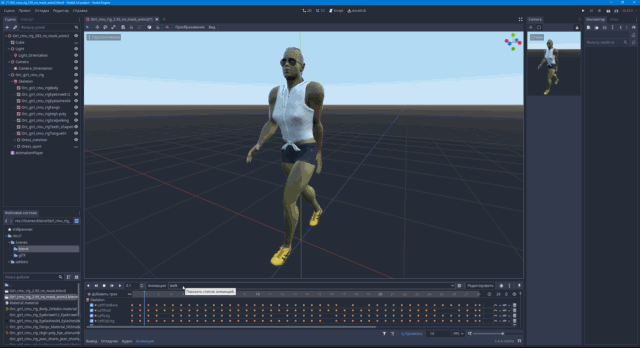

## Creating a character in MakeHuman

Creating a character for the game with a change of clothes and several animations.

### Introduction. MakeHuman Overview

What is MakeHuman?

    MakeHuman is a completely free, innovative and professional software for the modelling of 3-Dimensional humanoid characters.

    MakeHuman is an open source (AGPL3) tool designed to simplify the creation of virtual humans using a Graphical User Interface, also commonly referred to as a GUI.

    Humans are created through the manipulation of controls that allow for the blending of different human attributes to create unique 3D human characters. The controls are intended to provide the user with a simple way to create characters that give expression to the widest possible range of human forms.
    
    The MakeHuman project strives to provide a complete tool that allows for the management of all things needed to create realistic virtual humans.

Distinguished by a large number of settings and easily expandable features. There is a plugin for mass character creation "Mass produce". Has a lot of ready-made clothing and accessories. You can create new ones yourself.  Easy to integrate with Blender.

Has options not found in other similar programs:

* Allows you to change the age of a character. It is enough to create a model and you can change the age with one parameter. Very convenient if you are making a game about growing up.
* Allows you to assign different rigs to characters. Large selection of ready-made skeletons or you can make your own.

Sliders do not have the ability to enter a numerical value, which is sometimes not very convenient.

The program is mainly aimed at artists who create static images or videos. It is still little adapted for use in games, but has a lot of opportunities in this regard.

I will try to show how you can make a character with a change of clothes and assign him animation.

### Programs used:

* [MakeHuman 1.2.0](http://www.makehumancommunity.org/content/makehuman_120.html)
* [Blender 2.93.9](https://www.blender.org/download/lts/2-93/)
* [Godot 3.4.4](https://godotengine.org/download)

### Addons:

For Blender: 

* [Retarget BVH](https://github.com/black-punkduck/retarget-bvh)
* [MHX2](https://github.com/makehumancommunity/mhx2-makehuman-exchange)

For Godot:

* [Blender Importer Addon for Godot](https://github.com/V-Sekai/godot-blender)

The additional viewport in the screenshots is [Camera Monitor](https://github.com/zaevi/Godot-Camera-Monitor)

### Program Installation

[Download the program](http://www.makehumancommunity.org/content/makehuman_120.html), install it.

User data is located in the folder:

* Windows: C:\Users\[Name]\Documents\makehuman\v1py3\data\
* Linux: ~/Documents/makehuman/v1py3/data

This is where you install additional assets: clothes, hair, poses ect.

You can install them directly from the program, tab "Community". Or manually from the site — [User contributed assets](http://www.makehumancommunity.org/content/user_contributed_assets.html).

They are very well represented in the [gallery](http://www.makehumancommunity.org/clothesgallery.html), but it's a bit difficult to get there.

The following assets were used in the tutorial:

By punkduck:

* [sport briefs 01](http://www.makehumancommunity.org/clothes/sport_briefs_01.html)
* [sport bra 01](http://www.makehumancommunity.org/clothes/sport_bra_01.html)
* [sun visor](http://www.makehumancommunity.org/clothes/sun_visor_sports_visor.html)
* [Short jeans female](http://www.makehumancommunity.org/clothes/short_jeans_female.html)
* [Sleeveless Shirt](http://www.makehumancommunity.org/clothes/sleeveless_shirt.html)
* [Tennis shoes](http://www.makehumancommunity.org/clothes/tennis_shoes.html)
* [Martial-Arts Shoes, Kill Bill](http://www.makehumancommunity.org/clothes/martialarts_shoes_kill_bill.html)

By Elvaerwyn:

* [Ladies Sunglass1 by Elv](http://www.makehumancommunity.org/clothes/ladies_sunglass1_by_elv.html)

By RehmanPolanski:

* [Scalp Viking](http://www.makehumancommunity.org/clothes/scalp_viking.html)

By callharvey3d:

[Fangs](http://www.makehumancommunity.org/clothes/fangs.html)

By sonntag78:

* [Orkifyhead](http://www.makehumancommunity.org/target/orkifyhead.html)
* [Orkifyheadtarget custom skin](http://www.makehumancommunity.org/skin/orkifyheadtarget_custom_skin.html)

By Hatshj:

* [Alien Eyes](http://www.makehumancommunity.org/content/alien_eyes.html)

By blindsaypatten:

* [Fully close mouth](http://www.makehumancommunity.org/target/fully_close_mouth.html)

By Joel Palmius:

* [Elf ears](http://www.makehumancommunity.org/target/elf_ears.html)

Animations used from the cgspeed:

* [MotionBuilder-friendly version 2010 RE-RELEASE](https://sites.google.com/a/cgspeed.com/cgspeed/motion-capture/the-motionbuilder-friendly-bvh-conversion-release-of-cmus-motion-capture-database)
* [BVH directories 01-09](http://www.google.com/url?q=http%3A%2F%2Fwww.mediafire.com%2F%3Fo6ncxuu1oq5r6z9&sa=D&sntz=1&usg=AOvVaw0qOKV3wEikE_aFVbZ3P2EL), 02_01.bvh walk, 02_03.bvh run

### Modeling

Run the program and customize the character. By default, it offers a middle-gendered and middle-aged character.

Since there are no numeric values to enter, you have to move the sliders, like this:

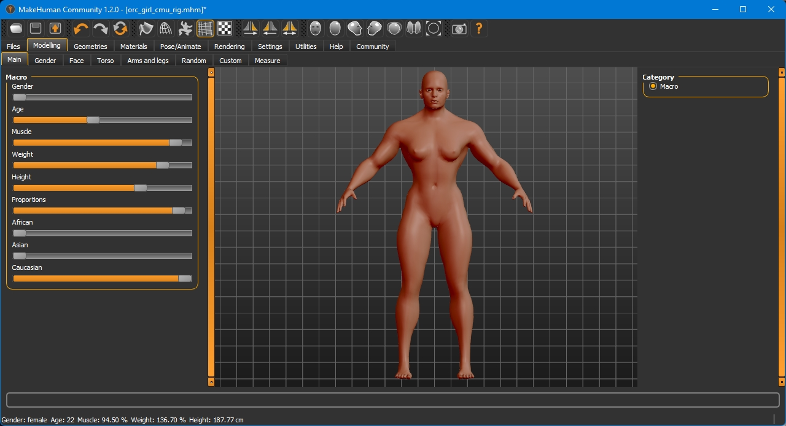

General body settings, head, torso, arms, legs...

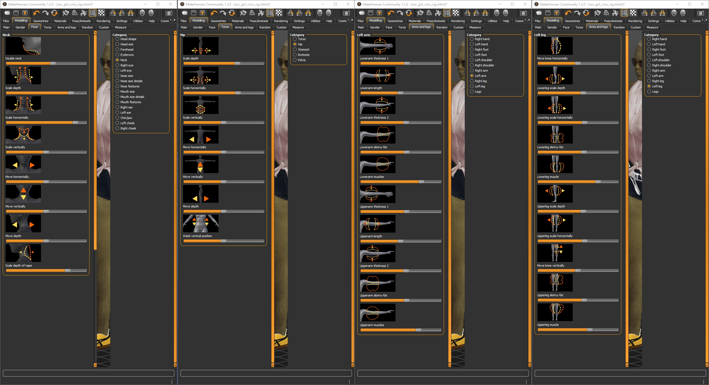

### Apply the modifiers

Under "custom": 

* Orkifyhead
* Elf ears
* Fully close mouth

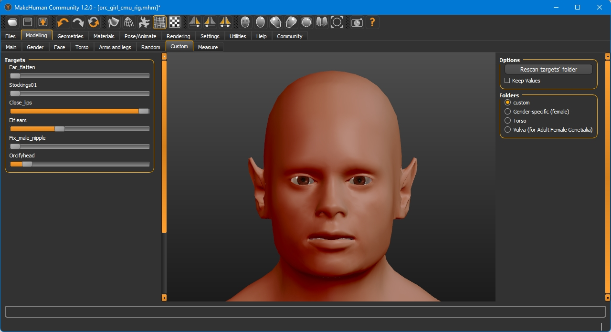

### Geometry

The following sequence is not important, we need to equip our character with everything necessary for life and combat: hair, teeth, tongue, eyebrows, eyelashes... if it is supposed that the character will not open his mouth, you can skip the teeth and tongue setup.

* Hair: Scalp Viking
* Fangs: Fangs (from the Clothes[Accessory] tab)

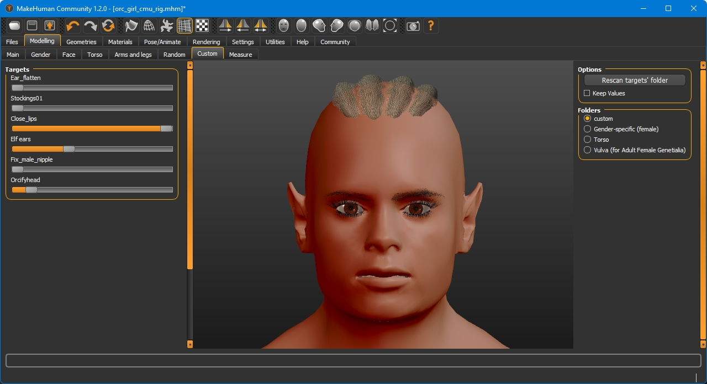

Making the body parts modifiable is possible, but difficult. At the end I'll tell you how.

### Materials

Assigning textures.

* Body: Orkifyheadtarget custom skin
* Eyes: Alien Eyes

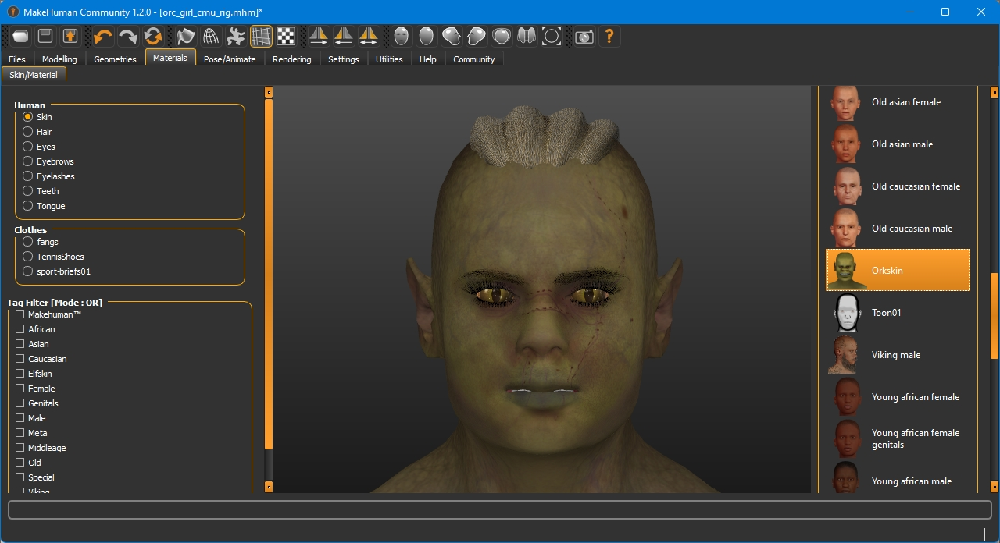

### Dress up your character

If a change of clothes is expected, then we put all the necessary clothes on the character. In this case there are 2 sets: casual and sports.

Casual:

* Short jeans
* Sleeveless Shirt
* Martial-Arts Shoes
* Ladies Sunglass

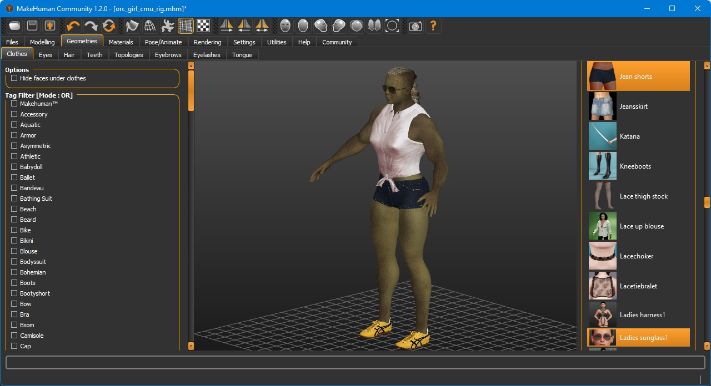

Sporty:

* port briefs 01
* sport bra 01
* sun visor (sports visor)
* tennis shoes

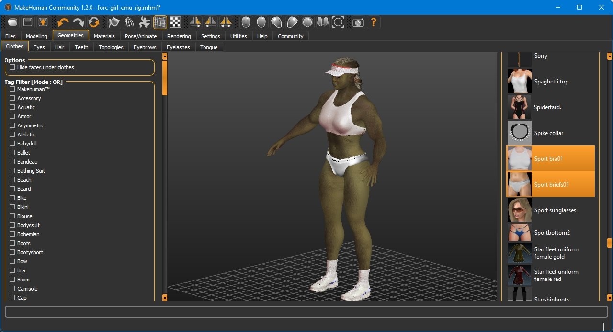

### The option "Hide face under clothing"

If you don't intend to change clothes, it's better to leave this option. If this option is disabled, then it will be visible when the body goes beyond the clothes. When exporting, this function will be enabled in any case.

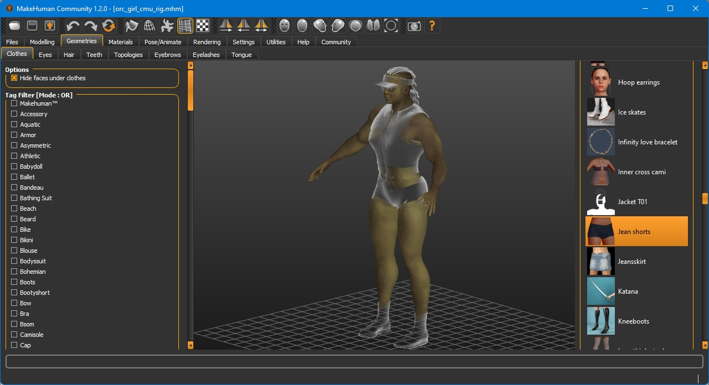

### Pose/Animate

Assign a rig.

The rig should match the animation. For this example I use the CMU Motion Capture animation and assign the corresponding rig CMU mb.

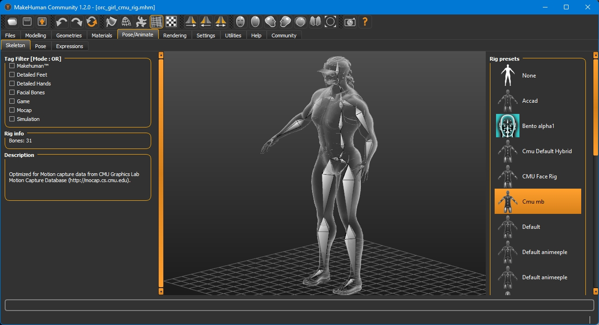

The character is ready for export.

### Export to Blender

You can put the character from MH into Blender in several ways.

* The most reliable one is exporting to .mhx2 ([https://github.com/makehumancommunity/mhx2-makehuman-exchange](MHX2 - MakeHuman eXchange format 2)). This is the only way to correctly transfer the textures to the game engine.
* If you use export to Blender via Socket (tab in MH "Community"), you will have to assign textures in the engine manually

It is desirable not to forget to switch "Scale units" to a meter.

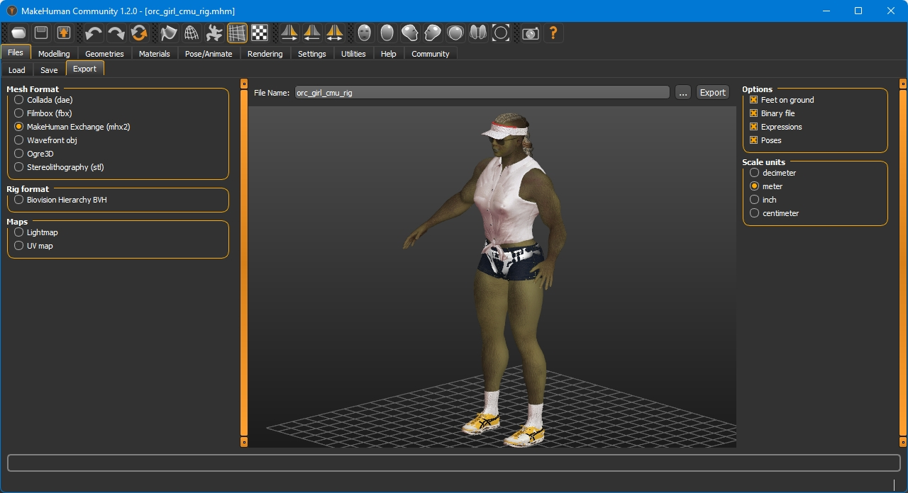
