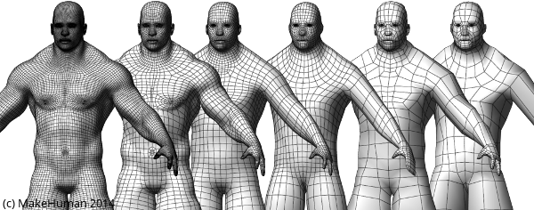
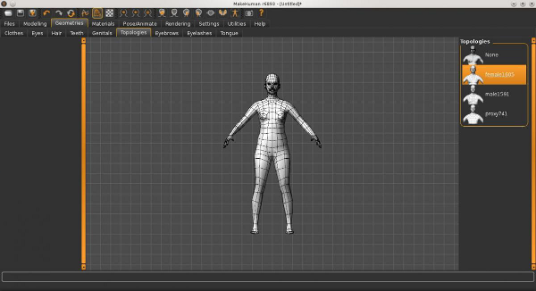

Makehuman provides a group of alternative topologies which replace the base mesh and are designed for special purposes. These are useful for various applications such as simulation (E.g. a car crash computer simulator), games and so on.

In order to use the alternative topologies provided by MakeHuman; go to Geometries -> Topologies.
For alternative topologies we follow a specific naming convention having the structureNameVertex-countE.g. proxy741 is a alternative topology named proxy with 741 vertices, female1605 is an alternative topology designed for females with 1605 vertices in the mesh.

For illustration purposes we show the wireframe/mesh view of female1605  with 1605 vertices in the figure below.

